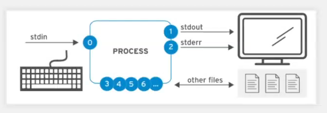
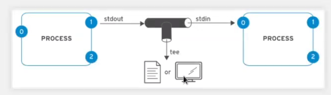
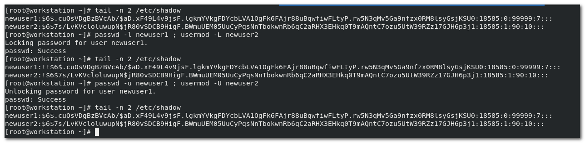

[TOC]

# chapter5 : 将输出重定向到文件或者程序

##### 标准输入、标准输出、标准错误



**标准输入**：键盘输入

标准输入后，在系统中执行将会开启一个新的进程，命令的执行结果无非是执行成功 ----> **标准输出**， 或者是执行遇到错误 ----> **标准错误**

```bash
ls -l /dev/std*
#
/dev/stderr -> /proc/self/fd/2
/dev/stdin -> /proc/self/fd/0
/dev/stdout -> /proc/self/fd/1
```


##### 将输出重定向到文件

默认的标准流程，执行命令之后，输出将在命令行打印执行结果。

通过特定的符号，将输出（标准输出，标准错误）输出到指定的文件，这个过程，即**重定向**

```bash
#标准输出重定向
|__##覆盖文件：
|	command 1> file 或 command > file
|__##追加到文件末尾
|	command 1>> file 或 command >> file
#标准错误重定向
|__##覆盖文件：
|	command 2> file
|__##追加到文件末尾：
|	command 2>> file
#同时重定向标准输出和错误
|__##覆盖文件：
|	command &> file
|__##追加到文件末尾：
	command &>> file
```

如果不需要打印输出到命令行，也不需要重定向到文件怎么办？

**特殊设备：**/dev/null （Linux中的黑洞设备，可以无限的吞噬数据）

```bash
$ command &> /dev/null
```


##### 建立管道

```bash
$ ls --help | less
```

将`ls --help` 的执行结果作为参数传递给 less 命令，作为less命令的执行参数。 也就是用less工具查看`ls --help`的执行结果

类似的：

```bash
$ cat passwd | grep jayce
```

将`passwd` 命令的执行结果传递给 grep 命令，作为grep命令的执行参数。 也就是在`passwd` 命令的输出结果中搜索“jayce” 关键字


##### tee

有这样一种场景，需要输出命令执行的结果，还需要把输出结果重定向到指定文件。  此时，如果直接重定向符号，会遇到一些问题。所以就产生了 tee 命令， 该命令实际上，也可以理解为重定向的作用，不过需要和 管道符 `|` 连用，实现类似“分流”的效果。



```bash
$ ls --help | tee /dev/tty3 | less
```

该示例中，除了会将执行结果打印到当前命令行终端，同时还会把执行结果“分流”到tty3 字符终端界面。

```bash
$ ls --help | tee ./ls_help.log | less
```

该示例则除了会将`ls --help` 的执行结果重定向输出到当前目录下的ls_help.log 文件，还会在当前命令行显示 less 工具页。


>  tee 命令开始并不容易理解，把他当作普通重定向无法实现的一种 解决方案就好。 它通常需要和管道符连用， 可以这么去记忆tee的使用规则，  执行命令command --> 通过管道符`|`将输出抛给tee命令，tee 将会从管道分出一个分支管道，而不影响管道的连通性，也就是后面还可以通过管道符`|`使得命令的执行结果流向其他的命令。 而tee的用法和 重定向符号类似， tee + file或者指定的特殊设备（如tty字符系统）。


##### VIM 编辑器 

Linux下常见的字符编辑器有：

- nano
- vi
- vim (vi 的升级版)

其中，vi是系统默认安装的，nano，vim在有些系统中有，有些系统中没有。  在有vim的发行版本中， 通常 vi 会是vim的一个软连接，也就是执行`vi` 命令，实际上打开的 是`vim` 编辑器

  

vim 编辑器的说明书：`vimtutor`

**高频使用：**

批量增删改：

Ctrl+v -> CapsLk+i(输入大写的i) -> 输入内容 -> Exit：

例如：

给多行注释：

光标移动到起始行行首 -> Ctrl+v -> 上下下键选中待注释的行 -> CapsLk+i -> 输入#（shift+(3)#）->Exit

取消多行注释：

光标移动到起始行行首 -> Ctrl+v -> 上下下键选中待取消注释的#字符 -> 输入小写的d删除单个字符（如果输入大写的D将会删除多行）

> 选中删除也可以使用 x 、 s
>
> Ctrl + v 是块选中，可以选中任意矩形范围的内容 。 Ctrl + V 可以选中多行


##### 更改SHELL 环境

**定义变量和引用变量**

```bash
$ hello=world
echo $hello
```

使用`set` 命令，可以查看当前shell中的变量。

```bash
$ set | less
#or
$ set | grep hello
```

取消定义的变量：

```bash
$ unset hello
```

以上是变量的定义和引用。以及消除和查看所有记录当前shell的变量。 


**普通shell变量 和 环境变量**

以上的演示，是 **shell变量** 还有一种变量，叫做 **环境变量**。

这两种变量的区别就是， shell变量仅仅能够在当前shell中去引用。  而环境变量可以被脚本程序所引用。 

要知道，在Linux 中，每执行一个脚本，就是开启了一个新的shell进程，也就意味着shell环境发生了改变。


通过 <span style="color:red">`export`</span> 命令， 可以将普通的shell变量提升为 环境变量。  

```bash
$ export hello=jayce
```

这样，hello变量就可以在脚本中去执行了。


实验：

bash1:

```bash
$ var1=hello
$ export var2=world
```

vim script.sh:

```bash
#! /bin/bash
echo $var1
echo $var2
```

bash1：

```bash
$ bash script.sh
```

输出：

```bash

world
```


**变量持久生效 和 “作用域”**

以上，不论是哪一种变量， 都只会在当前用户，当前shell中生效引用。 一旦重启电脑，变量就会自动失效。 因此是也叫临时变量。 


为了持久化变量，通常会把 变量定义在 用户家目录的 .bashrc 文件中。

家目录下：

```bash
echo -e 'var_a=aaa \nvar_b=bbb \nexport var_c=ccc' >> .bashrc
```

> 将：
>
> var_a=aaa
>
> var_b=bbb
>
> export var_c=ccc
>
> 这段内容追加到 .bashrc 文件末尾。 
>
> **<span style="color:red">echo -e </span>选项的作用是使得`\n` 换行符号生效。**


这样，当系统重启之后，将会自动加载 .bashrc 中的shell变量和环境变量。 用户就可以使用了。 但是只能是当前家目录的用户使用，多个终端也可用， 但是如果需要所有用户可以使用，就需要在 /etc/bashrc 文件中去定义。

> 也可以使用 <span style="color:red">`source`</span> 命令，重载.bashrc 文件，就不需要重启了。 `source .bashrc`

还有一点值得注意的是，定义在 .bashrc 中的变量，多个shell终端，同样可用。


**修改系统shell的命令提示符格式**

当前shell：

```bash
vim ~/.bashrc
```

所有用户shell：

```bash
vim /etc/bashrc
```

修改以下内容：

`PS1="[\u@\h \W]\\$" ` 	对应的shell提示符格式--> `[student@workstation ~]$`

即`[用户名@主机 相对路径]$`

如果把`\W` 改成 `\w` ，那么命令提示符在cd到目录时，就会显示绝对路径。

同样的，使用 `source` 命令重载文件后生效。


**修改默认编辑器**

默认编辑器的变量是 `EDITOR`

同样的，如果要使某用户的默认编辑器是nano，则 

```bash
$ echo export EDITOR=nano >> ~/.bashrc
$ source ~/.bashrc
```

是全局用户默认编辑器是nano，则

```bash
$ echo export EDITOR=nano >> /etc/bashrc
$ source /etc/bashrc
```

> 如果不生效，尝试重新登录


# ⭐chapter6 : 管理本地用户和组

目标：创建，管理和删除本地用户和组，以及管理本地密码策略

培训目标：

- 描述Linux 系统上的用户和组的用途
- 切换到超级用户账户来管理Linux 系统，并使用sudo命令授予其他用户超级用户访问权限。
- 创建，修改和删除本地定义的用户账户
- 创建，修改和删除本地定义的组账户
- 为用户设置密码管理策略，并且手动锁定和解锁用户账户


##### 查看用户：`id username`

Linux 系统上有三类用户： 普通用户，ROOT用户，系统用户

```bash
#普通用户（UID=0）
[student@workstation ~]$id student
uid=1000(student) gid=1000(student) groups=1000(student), 10(wheel) 
#Root用户（UID=1000-60000）
[student@workstation ~]$id root
uid=0(root) gid=0(root) groups=0(root)
#系统用户（UID=1-999）
[student@workstation ~]$id shutdown
uid=6(shutdown) gid=0(root) groups=0(root)
```

> UID 的划分区间，因不同发行版本存在差异
>
> 以上UID 的划分范围只是默认的，是可以被修改的：/etc/login.defs

##### [拓展]: 查看当前登录的用户有哪些？ `w`

```bash
$ w
```


**系统中的用户存放位置(本地用户的数据库文件)**

**/etc/passwd**

```bash
head -n 1 /etc/passwd
root:x:0:0:root:/root:/bin/bash
```

:warning:字段说明：详细查看 

|            | 第1列  | 第2列    | 第3列       | 第4列     | 第5列 | 第6列      | 第7列           |
| ---------- | ------ | -------- | ----------- | --------- | ----- | ---------- | --------------- |
| **示例：** | root   | x        | 0           | 0         | root  | /root      | /bin/bash       |
| **含义：** | 用户名 | 密码占位 | UID(用户id) | GID(组id) | GECOS | 用户家目录 | 用户的shell类型 |

特别说明：

第2列，密码占位x, 在早期的时候，这个x就是用户的密码，后来为了安全考虑，将密码和**/etc/shadow** 文件相关联了。  之间有很安全的机制，因此这里现在就是一个x字符占位。

第5列，理解为用户的备注信息就好，一般是 全名

第7列，RHEL/Centos/Fedora/Ubuntu 默认用户shell是 bash shell，

**如果设置用户为不可登录，则应当设定为  /sbin/nologin**


##### 什么是组

组分为两类：主要组和附属组（补充组）

**主要组**

为了方便管理用户，实现批量的管理。

组数据库文件为 ：**/etc/group**

```bash
wheel:x:10:student
```

|            | 第1列 | 第2列  | 第3列 | 第4列   |
| ---------- | ----- | ------ | ----- | ------- |
| **示例：** | wheel | x      | 10    | student |
| **含义：** | 组名  | 组密码 | 组id  | 组成员  |

- 组密码被存放于：/etc/gshadow


**附属组（补充组）**

系统中的用户，要至少属于一个组，这个组即主要组。 

也可以存在于多个组，这些组叫做附属组

```bash
[student@workstation ~]$id student
uid=1000(student) gid=1000(student) groups=1000(student), 10(wheel) 
```

10(wheel) 就是附属组。


##### 获得超级用户访问权限

超级用户即UID为0的用户，其权限级别是最高的

```bash
[student@workstation ~]$ ls -l /etc/shadow /etc/gshadow
----------. 1 root root 780 May 22 2019 /etc/gshadow
----------. 1 root root 1311 May 22 2019 /etc/shadow
```

权限位：---------- 意味着，系统当中，除了root用户，其他用户没有任何权限


##### **切换用户命令**

- `su [-c|-] USER`

  该命令：`-` 是 `-l` 的简写，又是 `--login` 的简写。 而 `-c` 则是表示执行的意思。

  ```bash
  #意思是以切换到root用户，然后执行 id 这个命令(临时的切换到root用户执行id命令，但是并不登录)
  $ su - root -c id
  
  #切换到student用户
  $ su - student
  
  #不接user，默认切换到root
  $ su -
  ```

- 除了`su -` ，还可以直接使用`su` 单一命令

  但是`su -` 是一个标准的用户切换过程，`-` 即 `--login` 选项会打印上次登录时间，且会切换到用户的家目录加，这意味着 变量环境也切换了。

  而 `su` 命令，并不会切换变量环境。 所以，一般使用`su -` 更好。至于差异存在多大的影响，暂不用深究。

  ```bash
  #切换到root用户，且不切换到root用户的变量环境
  $ su
  #切换到student用户，且不切换到student用户的变量环境
  $ su student
  ```

  


##### **普通用户临时执行root权限：sudo**

普通用户，是没有一些常用的root执行权限的，例如，安装软件。 

所以，为了解决这个问题，为了满足部分用户有root执行权限，即临时管理员权限 sudo

**默认，RHEL，只要用户属于wheel组成员，就有sudo执行权限。** 

> 不同发行版存在差异，例如ubuntu中就默认不是wheel组成员有sudo执行权限，而是sudo这个组。

```bash
[student@workstation ~]$ id student
uid=1000(student) gid=1000(student) groups=1000(student), 10(wheel) 

[student@workstation ~]$ id devops
uid=1001(devops) gid=1001(devops) groups=1001(devops)
```

```bash
[student@workstation ~]$ yum install ftp
Error: This command has to be run under the root user.
[student@workstation ~]$ sudo yum install ftp
[sudo] password for student:
#开始安装....

[devops@workstation ~]$ yum install ftp
Error: This command has to be run under the root user.
[devops@workstation ~]$ sudo yum install ftp
[sudo] password for devops:#devops
devops in not in the sudoers file. This incident will be reported
```

以上实验，验证了不在wheel组中的用户，没有sudo执行权限。


##### **⭐定义用户权限：/etc/sudoers**

```bash
$ vim /etc/sudoers
...
##Syntax:
##
##		user	MACHINE=COMMANDS
## Allow root to run any commands anywhere
root ALL=(ALL) ALL

## Allow members of the 'sys' group to run networking, software, 
## service management apps and more.
# %sys ALL = NETWORKING,SOFTWARE,SERVICES,STORAGE,DELEGATING, PROCESS,LOCATE, DRIVERS.

## Allow people in group wbeel to run all commands
%wheel ALL=(ALL) ALL
...
```

语法说明：

授权的用户/组	主机=[(切换到哪些用户或者组)]	[是否需要密码验证]  command1，command2，!command3(禁止执行的命令3)

> **特别说明：[(切换到哪些用户或者组)]，"[]" 表示可选的意思，默认的，sudo的时候，切换到root组。 如果定义了，就切换到定义的组，在定义的组别下再去执行命令**

```bash
##主机别名：
## Host_Alias	FILESERVERS = fs1, fs2
## Host_Alias	MAILSERVERA = smtp, smtp2

##用户别名：
##User_Alias ASMINS = jsmith, mikem
```

新增示例：

```bash
User_Alias ASMINS = zhangsan
Host_Alias	FILESERVERS = servera,serverb

kiosk	FILESERVERS=(ADMINS)	NOPASSWD:/usr/bin/passwd,NETWORKING,!/usr/ls
#解释：
#1.当用户kiosk，在使用sudo的时候，2.其身份就会切换成zhangsan这个用户，3.且在servera和serverb上才有效。4.在sudo的时候，不需要输密码。 5.kiosk 用户可以执行 /usr/bin/passwd命令，可以执行和网络相关的操作，不可以执行/usr/ls 命令
```

示例2：

```bash
#不允许wheel组成员 通过sudo修改root用户密码
%wheel ALL=(ALL) NOPASSWD:ALL,!/user/bin/passwd root 
```


**除了 etc/sudoers 这个文件，我们<u>还可以</u>把<u>自定义的规则</u> 放在 /etc/sudoers.d/ 下**


##### **使用sudo执行命令**

:warning: 注意事项：

- 尽量避免使用root用户直接登录系统进行管理。
- 在RHEL7之后，wheel组成员默认的权限太高，因此不建议直接使用wheel组作为sudo的管理组。


##### 管理本地账户

**增加用户:`useradd`**

- `useradd`
- `adduser`

> 再RHEL 系列中，这两个命令不做区分，用为 `adduser` 是`useradd` 的软连接。 但是再Devian系中，`adduser` 是交互式的。 在suse中，则没有`adduser` 这个命令。

常用选项；

- `-c` 备注
- `-D` 打印或者修改用户配置信息
- `-g` 指定gid（组），主要组
- `-G` 添加用户时直接跟上附属组
- `-p` 创建用户的同时指定用户的密码，但是这个密码是加密之后的密码（encrypted password of th e new account）
- `-s` 指定用户的shell
- `-u` 指定uid
- `-d` 指定用户家目录
- `-m` 
- `-l` 更改用户的登录 名

```bash
#打印默认的新增用户配置信息
useradd -D
#修改默认的新增用户配置信息
vim /etc/default/useradd
```

```bash
$ cat /etc/default/useradd
# useradd defaults file
GROUP=100 #最小值是100
HOME=/home #家目录所在路径
INACTIVE=-1 #用户是否可用，-1指未定义
EXPIRE= #过期时间
SHELL=/bin/bash #默认shell
SHEL=/etc/skel #隐藏文件
CREATE_MAIL_SPOOL=yes #是否含有邮件池
```

:warning: 特别说明1：

`-p` 选项： 指定的是加密之后的密码,使用示例如下：

```bash
# 通过openssl工具生成hash加密的字符串作为 用户的密码
$ openssl passwd -6 redhat
xxxxxxxxxxxxxxxxxxxxx
$ useradd -m -p 'xxxxxxxxxxxxxxxxxxxxx'
# 然后就可以通过redhat作为密码登录系统。
```

增加示例1：

```bash
# 注释 uid 用户shell 用户名
useradd -c "User Natasha, Female, 23 years old" -u 2000 -s /bin/tmux natash
```

:star: 修改用户密码的时候，更加推荐使用以下命令，可以回显输入的密码，避免输错：

```bash
echo thisismypasswd | passwd  --stdin natash
```


**修改用户：`usermod`**

用户和`useradd` 差不多， 唯一的区别在于 

`-G` : 覆盖附属组

`-aG`：增加附属组

`-m` ： 移动家目录，这个选项一般会和 `-d`（指定家目录）结合

`-l `: 更改用户的登录名

```bash
# 将newbie这个用户登录名修改为 geek ，同时把newbie用户的家目录移动至 /home/geek
$ usermod -md /home/geek -l geek newbie
```


 **删除用户： `userdel`**

`-r`： 递归删除，会删除和用户关联的家目录，邮件池等数据。

> 如果使用`userdel` 命令进行删除的时候，没有加上`-r`选项， 那么删除之后，这个用户的家目录还在，且`ls -l` 查看时，会发现，没有所属用户，仅root用户可访问。


**设置和修改用户密码：`passwd`**

方式1：

```bash
$ passwd natash
#...交互执行
```

方式2：还可以这样去修改：

```bash
$ echo  redhat | passwd --stdin natasha
```

> 方式1是交互式的，方式2式非交互式的，且密码是暴露出来的。 


##### 管理本地组账户

**增加组：`groupadd`**

`-g` : gid

``` 
$ groupadd sysadmin #增加一个名为sysadmin的组
#检验
grep sysadmin /etc/group 或者 cat  /etc/group | grep sysadmin
```

**修改组：`groupmod`**

`-g`: 修改组的gid

`-n`:  修改组名 

```bash
$ groupmod -n geek newbie #将newbie 这个组修改为geek
```

**删除组：**`groupdel`


##### **管理用户密码**

用户的信息存放在 ： /etc/passwd

用户的密码存放在： /etc/shadow

```bash
$tail -n 1 /etc/shadow
jayce:$6$rDQ2UpGQeAGejhmt$q5wBRviyF4HogXRf2mNM90W.G..QlPqUOIOSiiXuUa61qL05DHqgFgWhpIeFBupAIQnAXV7VNrBHs1WNsSC6T1:18529:0:99999:7:::
```

| 列   | 第1列  | 第2列      | 第3列                                        | 第4列                                       | 第5列                                                   | 第6列                                      | 第7列                                                        | 第8列            | 第9列          |
| ---- | ------ | ---------- | -------------------------------------------- | ------------------------------------------- | ------------------------------------------------------- | ------------------------------------------ | ------------------------------------------------------------ | ---------------- | -------------- |
| 示例 | jayce  | $6...6T1   | 18529                                        | 0                                           | 99999                                                   | 7                                          | A                                                            | B                | C              |
| 含义 | 用户名 | 加密的密码 | 距离上次修改密码的时间（1970/1/1算起的天数） | 可以再次修改密码的间隔天数（0即立刻可修改） | 距离上次密码修改，密码的有效天数（99999，密码永不失效） | 密码过期之前警告期间（7即提前7天开始警告） | 非活动期（密码过期后，超过规定的天数未更改密码的则密码失效。只能管理软介入修改） | 账户的不活动时间 | 未定义（保留） |

##### **怎么去管理用户的密码期限？**

- 全局：

  **vim /etc/login.defs**

  ```bash
  PASS_MAX_DAYS	9999	#第5列
  PASS_MIN_DAYS	0		#第4列
  PASS_MIN_LEN	5		#密码最小长度
  PASS_WARN_AGE	7		#第6列
  ```

  修改了这个文件之后，再新增任何用户，都是会按照这个设定的规则，写入/etc/shadow 文件。

- 使用 `chage` 命令 (注意不是change)

  对于已经存在的用户，需要使用 `chage` 命令去修改：

  常用选项：

  `-d` : 更改用户上次修改密码的时间

  > :warning: **特殊的** :如果 使用 `-d 0` 并不是说距离1970/01/01有0天，而是**密码强制失效，必须去立即更改**

  `-E`: 指定账户的过期日期

  ```bash
  chage -E $(date -d +180days +%Y-%m-%d)
  ```

  `-I` 密码在过期之后的不活动时间

  `-l` 查看某用户账户的时间相关信息

  ```bash
  # chage -l newuser1
  ```

  `-m` 距离上次修改密码后，最短可以再次修改密码的时间

  > 0 表示任何时候都可以修改

  `-M` 修改密码多久之后过期

  `-W` 表示失效提前 多久开始警告	

  

  新增示例：

  ```bash
  # chage -m -M 30 -W 2 -I 1 natash
  # natash这个用户，改密码的最小周期时间是2天（也就是如果今天改了，下次再要改必须到后天），30 天之后密码到期， 将会提前两天开始警告，如果没有更改，那么最多可以延期一天， 超出延期时间，就再也无法登录系统了。 只有root才能接管。
  ```

  

##### **拓展：如果锁定账户（显示用户访问）**

- 通过密码来锁定

  ```bash
  #锁定密码
  passwd -l natasha
  #解除密码锁定
  passwd -u natasha
  ```

- 通过账户锁定

  ```bash
  #锁定账户
  usermod -L natasha
  #解除账户锁定
  usermod -U natasha
  ```

  

示例：



> 注意锁定密码，前面会有两个 "!!", 而锁定账户时只有一个"!"。

 

##### **用户的shell（不可登录的shell）**

- sbin/nologin
- bin/false 

false 要比 nologin更加的严格