[TOC]

# chapter7: 控制对文件的访问

**目标：**

这只文件的Linux文件系统权限，并解释不同权限设置的安全校效果。

**培训目标：**

- 列出文件和目录的文件系统权限，并解释这些权限对用户和组访问权限的影响。
- 利用命令行工具更改问及那的权限和所有权限。
- 控制用户创建的新文件的 **默认权限**，解释 **特殊权限** 的影响，并使用特殊权限和默认权限设置在特定目录中，创建的文件的组所有者。


### Linux系统中，权限对应了三类用户：

- 文件的所有者： owner
- 文件的所属组：group
- 其他人：other

```bash
jayce@DESKTOP-JASQLDM:~$ ls -l
total 4
drwxrwxr-x 2 jayce jayce 4096 Nov  3 10:12 test
```

| 列     | 1                                                            | 2            | 3      | 4      | 5          | 6              | 7           |
| ------ | ------------------------------------------------------------ | ------------ | ------ | ------ | ---------- | -------------- | ----------- |
| 示例： | drwxrwxr-x                                                   | 2            | jayce  | jayce  | 4096       | Nov  3 10:12   | test        |
| 含义： | 首位：文件类型：<br />d -> 文件夹<br />- -> 普通文件<br />b -> 块设备<br />后面9位3个为一组：<br />分别指的是：user group other <br />r:read, w:write, x:excute | 硬链接的数量 | 创建者 | 所属组 | 文件的大小 | 文件修改的时间 | 文件/目录名 |

读、写、执行 操作权限针对文件和目录，有所不同：

**对于目录来讲：**

r -> 列举目录中的文件

w -> 创建/修改/删除目录或者目录下的内容

x -> (用户进入目录的最基本权限)

> :warning: 也就是说， 某用户对某文件夹有读写执行权限 => rwx,
>
> 某用户对某文件有读写权限 => rwx （对于目录来讲，访问目录中的内容，x是最基本的权限，没有x权限，就无法执行w权限。）
>
> 对于目录来讲 r-x 是只读权限。

**对于文件来讲：**

r	-> 查看

w	-> 修改/删除

x	-> （一般脚本或者二进制的可执行文件才需要）


*ls -l 列出的文件长列表中，第一列首位指的是文件类型，常见的文件类型有：*

- d : 目录
- \- ：普通文件
- l ：链接
- b : 块设备
- c : 字符设备


> 特别说明，文件列出后，权限列最后一个字符有可能是`.`或者`+`:
>
> 如：drwxrwxr-x. 2 jayce jayce 4096 Nov  3 10:12 test
>
> 1. `+`: 代表增加的有 ACL( 访问控制列表 ，在RH134中才会讲)
>
> 2. `.`: 和 SELinux 有关（S:Secret E：Enhanced, 安全增强型的Linux，给系统加固），（没有则说明没有SELinux）

> 当一个用户访问一个 文件/目录， Linux会首先判断，该用户是不是 文件/目录 的创建者，然后是不是文件/目录所属组，都不是就当作其他人的权限对待。

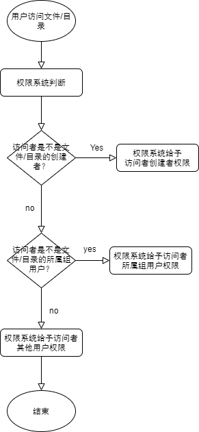

#### **查看文件最近的访问时间：`stat`**

```bash
jayce@DESKTOP-JASQLDM:~$ ls
test
jayce@DESKTOP-JASQLDM:~$ stat test/
  File: test/
  Size: 4096            Blocks: 8          IO Block: 4096   directory
Device: 810h/2064d      Inode: 40138       Links: 2
Access: (0775/drwxrwxr-x)  Uid: ( 1000/   jayce)   Gid: ( 1000/   jayce)
Access: 2020-11-16 13:07:59.335441000 +0800
Modify: 2020-11-03 10:12:44.449988200 +0800
Change: 2020-11-03 10:12:44.449988200 +0800
 Birth: -
jayce@DESKTOP-JASQLDM:~$

```


### 更改文件和目录访问权限：`chmod`

```bash
chamod [-R] 符号/数值 file|firectory
```

- 1. #### 符号法

     ```bash
     chmod whowhatwhich file|directory
     ```

     who ： User(user=u) Group(group=g) Others(others=o) ALL(all=a=空白不些)

     what : 运算符： 增加 `+` ， 减少 `-`, 精确赋值 `=`

     which : 权限：  r w x

     ```bash
     #示例：
     chmod g+w,o-r file1
     
     chmod u=r,go= file2
     ```

     ```bash
     jayce@DESKTOP-JASQLDM:~$ ls -l
     total 4
     drwxrwxr-x 2 jayce jayce 4096 Nov  3 10:12 test
     jayce@DESKTOP-JASQLDM:~$ chmod u-x,g-wx,o+w test
     jayce@DESKTOP-JASQLDM:~$ ls -l
     total 4
     drw-r--rwx 2 jayce jayce 4096 Nov  3 10:12 test
     jayce@DESKTOP-JASQLDM:~$ chmod a= test
     jayce@DESKTOP-JASQLDM:~$ ls -l
     total 4
     d--------- 2 jayce jayce 4096 Nov  3 10:12 test
     ```

     

- 2. #### 数值法

     在使用数值法的时候，需要用到简单的进制计算：

     **快速举例说明：** 有权限的位（任意权限）置1， 无权限置0：

     r-- : 100（二进制） --> 4（八进制）

     rw- : 110（二进制） --> 6（八进制）

     --x : 001（二进制）--> 1（八进制）

     r--rw---x : 100110001（二进制）--> 461（八进制）

     ```bash
     jayce@DESKTOP-JASQLDM:~$ ls -l
     total 4
     d--------- 2 jayce jayce 4096 Nov  3 10:12 test
     jayce@DESKTOP-JASQLDM:~$ chmod 640 test
     jayce@DESKTOP-JASQLDM:~$ ls -l
     total 4
     drw-r----- 2 jayce jayce 4096 Nov  3 10:12 test
     
     jayce@DESKTOP-JASQLDM:~$ chmod 777 test
     jayce@DESKTOP-JASQLDM:~$ ls -l
     total 4
     drwxrwxrwx 2 jayce jayce 4096 Nov  3 10:12 test
     
     jayce@DESKTOP-JASQLDM:~/test$ chmod 000 index.js
     jayce@DESKTOP-JASQLDM:~/test$ ls -l
     total 4
     ---------- 1 jayce jayce 217 Nov  3 10:12 index.js
     ```

> :warning::warning:在对目录进行权限设置的时候，如果不加 `-R` 选项进行递归，那么就只会对该目录生效，并不会对其内部的文件和子目录生效。 

```bash
jayce@DESKTOP-JASQLDM:~$ ls -l ; ls -l test/
total 4
drwxrwxrwx 2 jayce jayce 4096 Nov  3 10:12 test
total 4
---------- 1 jayce jayce 217 Nov  3 10:12 index.js
jayce@DESKTOP-JASQLDM:~$ chmod 555 test ;ls -l ;ls -l test/
total 4
dr-xr-xr-x 2 jayce jayce 4096 Nov  3 10:12 test
total 4
---------- 1 jayce jayce 217 Nov  3 10:12 index.js
jayce@DESKTOP-JASQLDM:~$ chmod 777 -R test ;ls -l ;ls -l test/
total 4
drwxrwxrwx 2 jayce jayce 4096 Nov  3 10:12 test
total 4
-rwxrwxrwx 1 jayce jayce 217 Nov  3 10:12 index.js
```


### 更改文件和目录的用户或者组所有权：`chown`、`chgrp`

#### `chown`可以修改组和所有者

```bash
[-R] 递归
$ chown student file //更改文件的所有者
$ chown student: file1 // 更改文件的所有者，且同时更该所属组为所有者的主要组
$ chown student:wheel file1 // 更改文件的所有者和所属组
$ chown :student file1 //等同于 chgrp 
#备注： ':' 可以用 '.'
```

#### `chgrp` 仅仅可以修改所属组

 

> 在CE 中学习的权限管理，对root无效，要想对root有效，需要使用文件的扩展属性。 
>
> jayce@DESKTOP-JASQLDM:~$ lsattr test
> --------------e----- test/index.js
>
> `lsattr`
>
> `chattr`


### **⭐⭐补充：特殊权限位**

引出：

在Linux 中，所有用户都应该可以修改自己的密码。

这就要求 passwd 命令，可以实现对 /etc/passwd 和 /etc/shadow 文件的修改。

意味着，这两个文件的权限至少是 rw-rw-rw- 即，666 

但是有一个问题，如果是这样的话，普通用户的权限就太高，会导致一些bug，由于所有人都可以修改这两个文件，所以用户可以互相篡改。 

特殊权限位：

```bash
ls -l /etc/passwd /etc/shadow
#在ubuntu中：
jayce@DESKTOP-JASQLDM:~$ ls -l /etc/passwd /etc/shadow
-rw-r--r-- 1 root root   1711 Oct 12 10:48 /etc/passwd
-rw-r----- 1 root shadow 1110 Oct 10 16:50 /etc/shadow
#在红帽中：
[root@workstation ~]# ls -l /etc/passwd /etc/shadow
-rw-r--r-- 1 root root   1711 Oct 12 10:48 /etc/passwd
---------- 1 root shadow 1110 Oct 10 16:50 /etc/shadow
```

可以看到，只有root用户，对 /etc/passwd  和/etc/shadow有写权限，在红帽中，甚至更为严格，`----------` 的意思是除了root用户，其他用户没有任何权限操作 /etc/shadow。 

那么按照上面的分析， 普通用户要想修改需要修改密码，666的权限太高且不合理，  所以实际上只有root用户能够修改密码。  

那么怎么实现所有用户能够修改密码呢？ 

如果能够让所有用户能够修改密码，但是又不能直接操作密码文件就好了。 这就是特殊权限位能实现的一个特性： 以文件属主身份去执行文件， 应用到密码修改上，就是所用用户能够使用root身份去修改自己的密码。 


特殊权限位引入示例：

```bash
$ ls -l /usr/bin/passwd
-rwsr-xr-x.1 root root 34512 Aug 13 2018 /usr/bin/passwd
```

可以看到 user用户的执行权限是 `rws` 而不是 `rwx` ， 实际上，这里的 s ，就是特殊权限位， 它覆盖了 x 。 其权限值为 4755 . 

实际上特殊权限位和其他位一样，也是一个8进制数，但是转化为2进制之后，每一个二进制位的含义不同于其他权限位。 分别是：

| 二进制位               | 第一个二进制位                                               | 第二个二进制位                                               | 第三个二进制位                                               |
| ---------------------- | ------------------------------------------------------------ | ------------------------------------------------------------ | ------------------------------------------------------------ |
|                        | SUIG                                                         | SGID                                                         | Stickybit(黏着位)                                            |
| 含义：                 | 当用户执行可执行文件时，会临时拥有该文件属主的权限（以属主身份运行） | 在设置了SGID权限的目录下建立文件的时候，新建文件的所属组继承上级目录 | 防删除位，目录下的文件，仅root，目录所有者，文件创建者可删除 |
| 特点：                 | 仅对二进制程序文件及可执行文件有效                           | 对二进制程序，可执行文件和目录有效                           | 仅对目录有效                                                 |
| 设定方式（置位方式）： | `chmod u+s file`或`chmod u=4 file `                          | `chmod g+s file`或`chmod u=2 file`                           | `chmod o+t file`                                             |
| 取消方式：             | `chmod u-s file`                                             | `chmod g-s file`                                             | `chmod o-t file`                                             |

除了passwd是一个对SUID置位的一个典型应用。 以touch 命令举例：

#### 针对SUID置位的实验：

```bash
#root用户执行：
$ ll /usr/bin/touch
-rwxr-xr-x.1 root root 109776 Jan 11 2019 /usr/bin/touch#touch 命令属主是root
$ chmod u+s /usr/bin/touch ; ll /usr/bin/touch
-rwsr-xr-x. 1 root root 109776 Jan 11 2019 /usr/bin/touch#置位SUID
#切换到普通用户：
[newuser1@workstation ~]$ touch file1 ; ls -l 
-rw-rw-r--.1 root newuser1 0 Nov 20 21:55 file1#普通用户使用touch命令创建文件，属主变成了root（因为SUID置为，使得newuser1在执行touch命令时，临时提权为了root。 ）

#切换到root用户恢复：
$ chmod u-s /usr/bin/touch /usr/bin/touch 
-rwxr-xr-x.1 root root 109776 Jan 11 2019 /usr/bin/touch
```


#### 针对SGID置位的实验1：

```bash
#newuser1@workstation:
#newuser1 新建一个文件夹并将其GUID置位
$ mkdir dir_made@newuser1 ;ll
srwxrwxr-x.2 newuser1 newuser1 6 Nov 20 22:15 dir_made@newuser1
$ chmod g+s dir_made@newuser1 ; ll
srwxrwsr-x.2 newuser1 newuser1 6 Nov 20 22:15 dir_made@newuser1

#切换到root用户，然后进入 dir_made@newuser1所在目录
[root@workstation ~] cd /home/newuser1/dir_made@newuser1
#创建一个文件夹和一个文件；
\# mkdir dir_made@root ; touch file_touch@root ; ll
drwxr-sr-x. 2 root newuser1 6 Nov 20 22:20 dir_made@root	
-rw-r--r--. 1 root newuser1 0 Nov 20 22:20 file_made@root
#可见，即便是rooty用户在普通用户newsuer1家目录下的 具有GUID置为的文件夹dir_made@newuser1 下创建的文件和文件夹，属组也会继承上级目录，也就是newuser1
```

> :warning: ​可以在创建文件后快速设定权限：
>
> ```bash
> $ touch file ; ll
> -rw-rw-r--.1 xxxxxxxxxxxxxxxxxxxxxxxxxx file
> $ chmod 2777 file ; ll
> -rwxrwsrwx.1 xxxxxxxxxxxxxxxxxxxxxxxxxx file
> ```
>
> 如果时文件夹，则可以借助 `mkdir -m` 选项 直接指定 权限
>
> ```bash
> $ mkdir 2777 dir1 ; ll
> drwxrwsrwx.1 xxxxxxxxxxxxxxxxxxxxxxxxxx dir1
> ```
>
> > 特殊权限位在工作中用的比较少

#### 针对SBIT的实验：

```bash
$ [newuser1@workstation tmp]$ touch file1 # 特别注意，用户newuser1 在/tmp下创建了一个文件
$ [newuser1@workstation tmp]$ chmod 666 file1 # 设定权限为rw-rw-rw-, 预期所有人可以删除

# 让 newuser2 用户尝试去删除
$ [newuser2@workstation tmp]$ rm -f file1 
rm: cannot remove 'file1': Operation not permitted #无法删除
```

这就是粘滞位起到的作用，是 /tmp 目录的SBIT 位置位了：

```bash
$ ls -d /tmp
drwxrwxrwt. 6 root root 103 Nov 21 08:55 /tmp # SBIT 置位了
```

置位起到的作用，就是，除了root 和文件所有者， 其他人都没有删除权限

> :star:但是，要特别注意的是， 虽然不能删除SBIT置位的文件下的文件，但是，有读写权限，意味折可以修改文件内容。


### H3 - ACL 文件扩展权限：Access Control List

有这样一种情况，遇到的比较少。 

对于 用户 A 创建的一个文件 A.a ， 用户B 不属于 A.a 的文件所属组。 但是又希望B 能够对 A.a 进行操作。 （A.a 也可以目录）

简单的说，就是让一个不属于文件所属组成员的用户，能够有对该文件操作的权限。 这时候，就需要用到ACL.

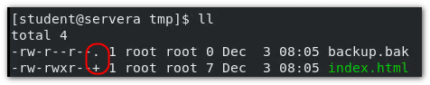

> 权限位末尾，如果是“+”, 则说明启用了ACL


#### H4 - 查看某文件的 访问权限：`getfacl` (get file acl)

```bash
[root@workstation tmp]# touch file@root ; getfacl file@root
# file: file@root
# owner: root
# group: root
user::rw-
group::r--
other::r--
```


#### H4 - 管理文件的ACL： `setfacl`

管理文件的ACL 关键命令是 `setfacl` ， 该命令常用的选项有：

- <span style="color:red">`setfacl -m` </span>修改acl
- `setfacl -M` 通过文件来修改acl
- <span style="color:red">`setfacl -x`</span> 删除某个对象的acl策略
- `setfacl -X` 删除某个文件所对应的acl策略
- <span style="color:red">`setfacl -b`</span> 移除所有acl策略（关闭acl）
- <span style="color:red">`setfacl -R`</span> 迭代设定acl策略
- `setfacl -d` 默认acl

> 下面的 index.html 为普通文件，www为目录文件

##### H4 - 添加用户到普通文件访问控制列表，并且授予权限：

```bash
setfacl -m user:student:rwx index.html
#简写，将user 替换为 u
setfacl -m u:student:rwx index.html

setfacl -m d:u:student:w www
```


##### H4 - 添加组到文件 (普通文件/目录文件) 访问权限列表，并授予权限：

```bash
setfacl -m g:wheel:rwx www
```


##### H4 - 从文件ACL 列表中删除用户或者组的指定权限

```bash
setfacl -x u:student index.html
setfacl -x g:wheel index.html

setfacl -x u:student www
setfacl -x g:wheel www
```

> 其他用户也是一样的：
>
> ```bash
> setfacl -m o:rwx index.html
> ```


##### H4 - 迭代增加ACL (使得所有子目录具有指定权限)

```bash
setfacl -R -m :u:用户:权限8进制数值 dir
```

> :warning:
>
> - `-R` 一定要在 `-m` 之前
>
> - <span style="color:red">针对执行权限，不能使用小写x，要用大写X</span>
>
>   ```bash
>   setfacl -Rm u:devops:rwX dir_name
>   ```


#### H4 - 默认acl的指定和删除

```bash
setfacl -m d:g:sysadmin:rwx share
setfacl -m d:g:sysadmin:rx share
```

这样设定，起什么作用？实现什么样的目的？

如果一个目录，设定了默认的acl，那么在该目录下创建文件的时候，文件会继承目录的默认acl。 所以，如果同时设定了默认acl，且指定了单独的acl 。 这样，示例中，sysadmin组用户对share目录仅有读取权限，但是，对其子目录有读写权限。 

```bash
#删除默认acl
setfacl -k /share
```


:star:<span style="color:red">在管理文件的ACL的时候，有这样几点需要注意：</span>:star:

- 在使用了ACL来控制文件权限之后，chmod就失效了,查看文件权限也应该使用专用的命令来查看`getfacl`
- ACL权限控制可chmod一样，分为user，group，other
- 管理文件的acl策略有两种方式，通过文件或者通过命令行。（通过命令行就行了。）
- :warning: 文件删除，仅root用户和文件属主有删除权限，其他用户可以修改内容，但是不能删除该文件。 有点类似黏着位。


#### H4 mask

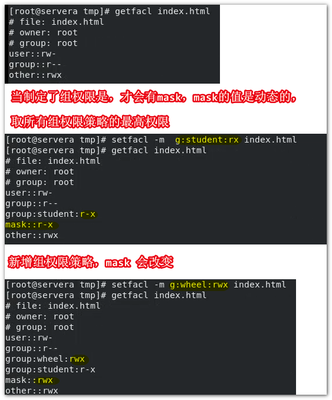

```bash
setfacl -m m::rx /share
#手动指定mask的值
```

> mask权限为最大有效权限，我们可以通过调整mask权限，来设定文件的有效权限.。 除非显示指定mask权限，否则mask会根据已有的权限策略自行计算。用的少。

### 管理默认权限和文件访问

普通用户的默认权限是：

- 目录： 775
- 文件：664

root 用户的默认权限是：

- 目录： 755
- 文件： 644

**这些默认的权限是怎么来的？**

Linux ，`umask` 值，定义了默认权限的配置：

使用` umask` 命令，可以返回umask值。

```bash
#root:
$ umask
0022
#not root user:
$ umask
0002
```

**umask 值是怎么和 权限值关联的 ？**

umask : mask 指的是 掩码， umask 就是反掩码， 其实就是，权限值的反码 。 权限值是8进制的，所以umask 就是 八进制权限位的反码 。 

以普通用户为例， 对于目录来讲，最高权限是 777 ，对于文件来讲，除了可执行文件，普通文件的最高权限是 666 。

如果普通用户的umask值为 0022 ， 首位是特殊权限位。 我们只关注后三位。 对于文件：666 - 022 = 644 ， 对于目录： 777 - 022 = 755 。

> 这个地方，存在一个遗留的问题，那就是首位，特殊权限位。 0002 的情况下，首位是0 ，八进制补码 7 ， 则 对应二进制是 111 ， SUID, SGID , SBIT 全部置位 ？？ 但是实际上的情况并不是这这样的啊，默认创建文件/目录的时候，并不会设定特殊权限位啊。   暂时没有在网上找到关于这个的解释。 

**设定 umask** 

- **临时设定umask**

  只对当前登录的用户的shell有效。

  ```bash
  umask 000 # 设定umask值为0000  即创建文件的权限为666 ， 目录则是777
  ```

- **持久设定**

  实现持久设定就要写入到文件。 

  - 针对特定用户：~/.bashrc

    ```bash
    echo "umask 022" >> ~/.bashrc
    ```

  - 针对全局用户：/etc/profile

    默认的配置文件，因发行版本的不同存在差异，可以根据管理者的需求，自己去定义脚本规则：

    以redhat为例，有以下相关逻辑：

    ```bash
    #/etc/profile
    if [ $UID -gt 199 ] && [ "`id -gn`" = "`id -un`"]; then
    	umask 002
    else
    	umask 022
    fi
    # 判断用户的UID ，如果UID 大于199 ，umask值默认为 002， 否则设定为 022
    ```

    


# chapter8 : 监控和管理Linux 进程

目标：评估和控制运行红帽企业Linux系统上的进程

- 获取有关在系统上运行的程序的信息，以便您可以确定状态，资源使用情况和所有权，从而对它们进行控制
- 使用Bash作业控制来管理从用一个终端会话启动的多个进程
- 控制和终止与shell无关的进程，以及强行结束用户会话和进程
- 描述负载平均值的定义，并确定对服务器高资源使用量负责的进程


<center>Process life cycle</center>
当打开终端开始，就已经运行了一个主进程，当执行命令时，Linux内核将会通过fork函数，分支一个子进程，然后通过exec函数去执行输入的命令， 命令执行完毕，子进程通过exit函数退出，然后销毁。工作流回到主进程。 这是一个命令的大致执行过程


### H3 - 查看进程

#### H4 - 进程快照： `ps`

`ps` (process snapshot :快照，就是一瞬间)， 该命令截获在命令执行的一瞬间，进程的状态信息，并不是实时的。 

- 查看所有进程：`ps aux`、`ps -ef`

```bash
ps aux
# 常用 ps aux | less
ps -ef
#ps -ef 命令和pa aux差不多，不过pa -ef会换行
```

> ps 命令的选项非常多，使用时多查手册

- 字段含义：

  `man ps ` => "CODE"

  | USER | PID    | %CPU      | %MEM       | VSZ                            | RSS                | TTY                      | STAT | START    | TIME       | COMMAND  |
  | ---- | ------ | --------- | ---------- | ------------------------------ | ------------------ | ------------------------ | ---- | -------- | ---------- | -------- |
  | 用户 | 进程号 | CPU使用率 | 内存消耗率 | 进程申请的地址空间（单位：字节 | 实际消耗的地址空间 | 终端（?:不是终端发起的） | 状态 | 开始时间 | 消耗的时间 | 资源名称 |

  

- 进程状态码

```BASH
PROCESS STATE CODES
       Here are the different values that the s, stat and state output specifiers
       (header "STAT" or "S") will display to describe the state of a process:

               D    uninterruptible sleep (usually IO)
               # D 不可中断的休眠状态,可能时磁盘IO的问题：1.1 进程正在讲关键数据写入磁盘；1.2.磁盘了能有坏块；还可能时网络IO 的问题：2.1 网络中断， 2.2 网络服务异常
               I    Idle kernel thread
               #内核线程
              
               R    running or runnable (on run queue)
               #运行中，或即将运行
               S    interruptible sleep (waiting for an event to complete)
               #可中断休眠（大部分都是）
               T    stopped by job control signal
               #通过信号发送的停止状态
               t    stopped by debugger during the tracing
               #W    paging (not valid since the 2.6.xx kernel)
               X    dead (should never be seen)
               # 死亡，
               Z    defunct ("zombie") process, terminated but not reaped by its
                    parent
               # 僵停状态，没有被父进程终止（可能时内核导致的问题，系统需要重启）

       For BSD formats and when the stat keyword is used, additional characters
       may be displayed:

               <    high-priority (not nice to other users)
               #高优先级的
               N    low-priority (nice to other users)
               #低优先级的
               L    has pages locked into memory (for real-time and custom IO)
               #
               s    is a session leader
               #进程引导者
               l    is multi-threaded (using CLONE_THREAD, like NPTL pthreads do)
               #多线程的，没有l就是单线程的
               +    is in the foreground process group
               #前端运行的 
```


#### H4 - 查看进程树 `pstree`

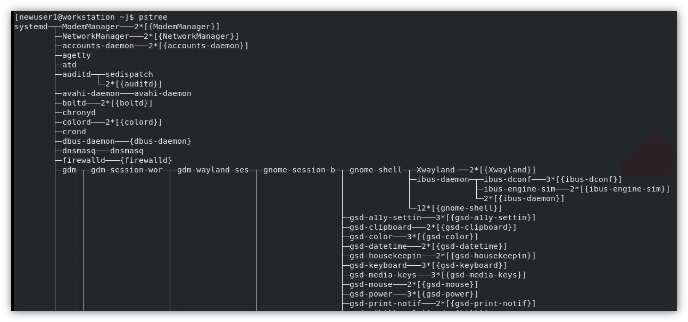

进程树命令`pstree`可以查看所有进程的依赖关系。主次关系。

#### H4 - 实时监控： `top`

动态的显示当前的进程运行状态。和资源消耗情况。

```bash
jayce@DESKTOP-JASQLDM:~$ top
top - 21:24:27 up 6 days,  8:19,  0 users,  load average: 0.01, 0.00, 0.00
Tasks:  14 total,   1 running,  13 sleeping,   0 stopped,   0 zombie
%Cpu(s):  0.0 us,  0.3 sy,  0.0 ni, 99.7 id,  0.0 wa,  0.0 hi,  0.0 si,  0.0 st      MiB Mem :   9490.3 total,   8909.9 free,     85.2 used,    495.3 buff/cache
MiB Swap:   3072.0 total,   3072.0 free,      0.0 used.   9171.1 avail Mem

  PID USER      PR  NI    VIRT    RES    SHR S  %CPU  %MEM     TIME+ COMMAND
    1 root      20   0     900    544    476 S   0.0   0.0   0:00.87 init
   63 root      20   0     900     84     16 S   0.0   0.0   0:00.01 init
   66 jayce     20   0    2612    536    468 S   0.0   0.0   0:00.00 sh
   68 jayce     20   0    2612   1884   1772 S   0.0   0.0   0:00.00 sh
  130 jayce     20   0    2612    604    536 S   0.0   0.0   0:00.00 sh
  132 jayce     20   0  943948  50884  31716 S   0.0   0.5   0:08.41 node
  564 root      20   0     900     84     16 S   0.0   0.0   0:00.08 init
  565 root      20   0     900     84     16 S   0.0   0.0   0:01.51 init
  566 jayce     20   0   10444   5664   3612 S   0.0   0.1   0:05.13 bash
 2156 root      20   0   10500   4248   3560 S   0.0   0.0   0:00.09 su
 2157 root      20   0   10292   5504   3564 S   0.0   0.1   0:00.29 bash
 3212 root      20   0   10124   3824   3392 S   0.0   0.0   0:00.00 su
 3213 jayce     20   0   10164   5188   3420 S   0.0   0.1   0:00.08 bash
 3412 jayce     20   0   10860   3752   3236 R   0.0   0.0   0:00.08 top
```

输出分为两个部分，第一部分是系统的简单运行日志，和资源消耗等。第一部分的首行，也可以使用专门的命令输出：`uptime`。

```bash
jayce@DESKTOP-JASQLDM:~$ uptime
21:25:37 up 6 days,  8:20,  0 users,  load average: 0.00, 0.00, 0.00
```

各列含义

| USER | PR             | NI         | VIRT     | RES            | SHR  | S    | %CPU    | %MEN     | TIME+    | COMMAND |
| ---- | -------------- | ---------- | -------- | -------------- | ---- | ---- | ------- | -------- | -------- | ------- |
| 用户 | 系统进程优先级 | nice优先级 | 申请内存 | 实际消耗那日村 | 共享 | 状态 | cpu消耗 | 内存消耗 | 运行时间 | 进程名  |

常用按键帮助：

| ？       | L              | Z                | M            |      |      |      |      |
| -------- | -------------- | ---------------- | ------------ | ---- | ---- | ---- | ---- |
| 获得帮助 | 是否查看第一行 | 更换屏幕显示颜色 | 内存显示样式 |      |      |      |      |

> ps top 都是Linux 内核提供的工具，还有类似top，但是是彩色显示的工具，htop，需要联网安装：
>
> ```bash
> $ sudo dnf install htop
> ```

### H3 - 控制作业

在Linux中，一个 shell 一次执行执行一个任务，如果在任务进行中，关闭该shell，那么该任务的进程也会被终止掉。

#### H4 - 前后台进程管理：

##### 让进程后台运行：`command &`

```bash
[kiosk@foundation0 ~]$ firefox &
[1] 87992
# firefox会后台执行
```

##### **让进程后台执行，且和终端无关：`nohup` **

在上面的示例中，firefox后台执行：

```bash
[kiosk@foundation0 ~]$ps | grep firefox
87992 pts/7		00:00:33 firefox
```

可以看到TTY字段值为 pts/7 说明是和终端有关的，但是有的时候，我们希望进程和终端无关：

- `nohup command &` 

  `nohup` 命令是一个通用的老方法，支持几乎所有的发行版本：

  ```bash
  $ nohup firefox &
  ```

##### 将后台进程调至前台：`fg %n`

```bash
$fg %1
nohup firefox
```

#####   查看当前后台运行的进程：`jobs`，`ps j`

- 查看当前shell的后台进程：`jobs`

  ```bash
  $ jobs 
  [1]- Running				nohup firefox &
  [2]+ Done					nohuo furefox 
  ```

- 查看当前用户的后台进程：`ps j`

####  H4 - 进程的暂停与继续

#####  暂停进程 \<Ctrl> + \<Z>：

- 暂停前台进程，直接 Ctrl + Z 就可以了
- 暂停后台进程，需要先调至前台，然后Ctrl + Z：

  ```bash
$ jobs 
	[1]- Running				nohup firefox &
$ fg %1 #先将后台任务调至前台
nohup firefox 
<Ctrl> + <Z> #即可暂停
  ```

> :warning: 注意： 当任务被暂停，相关的服务就停止了，例如，firefox被暂停之后，就无法被点击了。

##### 继续暂停的进程：`bg +%n`

```bash
$ bg %1
nohup firefox
```

#### H4 - 中断进程 `kill`

kill 命令的使用，又大量的信号可供选择。取决于你需要完成什么操作：

```bash
$ kill -l
jayce@DESKTOP-JASQLDM:~$ kill -l
 1) SIGHUP       2) SIGINT       3) SIGQUIT      4) SIGILL       5) SIGTRAP
 6) SIGABRT      7) SIGBUS       8) SIGFPE       9) SIGKILL     10) SIGUSR1
11) SIGSEGV     12) SIGUSR2     13) SIGPIPE     14) SIGALRM     15) SIGTERM
16) SIGSTKFLT   17) SIGCHLD     18) SIGCONT     19) SIGSTOP     20) SIGTSTP
21) SIGTTIN     22) SIGTTOU     23) SIGURG      24) SIGXCPU     25) SIGXFSZ
26) SIGVTALRM   27) SIGPROF     28) SIGWINCH    29) SIGIO       30) SIGPWR
31) SIGSYS      34) SIGRTMIN    35) SIGRTMIN+1  36) SIGRTMIN+2  37) SIGRTMIN+3
38) SIGRTMIN+4  39) SIGRTMIN+5  40) SIGRTMIN+6  41) SIGRTMIN+7  42) SIGRTMIN+8
43) SIGRTMIN+9  44) SIGRTMIN+10 45) SIGRTMIN+11 46) SIGRTMIN+12 47) SIGRTMIN+13
48) SIGRTMIN+14 49) SIGRTMIN+15 50) SIGRTMAX-14 51) SIGRTMAX-13 52) SIGRTMAX-12
53) SIGRTMAX-11 54) SIGRTMAX-10 55) SIGRTMAX-9  56) SIGRTMAX-8  57) SIGRTMAX-7
58) SIGRTMAX-6  59) SIGRTMAX-5  60) SIGRTMAX-4  61) SIGRTMAX-3  62) SIGRTMAX-2
63) SIGRTMAX-1  64) SIGRTMAX
```

kill 命令的语法： ```kill signal PID```

这个signal， 可以是信号值，信号名，还来可以是信号的关键字（短名称），以`1) SIGUP` 为例，以下三种写法是一样的：

```bash
$ kill -1 PID
$ kill -SIGHUP PID
$ kill -HUP PID
```

> 虽然kill 的信号非常多，但是实际上，平常工作中只高频使用的也就只有两三个：

| 信号编号 | 短名称 | 定义           | 用户                                                         |
| -------- | ------ | -------------- | ------------------------------------------------------------ |
| 1        | HUP    | 挂起           | 请求进程重新初始化（数据重新加载）而不终止<br />类似于：`service reload service_name``systemctl reload UNIT` |
| 2        | INT    | 键盘中断       | 导致程序终止，相当于发送了Ctrl + C                           |
| 3        | QUIT   | 键盘退出       | 相当于发送了 Ctrl + \\                                       |
| 9        | KILL   | 中断，无法拦截 | ⭐相当于立即断电，将立即终止程序                              |
| 15       | TERM   | 终止           | 默认的，kill命令如果不加signal，那就默认是15                 |
| 18       | CONT   | 继续           | 发送至进程使其恢复，无法被拦截                               |
| 19       | STOP   | 停止，无法拦截 | 暂停进程，无法被拦截处理                                     |
| 20       | TSTP   | 键盘停止       | 暂停程序，相当于发送了 Ctrl  + Z                             |

实验：

student@workstation:

shell1 :

```bash
$ ping servera
```

shell2 : 

```bash
$ pgrep ping 
4851
$ kill -9 4851
```

> 以上实验，再shell1 中不断的哦ping servera , 在shell2 中去查找 ping 进程的PID ，然后中止进程。

> :star::star: 以上这个示例，非常的常用。 其中  <span style="color:red">`pgrep service_name`</span> 是一个非常实用的命令，用于快速查到进程的PID 。 相当于 
>
> ```bash
> $ ps aux | grep ping #然后在结果中去找ping进程的PID
> ```

##### 延申（常用）：

- `killall -signal service_name `  // 管理同名的进程

- `pkill` //管理一组进程

  ```bash
  #以apache服务为例：
  $ sudo yum -y install httpd
  $ systemctl start httpd
  $ systemctl status httpd
  ```

  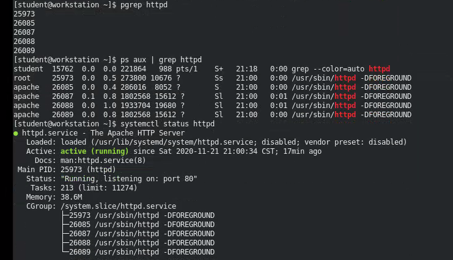

可以看到一堆依赖进程。 所以此时如果需要杀掉进程，就应该使用 `pkill` 

```bash
$ pkill -9 httpd
```

> 还可以使用 `pkill -U User` 来终止用户：
>
> ```bash
> pkill -U student
> ```


#### H4 -  以管理员身份注销用户

在Linux中，只要登录了一次，系统中就多了一个用户（即便是同一个用户名）：

使用单命令`w` 可以查看当前系统中，已经登录的用户。

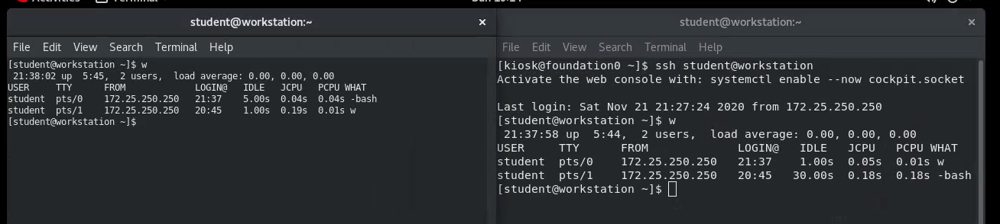 

**查看当前的登录用户：**

- `id`
- `whoami`


# chapter9 控制服务和守护进程

**目标：**使用Systemd 控制和监控网络服务与系统守护进程

培训目标：

- 列出systemd服务启动的系统守护进程和网络服务，以及套接字单元
- 使用systemctl控制系统守护进程和网络服务

### H3 - 识别自启动的系统进程

#### H4 - **systemd简介**

在RHEL5的时候 使用的SysV 和 LSB

以前的系统，开机的时候，启动服务都是通过编写脚本实现的。 编写好的脚本，本放在/etc/init.d/目录下，例如/etc/init.d/network， 然后，系统定义了不同的runlevel， 不同的runlevel需要启动不同的服务， 所以每一个runlevel 都对应一个目录，这个目录就是 /etc/rc.d/rc.x (x:level 1~6)，为了复用，会用软连接将/etc/init.d/中的服务脚本指向对应的/etc/rc.d/rc.x。


这种启动方式，存在一个问题，就是启动会比较慢，因为启动时一个服务脚本依赖于另一个服务脚本的，有严格的执行顺序。 所以在RHEL6的时候，就有一个新的启动方式 StartUp， 但是其实本质上是一样的，只是调整了部分服务并行启动。本质上RHEL5,6 都是通过init这种方式启动系统的。 

RHEL7开始，在兼容init启动的同时，开始使用 systemd 方式启动，最大区别在于，init是一个一个脚本负责一个服务，而systemd是负责所有。 可以理解为系统启动服务只有一个systemd 。 也慢慢成为了其他发行版本的主流启动方式。 而在RHEL8上，就完全使用了systemd 方式启动。 systemd会使得服务都是并行启动，意味着开机速度会相比快很多。

> Linux 的开机速度相比Windows，是比较慢的。

systemd很强大，以下是systemd的架构图


**查看systemd版本：**

```bash
jayce@DESKTOP-JASQLDM:~$ systemctl --version
systemd 245 (245.4-4ubuntu3.2)
+PAM +AUDIT +SELINUX +IMA +APPARMOR +SMACK +SYSVINIT +UTMP +LIBCRYPTSETUP +GCRYPT +GNUTLS +ACL +XZ +LZ4 +SECCOMP +BLKID +ELFUTILS +KMOD +IDN2 -IDN +PCRE2 default-hierarchy=hybrid
```

【补】：查看系统内核版本可以通过：`uname -r`

在RHEL 5,6 的时候，在管理服务的时候用的指令是：

- `service COMMAND NAME`

  - COMMAND:

    reload

    start

    stop

    restart

- `chkconfig NAME on`


> runlevel:
>
> 0 poweroff
>
> 1 single-user
>
> 2
>
> 3 multi-user 
> 4 multi-user without nfs
> 5 X window
> 6 reboot
>
> 5 X window
>
> 6 reboot
>
> ```bash
> shutdown -h -> init 0 #早期关机的时候关机可以使用shutdown -h还可以使用 init 0
> shutdown -r -> init 6 #重启
> init 5 # 从字符界面TUI 到 图形界面GUI
> ```


**现在一般使用`systemctl`来管理** , 并且以前管理的对象叫做 ”服务“ ，现在不叫服务了，因为太片面了， 现在叫做 ”单元“ UNIT

$ systemctl COMMAND UNIT

.service	服务单元

.socket 	套接字（tcp/udp 端口）

.path		路径单元

.mount	挂载单元

.target 	目标单元

......上面那个图中有


**怎么在系统中查看有哪些单元？**

```bash
jayce@DESKTOP-JASQLDM:~$ systemctl list-<tab>
list-dependencies  list-machines      list-timers        list-units
list-jobs          list-sockets       list-unit-files
```

```bash
#ubuntu 20.04 LTS wsl 不是以systemd方式启动，无法操作
jayce@DESKTOP-JASQLDM:~$ systemctl list-units
System has not been booted with systemd as init system (PID 1). Can't operate.
Failed to connect to bus: Host is down
```

```bash
#RHEL8
```


查看单元中的内容：

例如查看httpd服务状态：

```bash
$ systemctl status httpd.service
```


httpd.service : 服务单元为 httpd.service, 后面跟的是描述 Apache服务器

Loaded： /usr/lib/systemd/system/httpd.service #这就是服务的源文件，类似于以前的服务脚本

- > 如果想要查看：
  >
  > ```bash
  > #方法一：
  > $ cat /usr/lib/systemd/system/httpd.service 
  > #方法二：
  > $ systemctl cat httpd.service
  > ```
  >
  > 
  >
  > [Unit] #声明单元
  >
  > wants # 依赖
  >
  > After # 这个服务起来，要保证这部分的服务是运行的

Loaded : disabled/enabled 是否跟随系统启动的

Docs: 文档

Main PID : 主进程号


**询问某服务状态**

```bash
#是否启用？
$ systemctl is-enabled httpd
disabled
#是否活动
$ systemctl is-axtive httpd
active
```

**查看依赖：**

```bash
$ systemctl list-dependencies 
```


### H3 - 控制系统服务

#### H4 - 启动和停止服务（单元）

```bash
#启动服务（单元）（可以同时启动多个单元）
$ sudo systemctl start UNIT(S)
# $ sudo systemctl start service1 service2 ...
```

```bash
#重启....
$ sudo systemctl restart UNIT(S)
#......
```

```bash
#停止....
$ sudo systemctl stop UNIT(S)
#......
```

```bash
#设定跟随系统启动
$ sudo systemctl enable UNIT(S)
#......
#设定跟随系统启动的同时，立即启动
$ sudo systemctl enable http.service --now
```

```bash
#禁止单元跟随系统启动
$ sudo systemctl disable UNIT(S)
```

【补】默认Ctrl + ALt + Del : 重启，

```bash
sudo systemctl cat ctrl-alt-del.target
```


想要避免，可以直接屏蔽掉这个功能（针对字符界面，一般管理服务器是没有图形化界面的）:

```bash
sudo systemctl mask ctrl-atl-del.target
```


> 直接将这个源文件隐射到了空设备

取消屏蔽直接 换成 `imask` 就可以了

#### H4 - 标准关机，重启 `systemctl poweroff`,`	systemctl reboot`


# :star:chapter10: 配置和保护SSH

**目标：**使用 OpenSSH配置远程系统上的安全命令行服务

目标：

- 使用ssh登录远程系统并运行命令
- 为用户账户配置基于密钥的身份验证，以使其无需密码就能安全的登录远程系统
- 限制直接以root身份登录，并为OpenSSH 服务禁用基于密码的身份验证。

### H3 - 使用SSH 访问远程命令行

#### H4 - 什么是OpenSSH ? 

实际工作中，管理的都是远程服务器，例如，云主机。所以都是需要远程的登录到主机，管理服务器。而且也不可能直接操作物理控制台，因为云主机都是虚拟机。

> 通过web页面登录的实际上走的是vnc协议。

以前的时候，多使用telnet，但是现在淘汰了，用telnet一般也就是用来判断端口是不是侦听的。登录一般都是用SSH（OpenSSH,开源的）

**引入：**

以现有的实验环境举例：

workstation 和 servera,serverb 之间配置了OpenSSH，所以通过ssh协议登录的时候直接走密钥，根本不需要使用登录密码。 但是servera和serverb之间没有OpenSSH密钥认证，因此互相登录必须使用密码。

#### H4 - 登录方式：

以student账户登录到servera主机：

- 省略写法 :`ssh student@servera`  # 这里没有指定端口号，是因为ssh协议默认端口就是22
- 选项写法:`ssh servera -l student -p 22`  # -l 即 --login 登录名

#### H4 - 登录并执行临时命令：


#### H4 - 查看登录用户

当从workstation上通过ssh 连接到servera，在servera上可以通过`w` 命令查看：

> 该命令实际上是查看所有在线用户，无论是否远程登录，也包括了本地登录的用户。


**:star:还可以用过以下命令查看更加 详细的情况：**

```bash
$ ss -tlna | grep :22
```


:star: **还可以查看日志**

```bash
$ sudo grep sshd /var/log/secure
```


#### H4 -  登录原理

##### 密码连接过程

在理解一次ssh连接的原理之间，需要先了解以下一些关键点：

公钥：加密

私钥：解密

*默认SSH 的连接方式为密码认证：*

过程：

1. 客户端发动连接请求时，服务端将最新的公钥发送给客户端
2. 客户端查看当前家目录下的文件 ~/.ssh/known_hosts 是否存在对方的公钥，如果存在，则第三步，如果不存在，则询问是否添加公钥。
3. 询问客户端输入账户的密码，然后使用服务端的公钥进行加密，并发送给服务端
4. 服务端使用对应的私钥解密，如果正确则允许登录。

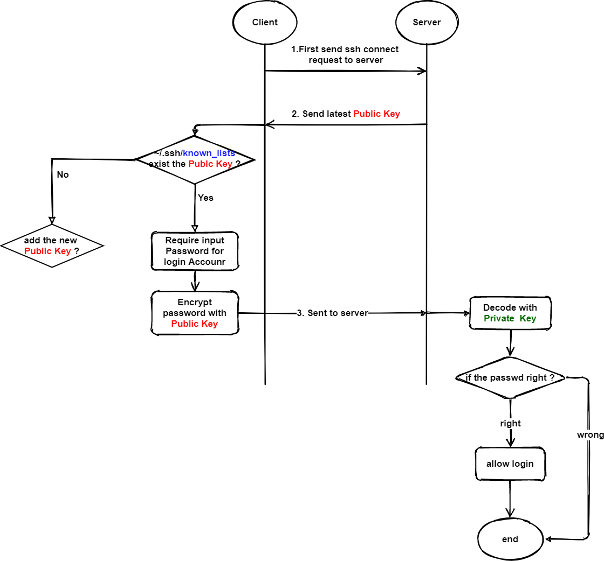

> 总结@jayce：
>
> 总结一下，以上的ssh连接过程：
> 当从servera 尝试连接到serverb， serverb会将自己最新的公钥发送给 servera 。 servera 收到了发送过来的公钥， 首先在servera:~/.ssh/known_hosts 文件中去查找，是否存在该历史公钥，如果有直接下一步，如果没有，就将其内容写入到 servera:~/.ssh/known_hosts 文件（如果没有该文件，会自动创建，前提是存在sshd服务。）
>
> 在确保servera的主机上（know_hosts）存在有serverb主机的公钥之后， 此时尝试登录的用户将会被询问远程登录账户的密码， 用户输入密码之后， 将使用 serverb 的公钥进行加密。 然后发送给serverb
>
> serverb在接收到了加密过后的密码， 尝试使用私钥进行解密然后核对密码是否正确， 如果正确，才会准许servera 通过ssh 远程连接。 
>
> 如果对连接过程还是不清楚，可以查看【附属】/第十章 SSH连接过程实验.md  中有详细的实验过程。

##### 服务端更新密钥：

```bash
$ rm -f /etc/ssh ssh_host_* #删除公钥私钥
$ systemctl restart sshd #会重新生成
```

生成的密钥对存放在 /etc/ssh 目录下， 输入删除了密钥对，然后再尝试从servera 连接 serverb会发生什么 ？ 

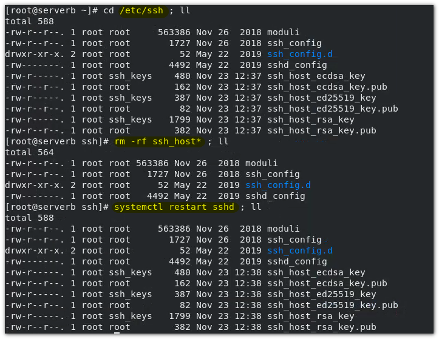

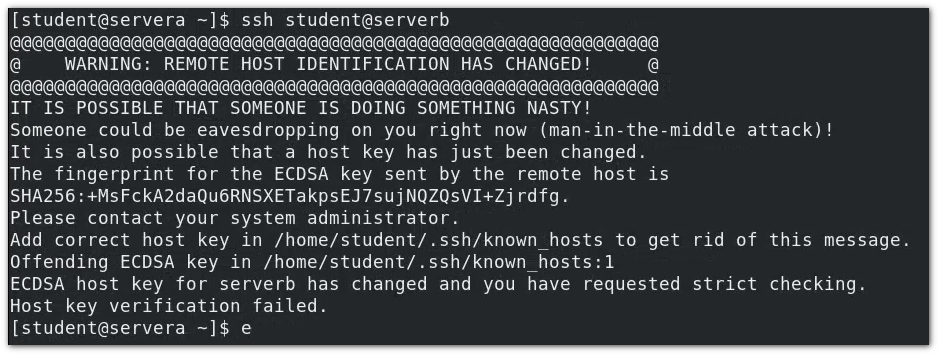

> 提示：远程主机人正已经修改，有可能是中间人挟持攻击(略)所以一般在更新密钥的时候，远程连接的时候需要向管理员确认。
>
> 有三种不同的密钥对，区别在于使用了不同的算法

为什么会出现这个提示？ 

当servera 尝试 ssh 远程连接到serverb， serverb发送公钥给servera， 而servera之前是连接过serverb的，所有存在历史的公钥，但是现在，serverb的公钥修改了， 所以在 servera 上，比对历史公钥和最新的公钥的时候存在差异，所以就会报这个提示。 

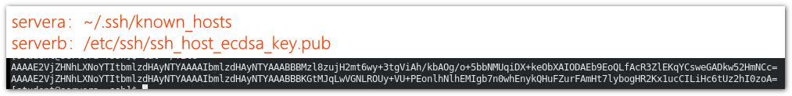


##### 移除某主机的认证信息 ： `ssh-keygen -R hostname`

`ssh-keygen -R serverb` 移除掉serverb的历史认证信息

移除掉之后，然后servera 重新连接serverb 就能够正常连接上了。 


### :star::star:H 3- 密钥认证（公钥认证）

工作中，密钥人正更加安全，方便。

#### H4 - **引入：**

以实验环境为例引入， 有虚拟机workstation 和 servera, serverb 。 workstation 和servera,serverb 之间就是走的公钥认证。 公钥认证使得ssh连接不需要输入密码。

示例：

```bash
$ ssh -i ./.ssh/lab_rsa student@servera
```

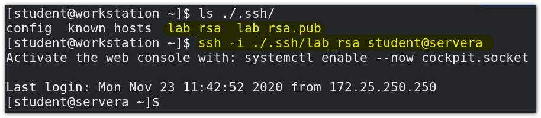

实际上，可以不用带 `-i` 选项， 因为<span style="color:red">当服务端开放了密钥（或者说公钥）认证</span>（前提），那么在ssh 连接的时候，默认会走密钥认证， 如果认证失败，才会走密码认证。
所以实际上，一般是这样登录的：

```bash
$ssh student@servera
```

> workstation:~/.ssh/lab_rsa 和 workstation:~/.ssh/lab_rsa.pub 是密钥对。 


#### H4 - :star: 密钥认证原理

在客户端和服务端是相互信任的情况下（绝对没有中间人）

1. 客户端使用 `ssh-keygen` 命令生成密钥对 : `ssh-keygen`

   ```bash
   $ ssh-keygen # 默认如果不加 -t 选项设定算法，默认的会以sha256 算法
   
   # -t 选项选定特定的算法
   $ ssh-keygen -t ecdsa
   ```

   ```bash
    #ubuntu 示例
    jayce@DESKTOP-JASQLDM:~$ ssh-keygen
   Generating public/private rsa key pair.
   Enter file in which to save the key (/home/jayce/.ssh/id_rsa):#密钥对存放的位置
   Created directory '/home/jayce/.ssh'.
   Enter passphrase (empty for no passphrase):#对私钥加密 ？ 多了一把锁，泄露别人也用不了（如果是为了免密码认证，这里就不要加密了）
   Enter same passphrase again:
   Your identification has been saved in /home/jayce/.ssh/id_rsa
   Your public key has been saved in /home/jayce/.ssh/id_rsa.pub
   The key fingerprint is:
   SHA256:IyCSLQHKsHZykIFc7gaQfihunvz+dWOTs8dJxFB9UIQ jayce@DESKTOP-JASQLDM
   The key's randomart image is: # 散列图
   +---[RSA 3072]----+
   |O++.      ....=o |
   |BBo      .   E . |
   |B=++.     o   .  |
   |o=*o .     o     |
   |o .o  . S .      |
   | o.    . ...     |
   |+ .    . Bo .    |
   | +    . o =+     |
   |  oo..   ..      |
   +----[SHA256]-----+
   ```

   

2. 客户端将<span style="color:red">公钥</span>发送服务端 user@host:~/.ssh/authorized_keys/  `ssh-copy-id`

   ```bash
   $ ssh-copy-id -i 私钥 用户@主机
   #eg: ssh-copy-id -i id_ecdsa.pub student@serverb
   ```

   输入完命令之后，将会走密码完成复制。（拷贝到了 student@serverb:~/.ssh/authorized_keys/ ）

3. 连接时：

   1. 客户端发起连接

   2. 服务端收到信号后，随机生成字符串（每次连接都重新生成）并使用客户端提供的公钥进行加密，然后返回给客户端

   3. 客户端使用私钥进行解密。并将解密后的字符串再返回给服务端

      > 客户端只知道公钥，私钥时正确的，服务端只知道字符串是否正确。两者都只知道自己的

   4. 服务端验证字符串是否是之前生成的，如果正确则允许连接。

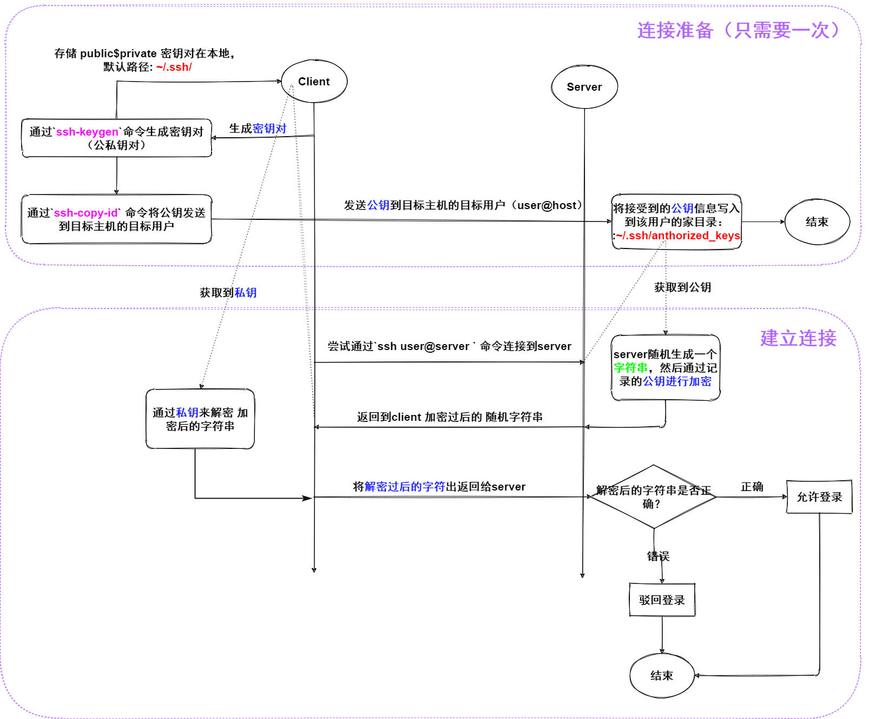

#### H4 - **完整实验 - 密钥认证 - 从servera 连接至 serverb **

准备：初始状态：从servera 连接到serverb 需要密码认证：

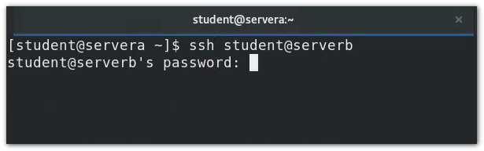

1. servera 作为客户端，通过 `ssh-keygen` 生成 密钥对：

   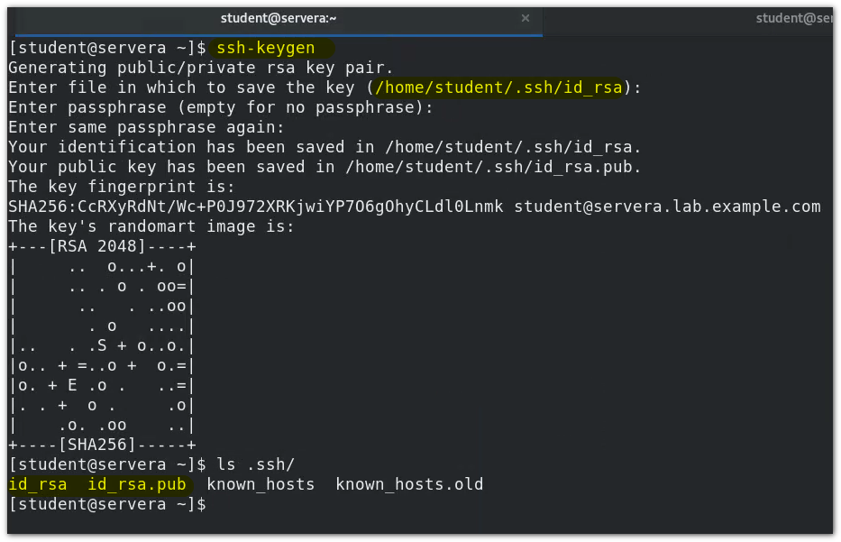

2. 通过`ssh-copy-id` 命令，将 公钥 通过密码认证复制（发送）到预连接的 用户@主机

   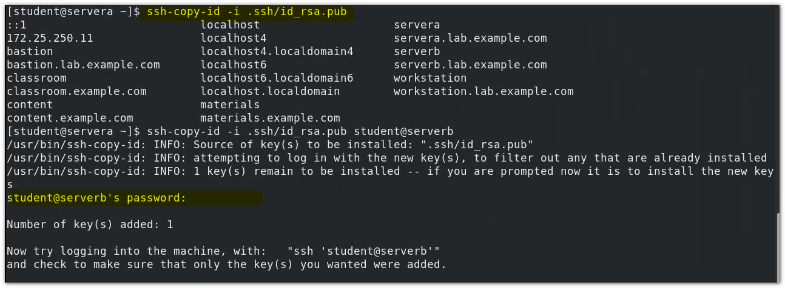

   > 可以验证一下：
   >
   > 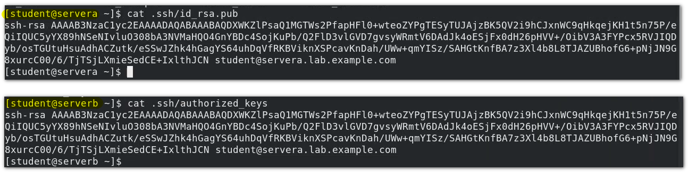

3. 尝试连接：

   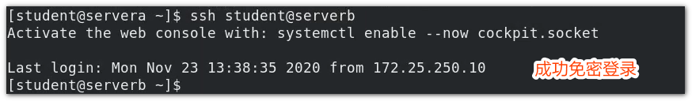

   > 完整的连接应该是：ssh -i id_rsa

> :warning: 普通密码认证，是server 发送 public key 到client， 而密钥认证是 client 生成密钥对，并发送 public key 到server 

#### 使得SSH 连接更加的安全：自定义 OPENSSH 服务配置

<span style="color:red">服务端</span>： /etc/ssh/sshd_config

> <span style="color:red">这里注意一下，补一个小概念：</span>
> SSH 作为多端程序，有客户端和服务端， 一般来讲，服务端应该是常驻进程，（也就是Linux 中的守护进程），这里的sshd就是守护进程。 为什么呢？ 因为服务端应该时刻等待被连接，时刻都能都被连接上。 如果并不是单向连接，需要频繁的相互连接，那么各端都应该有守护进程。

```bash
#Port 22					//自定义端口，默认是22，修改设计Selinux 和防火墙
#AddressFamily any			 //局域网中侦听的端口类型， inet（ipv4） 、inet （ipv6）、any（ipv4 & ipv6）
#ListenAddress 0.0.0.0		 //侦听端口，制定了端口就只能听到所侦听端口的登录申请。
#ListenAddress ::


PubkeyAuthentication yes 	  //默认是否开启公钥认证，强烈建议开启
PermitRootLogin no 			  //⭐⭐⭐⭐⭐强烈建议关闭（每时每刻都有在黑客在扫面是否有端口开放了root登录）
AuthorizedKeysFile  .ssh/authorized_keys .ssh/authorized_keys2 //密钥默认存放位置,如果公钥认证开了 这里一定要保证是开着的
PasswordAuthenticatoin no	  //是否开启密码认证，如果同时开启了，  公钥认证和密码认证，那么将优先使用公钥认证。  如果公钥认证方式登录失败会使用密码认证， 而使用密码认证就有中间人挟持攻击的可能，所以一般正式生产环境，建议是关闭密码认证的。
.......
```

```bash
自定义sshd的配置

/etc/ssh/sshd_config

Port 22  //端口号
AddressFamily inet  //IP协议类型 inet inet6 any
ListenAddress 172.25.250.11   // 接口
HostKey /etc/ssh/ssh_host_rsa_key
HostKey /etc/ssh/ssh_host_ecdsa_key
HostKey /etc/ssh/ssh_host_ed25519_key
SyslogFacility AUTHPRIV
PermitRootLogin no  //关闭root远程登录
PubkeyAuthentication yes //启用公钥认证
AuthorizedKeysFile  .ssh/authorized_keys
PasswordAuthentication no  //关闭密码认证
ChallengeResponseAuthentication no
GSSAPIAuthentication yes
GSSAPICleanupCredentials no
UsePAM yes
X11Forwarding yes
PrintMotd no
ClientAliveInterval 60
AcceptEnv LANG LC_CTYPE LC_NUMERIC LC_TIME LC_COLLATE LC_MONETARY LC_MESSAGES
AcceptEnv LC_PAPER LC_NAME LC_ADDRESS LC_TELEPHONE LC_MEASUREMENT
AcceptEnv LC_IDENTIFICATION LC_ALL LANGUAGE
AcceptEnv XMODIFIERS
Subsystem sftp	/usr/libexec/openssh/sftp-server
```

> 设定完成之后，重启 sshd 服务 
>
> ```bash
> $ systemctl restart sshd
> ```
>


