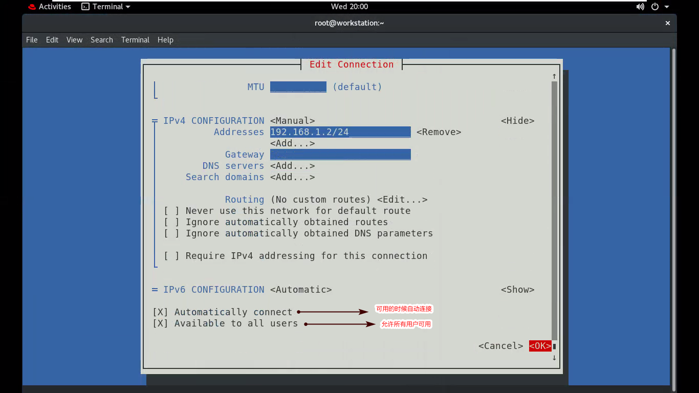
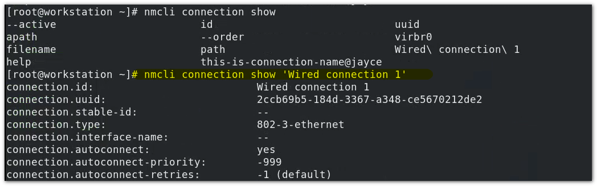
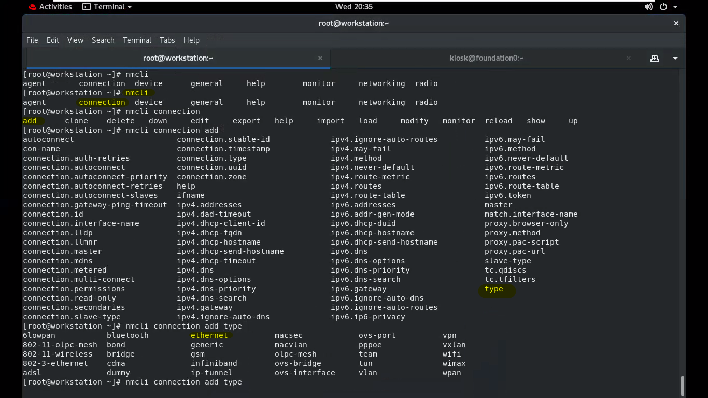

[TOC]

# chapter:11 分析和存储日志

**目标：查找和准确解读系统事件的日志，以满足故障排除只需**

- 描述红帽企业Linux用于记录事件的基本日志架构
- 解读相关syslog文件中的事件，以排除故障或查看系统状态
- 查找和解读系统日志中的条目，以排除故障或者查看系统状态
- 配置系统日志，以在服务器系统重启时保留事件记录
- 利用NTP 维护准确的时间同步，并配置时区以确保系统日志和日志记录的事件标有正确的时间戳。

### H3 - 描述系统日志架构

日志的服务：

- RHEL 5 syslog	
- RHEL 6 rsyslog
- RHEL7-8 **<span style="color:red">rsyslog</span>  <span style="color:red">systemd-journald</span>**

> systemd-journald 是RHEL8 增加的一个专门负责记录systemd 的日志 -- 即系统日志。
> 前面讲过，RHEL8 的系统启动方式不再是init， 而是systemd, 基本可以理解为systemd是负责系统所有的服务的。
>
> 前面讲过，RHEL8 的系统启动方式不再是init， 而是systemd, 基本可以理解为systemd是负责系统所有的服务的。

> rsyslog是一个传统的系统日志服务，systemd-journal是一个改进型的日志管理服务，可以收集来自内核、系统早期的启动阶段的日志、系统守护进程在启动和运行中的标准输出和错误信息、还有syslog的日志。该日志服务仅仅把日志集中保存在单一结构化的日志文件/run/log。<span style="color:red">默认情况下并不会持久化保存日志、每次重启后，之前的日志都会丢失。</span>另外，一些rsyslog无法收集的日志也会被jounral记录到。

> rsyslog 记录的日志存放于： /var/log
> systemd-journald 记录的日志存放于： /run/log

### H3 - rsyslog 系统日志记录

#### H4 - **查看日志：**

查看系统日志，需要系统管理员权限。

通常，使用 `less tail` 命令来查看日志，利用`-n 0 -f` 选项来实时监控日志
会频繁使用 `grep` 来筛选日志： 

##### H5 - **/var/log/ 下常见的<u>系统日志</u>类型：**

```
系统日志
/var/log/message             //绝大多数的系统日志都记录到文件
/var/log/secure              //所有跟安全和认知授权等日志都会记录到此文件中  
/var/log/maillog             //邮件服务日志
/var/log/cron                //计划任务日志                             
/var/log/boot.log            //系统启动相关的日志
/var/log/audit/audit.log     //系统审计相关的日志

/var/log/cron   			 //负责系统中的任务调度 / 计划任务相关的日志。
/var/log/cups 	    		 //打印机服务相关日志（现在用的少了）
/var/log/dnf.log 	    	 // 以前叫做 yum.log (红帽8 上 yum 变成了 dnf)
/var/log/firewalld 		     //防火墙日志
/var/log/gdm			     //gnome-desktop-manager gnome桌面相关日志
/var/log/glusterfs           //文件系统
/var/log/insight-client      //红帽官方推出的智能分析系统平台工具
```

> audit  是审计日志，不同于普通日志，主要是用Kernel 审计模块负责。 但是为例保证在审计模块无法正常工作的时候，依然能够记录审计信息，所以syslog 也具有记录审计报告的功能。 其格式和其他日志的格式是不同的。 

#### H4 - rsyslog 日志配置文件

rsyslog 对应的配置文件 ： /etc/rsyslog.conf		/etc/rsyslog.d/ * 

> :star: 在Linux 上，软件或者服务的配置文件一般都会有一个.conf文件，我们称该文件为主要配置文件， 但是有的时候，我们需要对服务或者软件，做一些自定义的配置，那么可以直接在主配置文件中去修改，弊端就是，一旦某一个配置错误，会导致整个配置文件出现问题。 排查起来很不方便。 
>
> 所以就把一般把自定义的配置文件，分支放在 .d 结尾的目录中。 在加载配置文件的时候，会自动去加载 .d 目录下的子配置文件。
>
> 服务或者软件在加载的时候，会合并主配置文件和 .d 文件下的子配置文件。 

查看帮助：

```bash
# man 5 rsyslog.conf
```

##### H5 - 记录日志的规则：

设备名.优先级  /path/to/filepath

**设备名(facility)：**


```
auth, authpriv, security ( same as auth ) //认证 / 安全相关
cron            //系统调度/计划任务
daemon          //守护进程相关
kern            //内核相关 
lpr             //打印机
mail            //邮件
mark            //标记类
news            //新闻类
syslog          //系统日志
user            //用户相关
uucp            //unix to unix communicate process 一种老式的通信进程
local0 - local7 //预留8个设备
```


**优先级(priority)：**


> | 优先级                                            | 级别    |
> | ------------------------------------------------- | ------- |
> | debug :  是最低级别，指的是：调试级别的信息       | 等级为7 |
> | info : 一般信息                                   | 等级为6 |
> | notice :重要的事件                                | 等级为5 |
> | warning , warn (same as warning) :警告信息        | 等级为4 |
> | err , error (same as err) :错误信息，但是并非严重 | 等级为3 |
> | crit : 紧急事件，不可忽略                         | 等级为2 |
> | alert : 需要立即采取措施                          | 等级为1 |
> | emerg , panic (same as emerg) :	系统不可用     | 等级为0 |

> 明白了基本规则,就可以直接去看 /etc/rsystem.conf 文件

以一条规则为例：


系统中所有的日志记录，除了邮件，安全，系统调度相关的，全部都记录在 /var/log/messages 中。 

再例如：


-/var/log/maillog 前面的这个dash符号 `-` ，指的是异步记录。 因为邮件服务的日志相对来说可能量很大，并且也不一定重要，如果把邮件的日志立即写入磁盘，可能会导致磁盘的IO负载过大从而影响到其他的服务日志记录。异步的话，就相当于先放到内存中，然后，慢慢的去写入磁盘（？？？异步的意思是这样解释的吗？？CTMD）


:omusrmsg:*

```bash
man 5 rsyslog.conf 然后搜索关键词 "omusrmsg" 可知
```

指的是所有在线用户。 ：online machine 


#### H4 - 自定义日志

**定义日志：**

```bash
# cd /etc/rsyslog.d/
# vim rht.conf
```

```bash
#rht.conf
# log any facility and any priority 
*.* 		/var/log/all.log #记录所有类型服务的所有优先级别的日志内容，记录到/var/log/all.log 文件
```

**重启日志服务：**

```bash
# systemctl restart rsyslog.service
```

**实时监控日志：**

```bash
tail -n 0 -f /etc/all/all.log
```

> tail 命令 -n 0 的意思是只看最新产生的行，-f 即follow 表示跟踪查看


#### H4 - **日志轮转 ：logrotate**

日志的文件类型：

```bash
$ file /var/log/messages
/var/log/messages :UTF-8 Unicode text, with very long lines
```

意味者，日志文件将会比较占用磁盘空间，

可以使用 `du -sh` 命令查看当前目录的磁盘占用空间大小

```bash
$ du -sh /var/log
15M		/var/log
```

(运行时间很短，且没有什么操作，如果是正常的生产环境，都是以G为单位的)

如果是购买的云主机，那么系统空间就很重要。

因此，为了解决这种情况，应该把旧的日志自动删除掉。 

系统自带一个日志轮转的工具，logrotate

> 注意，logrotate 是一个工具，而不是一个守护进程，需要主动的去调用。

**logrotate 计划任务**

系统中的实现方案是通过计划任务定时的去使用logrotate工具实现日志轮转操作。

/etc/cron.daily/logrotate  


> `usr/sbin/logrotate /etc/logrotate.conf` ： 使用logrotate 这个命令，根据logrotate.conf` 这个配置文件定义的规则来做日志轮询。
>
> $EXITVALUE 这个值是用于判断时候被执行，如果为0 则被执行。

**logrotate 配置**


weekly : 轮询周期为每周

rotate4 ： 保留4份 

create ： 产生空白问及那

dateext ： 日志文件的时间格式

compress : 压缩日志文件以节约存储空间

> 

 	 

**新增一个自定义 logrotate 配置**

\# vim /etc/logrotate.d/all

```
/var/log/all.log { #文件位置
	create
	rotate 1 
}
```

**使轮转配置生效**

- 手动使其生效：

  ```bash
  # logrotate -f /etc/logrotate.conf
  ```

  

> :warning: 写这个实验的时候，需要注意， vim /etc/logrotate.d/all 这个文件中， 首行指定的是日志的文件的位置， /var/log/all.log  。 所以，要让这个轮转生效的前提是，有这个日志文件，轮转的对象是日志文件。 前面已经讲过了怎么自定义日志：
>
> 新增自定义日志：vim  /etc/rsyslog.d/new.conf    内容示例："\*.\* 		/var/log/all.log"
> 使生效： systemctl restart rsyslog.service


#### H4 - `Logger` 命令

*`logger`命令* 可以用于发送消息到日志系统

> ```bahs
> $whatis logger
> logger (1)           - enter messages into the system log
> ```
>
> ```bash
> $ logger -p local0.emerg "I am Jayce"
> ```
>
> 在rsyslog.conf 这个配置文件中，我们看到了，来自所有设备(服务/程序facility)的 紧急消息会被推送给所有在线用户。 `:omusrmsg:*`

如果使用 编辑器vim ，或者阅读器less 等查看此时的 /var/log/messages日志，


### H3 - 查看系统日志条目 <span style="color:red">systemd-journald</span>

> 传统日志rsyslog存在的问题：
>
> - 以ASCII码文本存储，当日志量过大时，会比较慢
> - 由于是以人类可读的文本格式存放，容易被人为篡改

#### 存放于 /run/log 以二进制存放， 机器在读取日志时，不需要翻译，速度比较快，防止篡改。

#### H4 - 查看systemd-journald日志，`journalctl`

由于是二进制存放的，所以无法直接查看， systemd-journald 提供了专门的查看工具，journalctl 

记录了自启动以来的所有日志

journalctl提供了可供选择的选项，可以通过 --help 或者手册 查看。journalctl 常用选项示例：

```bash
#只查看某个服务的日志
$ ⭐journalctl -u sshd
#查看系统中是否有报错信息
$ journalctl -p error 或者 $ journalctl -p err(查看error级别及以上)
# ⭐监控
$ journalctl -n 0 -f
# ⭐查看详细的日志
$ joutnalctl -p err -o verbose #-o : output ;verbose: 详细
# ⭐查看某个时间开始的所有日志
$ journalctl -S '2020-10-18 11:00'
```


#### H4 - 永久存储 systemd-journald 日志（永久存储系统日志）

由于systemd-journald 日志存放的位置在 /run/log ，意味着，计算机重启，日志就会被删除掉。

/etc/systemd/journald.conf

帮助 ： man 5 journald.conf 

```bash
$ cat /etc/systemd/journald.conf
...
 12 # See journald.conf(5) for details.
 13
 14 [Journal]
 15 #Storage=auto
 16 #Compress=yes
 17 #Seal=yes
 18 #SplitMode=uid
 19 #SyncIntervalSec=5m
 ...
```

```bash
$ man 5 journald.conf
...
Storage=
	Controls where to store journal data. One of "volatile", "persistent", "auto" and "none". If "volatile",journal log data will be stored only in memory, i.e. below the /run/log/journal hierarchy (which is created if needed). If "persistent", data will be stored preferably on disk, i.e. below the
/var/log/journal hierarchy (which is created if needed), with a fallback to /run/log/journal (which is created if needed), during early boot and if the disk is not writable.  "auto" is similar to "persistent" but the directory /var/log/journal is not created if needed, so that its existence controls where log data goes.  "none" turns off all storage, all log data received will be dropped. Forwarding to other targets,such as the console, the kernel log buffer, or a syslog socket will still work however. Defaults to "auto" in the default journal namespace, and "persistent" in all others.
...
```

> 可以看到，如果需要持久化，存储，需要把Srotage变量值赋值为 “ persistent ”，并且创建 /var/log/journal目录。

**测试：**

1. 修改systemd-journald 服务配置文件

   ```bash
   # vim /etc/systemd/journald.conf
   ...
   Storage=persistent
   ...
   ```

2. 创建 /var/log/journal 目录

   ```bash
   $ mkdir /var/log/journal
   ```

3. 重启守护进程 和 服务

   ```bash
   $ systemctl daemon-reload
   $ systemctl restart systemd-journald
   ```

4. 查验

   ```bash
   $ ls /var/log/journal
   xxxxxxxxxxxx
   ```

   > 成功

5. 恢复

   ```bash
   # 改回配置文件
   # vim /etc/systemd/journald.conf
   ...
   Storage=volatile
   ...
   
   #重启守护进程和sytemd-journald 服务
   # systemctl daemon-reload ; systemctl restart systemd-journald
   
   #查验
   # ls /run/log/journal
   xxxxxxxxxx
   ```

   > 哪里不清楚就去看文档 都有，man 5 journald.conf


### H3 -  维护准确的时间

时间日期的管理工具:`timedatectl`


timedatectl 集合了很多工具


> 单命令 `timedatectl ` 等同 `timedatectl status`

#### H4 - 手动同步时间

```bash
# 修改时区
$ timedatectl set-timezone Europe/London #输入过程中， 可以使用tab来提示
# 修改时间
$ timedatectl set-time "12:00"
Failed to set time : NTP unit is active
```

> :warning: 直接修改时间会失败。因为NTP 同步是开启状态。 RHEL8上的NTP服务是 chronyd.service 
>
> 所以修改时间应该这样去操作：
>
> ```bash
> #关闭ntp同步
> # systemctl stop chronyd.service
> # systemctl set-time "12:00"
> # hwclock -w ⭐//将当前时间写入硬件时钟  
> # systemctl start chronyd.service
> ```
>
> 或者不管 chronyd.service 这个服务，直接简单点：关闭ntp同步
>
> ```bash
> # systemctl set-ntp 0
> ```

#### H4 - 通过NTP 服务器自动同步时间

以上时间同步方式是手动改的，而最好的方式，应该是，通过ntp服务器自动同步。需要通过修改配置文件来实现：

vim /etc/chrony.conf


这是实验环境，修改过的，使用了局域网的时间同步服务器。 默认有四个时间同步服务器，就是这四个注释掉的。 

> iburst  说明， 通过时间服务器来实现时间同步，由于是通过网络通信的，所以肯定会存在时延。 iburst 仅在配置了多台时间同步服务时才会有效。  它会比对出最精确的一个时间作为同步时间。如果只配置了一个时间同步服务器，例如没有注释的局域网时间同步服务器， iburst 实际是没有意义的，可以省略不写。

**使生效：**

当修改了NTP服务器时间同步配置，不会立刻生效，需要重启时间同步服务：

```bash
# systemctl restart chronyd.service
```

**检查：**

可以通过 `timedatectl timesync-status`来检查时间同步是否成功

```bash
# timedatectl timesync-status
Failed to query server : The name org.freedesktop.timesyncl was not provided by any .service files
```

```bash
# timedatectl show-timdesync
Failed to parse bus message: No route to host # 没有路由到主机
```

> 这是环境导致的

:star::star::star: 考试的时候 ，用`chronyc sources ` 这个命令来检查：

```bash
# chronyc sources
```


# :star::star::star::star::star:chapter12 : 管理网络

**目标：** 配置红毛企业Linux 服务器上的网络接口和设置

- 描述服务器的网络寻址和路由的基本概念
- 使用命令行实用程序，测试并检查当前的网络配置
- 使用` nmcli `管理网络设置和设备
- 通过编辑配置文件修改网络设置
- 配置服务器的静态主机及名称解析，并测试结果

### H3 - 网络接口的名称

> 强调： RHEL7 开始，系统不在使用传统的脚本的方式来管理系统了。 而是使用systemd。
> 因此，系统中的网卡设备，也是以systemd来识别的，和以前的是有比较大的差异的。

**早期**：version < RHEL6 , 网卡的名称： ethx (x : number) , x 是根据网卡<span style="color:red">激活顺序</span>命名的，例如 eth0、 eth1、 ...

> ubuntu 上还是这种命名，ubuntu的启动方式还是init，不是systemd

> 这种命令方式，在遇到网卡硬件导致的问题的时候，不便于排除，不一定和物理卡槽编号对应
>
> 但是有一个办法，`ethtool -p 网卡名`， 回车，然后去看服务器后面的网卡位的指示灯，如果哪个灯快速闪烁，这就是那张网卡

**现在**： version > RHEL7 , 网卡的名称（注意是物理机，虚机不一样）：常见的有以下几种开头的网卡命名：

- en开头 ： 以太网接口

  - oN(N:number) 表示板载网卡,例如 ：eno1,eno2,...
  - sN(N:number) 表示热插拔网卡（PCI ），例如 ：ens1， ens2,...
  - pMsN 位于PCI第N个卡槽 ，例如：enp7s0,enp7s1,...

  

- wl ： 笔记本无线网卡

- ww ： 一般商务笔记本上网卡 wwan接口

> 这种命令方式，可以在遇到硬件网卡故障的时候，快速定位到出现问题的卡槽。

**怎么不用这种命名方式，采取老的命名规则？**

有两种情况：

- 主动 ：如果systemd无法识别网卡类型，就会使用老式的命令方式，ethN
- 被动：修改grub启动引导菜单，vim /etc/default/grub --> 具体怎么改自己查


查看网卡设备 `ip link` 

```bash
#koisk@workstation 物理机
$ ip link
```


### H3 - IPV4


### H3 - IPV6


> IPV6 的地址长度为 8 x 16  = 128位 ， 是IPV4 地址的四倍（4 x 8 = 32）
>
> 每两个“：”之间，都是一个十六进制位，由四个十六进制数组合而成，每一个十六进制数可以表示为 四位二进制数的一个组合。所以就是 十六个 1 0 转换而成 。 例如ABCD 就可以表示为 ：
>
> ipv4 和 ipv6 是不能够直接通信的， 同时兼并支持ipv4 和 ipv6 的站点，称之为双栈协议

#### H4 - IPV6 的写法

以以下地址为例：

```
2001:0db8:0000:0001:0000:0000:0000:0001/64
```

1. 连续的零，可以省略为1个0

2. 连续多段0， 可以用 `::`来代替，一个IPV6地址中，应该最多有一个 `::`

   所以上面的地址可以简写为：

```
2001:0db8:0:0001::0001 或者 2001:0db8::0001:0:0:0:0001
```

3. 可以省略前导0，所以含可以写成

```bash
2001:db8:0:1:0:1/64
```

4. 使用小写的字母来表达
5. IPV6 没有子网掩码（netmask），而是用网络前缀的方法

以前在描述一个IPV4地址时，有这样两种描述方式：

- 172.25.254.1/24 （ip/网络前缀）
- 172.25.254.1/255.255.255.0 （ip/子网掩码）

> 在IPV6 上，第二种写法时不支持的，因此以后统一使用第一种方案。 原因有二，1.简洁 2.对IPV4/6 通用 ，第二种方式能看懂就行。

**常见的IPV6地址**

```bash
::1/128		->	127.0.0.1/8
::			->	0.0.0.0
fe80::/10	->	本地链路地址
```


### H3 - 本地主机解析文件和动态主机解析文件

在访问域名的时候， 首先会在/etc/hosts文件中去查找，你访问的主机 ip 和 域名 没有油隐射关系，如果没有就会查找 /etc/resolv.conf 相关配置

**<span style="color:red">/etc/hosts</span>**

```bash
IP HOSTNAME
```


**<span style="color:red">/etc/resolv.conf</span>**


NetworkManager会读取网卡的配置文件，网卡的配置文件如果定义了dns，就会读取过来，生成该配置文件。 如果**直接修改该配置文件是无效的**。 临时修改实可以的，但是，网络服务重启，这里就会被重置。 

该配置文件定义了dns的nameserver，即dns的ip地址。 


### :star::star::star:H3 -  如何查看网络的配置

`ifconfig`不是Linux操作系统 中的标准指令，是通过软件安装包安装的。系统最小化安装，这个包是没有的。 

<span style="color:red">`ip`</span> 是Linux 内核携带的标准指令。 

**查看网卡：**

- <span style="color:red"> `ip link` </span>（查看：网卡的名字，状态，MAC地址等）

**查看网卡的IP信息：**

- <span style="color:red"> `ip addr show 网卡名称` </span>(如果不跟网卡名称参数，就会打印所有的网卡ip信息。)
- 该命令可以简写为 ：<span style="color:red">`ip a s`</span> 或者 <span style="color:red">`ip a` </span>
> 输出信息，包含了mac 地址，ipv4地址 "inet" , ipv6 地址 " inet6"  信息	。 ipv6 地址 如果是fe80 则代表是不可用的，它代表了本地链路地址。

**查看网卡的流量使用情况:**

- `ifconfig 网卡名称`
- `ip -s link show 网卡名称`

**测试主机通信 :** 

- ping -c N host

  ```bash
  $ ping -c 2 servera
  ```

  默认如果没有 `-c` 参数限定ping次数，会一直ping。 这不同于windows（4次）

**查路由:** 

- `ip route`

**跟踪路由:** 

- `tracepath host`

  ```bash
  $ tracepath classroom.example.com
  ```

**查看端口使用情况 :** 

- <span style="color:red">`ss`</span> 命令

  - `-t` : 查看tcp的使用情况
  - `-u` : 查看udp的使用情况
  - `-l` : listen 侦听
  - `-n` : name, 不需要将对应的端口解析成服务
  - `-a` : all， 所有
  - `-p` : process， 进程

  ```bash
  ss -tulnap
  ```

> 该命令有非常多的选项， 重点在于知道查看端口信息使用 `ss` 这个命令，遇到问题看手册或者-- help

**追踪站点访问的经过路由**

- <span style="color:red">`mtr host `</span> (mtr : my traceroute) 

  ```bash
  jayce@DESKTOP-JASQLDM:~$ mtr www.baidu.com
  ```

  

  

> 返回结果，HOST列如果为`???` 表示不允许跟踪


以上命令如果是针对ipv6 ：

ping -> ping6

tracepath -> tracepath6

其他有选项 -4 -6 ， 如果不加选项，那就是都看


### :star::star::star:H3 - 从命令行配置网络

Linux 网络配置转变

RHEL5 network
RHEL6 NetworkManager(残次品)，还是用network
RHEL7 NetworkManager(完善了，但是在应用一些高级应用效果不好，例如绑定网卡) ，network
RHEL8 只有NetworkManager , network 是NetworkManager 的软链接。

NetworkManager 提供了两种方式去配置网络：

- `nmtui` 基于字符的图形界面	//只建议配置基本的IP 
- `nmcli `（强烈推荐）

#### H4 - nmtui

```bash
# nmtui
```


> 一个连接名一次只能激活一个网卡

设备名：

Edit a connection			编辑一个连接

Activate a connection	 激活一个连接

Set system hostname 	更改系统主机名


\<Add> ---- 选择要创建的类型：


一般网络 选 <span style="color:red">Ethernet</span>， ---- \<Create>




新增完毕：


激活：


#### H4 - nmcli

```bash
$ man -k nmcli
```


**:star:nmcli 的使用，如果不是很熟悉，可以使用tab补齐提示 , 还可以查看 `man 7 nmcli-examples` 给出的示例。**


使用nmcli 工具，常用的有两个，


- 针对连接管理 ： `nmcli connection`
- 针对设备管理： `nmcli device`

##### H5 - **`nmcli device`**


- connect 启用网卡； disconnect 禁用网卡

- monitor 监控

- status 查看状态

  ```bash
  # nmcli device status
  ```

  


##### H5 - **`nmcli connection`**


- show 查看连接状态

  <span style="color:red">`nmcli connection show`</span>


详细查看



> `nmcli connection show 连接名 | less` 可以查看一个网卡中的所有详细信息，非常多 。 但是一般我们只需要关注：
>
> - connection.id 网卡的连接名
> - connection.uuid 网卡的uuid
> - connection.interface-name 网卡的接口名
> - ipv4.method : 管理方式， 如果是manual 说明是静态 ip
> - ipv4.dns. ip的dns
> - ipv4.search 搜索的域
> - ipv4.address ip地址
> - ipv4.gateway 网关


##### H5 - 使用 nmcli 添加一个连接示例

实验：添加一个连接classroom 




到这里，就成功添加了一个连接了。 

使用`nmcli connection show ` 查看所有的连接


然后修改连接的ip地址：

```bash
# nmcli connection modify classroom ipv4.addresses '172.25.250.20/24' ipv4.method manual 
```

> 每一步都可以使用tab来提示，最重要的是有这个大致的引导思路。

激活连接

```bash
# nmcli connection reload
# nmcli connection up classroom
```

尝试登录
以上步骤执行完毕，bash会失去相应，重开bash ，尝试使用ssh进行连接

```bash
[kiosk@foundation0 ~]$ ssh root@172.25.250.20
```

 再次查看连接状态：

```bash
# nmcli connection show 
#就能看到，原来的连接断开了，新的连接生效了。
```


取消连接

（可以换一个激活就可以了）

```bash
# nmcli connection up 'Wired connection 1'
```

删除连接

```bash
[root@servera ~]# nmcli connection delete classroom
```


##### H5 - :star:新建连接存放于：

/etc/sysconfig/network-scripts/ifcfg-xxxx


手动编辑文件添加新的连接：


### H3 - 配置主机名和名称解析

方法1：通过nmtui

```bash
nmtui
```


方法2：通过hostnamectl

		

```bash
hostnamectl set-hostname --
```

有三个主要的选项：


- `--pretty` :  非正规的名字（私人电脑例如： Natasha-PC）
- `--static` : 立即生效，且永久有效，（默认 ）
- `--transient`: 临时的，只对本次有效。

**示例：**


**查看主机名有很多种方式**，

- `hostnamectl status `

- `hostname`

- `cat /etc/hostname`

### H3 - DNS 检查

host 命令测试


dig 命令测试

```bash
dig -t A classroom
```

> dig  也可以这手动加一个加一个dns服务器测试能不能接续主机名，使用@符指定。`-t` 代表dns 解析的类型， A 代表IPV4 和 指定隐射的关系 ：
>
> `dig @dns-server -t A classroom`


> flags 字段中的 ”aa“ 代表了这个dns服务器查询的主机名是一个权威的主机名。 

### H3 - 本章总结

- TCP/IP 网络模型是一种简化的四层抽象集合，用于描述不同的协议如何进行相互操作，以便计算机通过互联网将流量从一台计算机发送到另外一台计算机。
- IPV4 是当今互联网上使用的主要网络协议。IPV6 旨在最终取代IPV4网络协议。 默认情况下，红帽企业Linux 以双栈模式运行，并行使用两种协议。 
- NetworkManager 是是监控和管理网络配置的守护进程
- nmcli 命令是一个通过NetworkManager 来配置网络设置的命令行工具
- 系统的静态主机名存储在 /etc/hostname文件中。 hostnamectl 命令用于修改或者查看系统的主机名和相关设置的状态。 hostname 命令显示或临时修改系统的主机名。 


# Chapter 13  ： 归档和传输文件

**目标：** 将文件归档，并从一个系统复制文件到另一个系统

- 使用`tar` 命令将文件和目录归档到压缩文件中，以及提取现有的归档文件的存储的内容
- 通过SSH ，与远程系统安全地来回传输文件
- 将本地文件或者目录的内容于远程服务器上的副本同步

### H3 -  管理压缩的TAR 归档

`tar`,常用选项：

```bash
-c Create 创建归档包
-f File 指定tar包名称
-t List 列举tar包中的文件内容
-v Verbose 详细
-x 展开归档包
```

高频率使用的几个组合：


```bash
tar -cf archive.tar foo bar 	#将foo 和 tar 文件归档为 archive.tar
tar -tcf archive.tar			#列举出归档包中的文件
tar -xf archive.tar 			#展开归档包
```

> :warning: 在Linux 上，压缩只能够压缩文件，不能够压缩目录， 所以一般都是先归档，然后压缩，以实现压缩整个目录。 此外，归档包不会丢失文件权限信息。 

特别要注意下`-C`这个选项：

通常和 `-xf` 选项同时使用，意思是，展开到指定的目录。


假如，归档了/etc 目录test.tar， 那么通过以下命令，可以直接实现 “还原 ” /etc 目录的操作：

```bash
tar -xf test.tar -C /
```

### H3 - 压缩文件

| 压缩工具 | 解压    | 后缀 |
| -------- | ------- | ---- |
| gzip     | gunzip  | .gz  |
| bzip2    | bunzip2 | .bz2 |
| xz       | unxz    | .xz  |

文件压缩很少单独使用，一般会和`tar` 结合使用。

`tar `命令还有拓展的常用选项：

- `-z` : gzip 压缩
- `-j` : bzip2 压缩
- `-J`: xz 压缩

:star::star::star: 特别要注意，tar 命令在和压缩选项在一起使用的时候，有顺序，压缩命令应该始终在 `-c` 选项之后。

示例：

```bash
#tar + gzip
#归档压缩
$ tar -czf file_and_dir.tgz file1 dir1 
#解压
$ tar -xzf file_and_dir.tgz


#其他两个都一样
#tar + bzip2
#tar + xz
```

> tar  +压缩选项 文件命令， 一般是 file.tar.gz , file.tar.bz2 , file.tar.xz
>
> 特别注意，tar + gzip 后缀经常见的还有 file.tar.tgz

### H3 - 在系统之间安全地传输文件

`cp`命令，用于复制

`cp` + ssh  = `scp`

-p 代表权限 (cp -p)

-P 端口 (ssh -p)

-r 递归

-i key_file (ssh 中的密钥文件)

```bash
$ scp file.tar.tgz root@serverb:/tmp
```


> 之前做了密钥认证 所以不需要输入密码


> 移除serveb保存的servera公钥，就会走密码认证。

复习：先做公钥认证 --> scp 传输 --> ssh登录执行临时命令：


### H3 -  在系统之间安全地同步文件

##### **方式一： 较老的方式： 利用依赖于ssh服务的 sftp 工具**

`sftp` :  该工具利用了ssh上面的一个子系统来实现的，并非搭建了一个ftp服务器。  依赖于ssh服务

> 因此使用上和ftp命令有些相似，但是不支持ftp的高级用法（如匿名登录）,在这里可以看到：/etc/ssh/sshd_config : " Subsystem "

```bash
[root@servera ~] # sftp root@serverb
```


也可以直接登录到远程主机的指定目录：


在sftp状态下，ls  命令：

- `ls`: 单一的`ls` 是查看远程主机的目录，示例中，也就是serverb的家目录
- `lls` ： 查看本地目录， 示例中，也就是servera的家目录


文件上传和下载：


> sftp可以用于传输小文件

##### 方式二：功能更加强大好用，更加新的 `rsync` 同步工具 （更加推荐）

常用选项有：

`-a` 归档模式

`-u` update 更新 （如果不加该参数就是和 scp 是一样的）

`-P` 进度

`-r` 递归

示例：将filePack.tar.gz 同步到 root@serverb:/tmp 


> :star: :star::star: `rsync` 工具不仅可以用户不同主机之间的文件传输，还可以作为本地工具，实现`cp` 复制同样的功能。 
>
> 并且，比`cp` 更有优势的是，`rsync` 命令可以实时的查看进度，这在传输大文件的时候，非常友好。