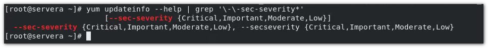

[TOC]

#  Chapter 14: 安装和更新软件包

**目标：**从红毛和Yum软件包存储库下载、安装、更新和管理软件包

- 注册系统到红帽账户，使用红帽订阅管理为其分配软件更新和支持服务的特权
- 说明如何以RPM 软件包形式提供软件，并使用Yum 和 RPM 调查系统上安装的软件包
- 使用 `yum`命令查找、 安装和更新软件包、
- 启用和禁用红帽或者第三方YUM 存储库
- 说明如何借助模块安装特定版本的软件，如何列出、启用和切换模块流，以及如何从模块安装和更新软件包。

### H3 - 注册系统以获得红帽支持

如果需要获取红帽的支持，除非是开发者账户，否则是需要付费以获得支持的， 系统本身是免费开源的。 

#### H4 - 红帽订阅管理（了解）

`subscription-manager` 命令用于管理订阅


- 用命令行订阅：

  ```bash
  subscription-manager register --username=USERNAME --password=PASSWORD
  ```

- 本地网页订阅：

  ```bash
  systemctl enable cockpit.socket --now
  ```

  浏览器访问：servera.lab.example.com:9090 --> Subscriptions --> Register：
  
  Activation Key ,  Orgnization

> (access.redhat.com/management/activaion_keys/ -->：
>
> 机构ID —— Orgnization
>
> foundation—— Activation Key

> 也可登录 127.0.0.1:9090 

**订阅之后又什么作用？**

订阅以后，可以使用红帽的yum 软件源，提供更新下载等服务，订阅之后，/etc/yum.repos.d/redhat.repo 中会有大量的订阅频道。 提供给我们在线搜索，下载软件包。 

> redhat.repo 这个是官方的订阅信息。该文件自己修改没有意义，yum命令执行，身份信息核对不通过，会直接重置该文件。

此外，红帽会针对系统，有一个线上的管理平台。 检测Bug， 错误， 自动分析系统指标。 记录日志。 

> access.redhat.com/management/

### H3 - RPM 软件包

> Linux 软件包主要分为两大阵营：
> Debian-based : *.deb，包管理dpkg。	：很多个体开发者，质量良莠不齐，但是可供下载的包非常多
> Redhat-based: *.rpm，包管理rpm。	：稳定，质量把控严格，完全开源，但是数量非常少

软件包和rpm ：


> Version: 	8.30-4 ----> 8: 主版本号，30：次版本号（奇数：开发版，偶数：正式版），4:是针对当前版本的修补次数，
> Release : el8 :红帽企业版 8 

实验环境中 ：content.example.com/rhel8.2/x86_64/dvd/BaseOS/Packages/ 和 content.example.com/rhel8.2/x86_64/dvd/AppStream/Packages/ 下有很多软件包


【拓】：<span style="color:red">`wget`</span> 命令，可以直接下载url指向的文件 ，用法 `wget url`

```bash
wget http://content.example.com/rhel8.2/x86_64/dvd/AppStream/Packages/ftp-0.17-78.el8.x86_64.rpm
```

 

### H3 - RPM 包管理器:star:

RPM: Redhat Package Manager, 可以实现包的安装，卸载，查询等

`rpm` 命令常用选项：

- `-q`: 查询/检验 <span style="color:red">已安装</span>的包

  ```bash
  #查验系统是否已经安装某个已知的软件包
  $ rpm -q ftp
  package ftp is not installed
  #弊端：必须要知道完整的包名
  ```

  - `-qa`: 列出所有<span style="color:red">已安装</span>的软件包

    ```bash
    $ rpm -qa
    # 结合 grep 查询
    $ rpm -qa | grep http #在所有包中查询http关键字 
    ```

  - `-qc`: 查询某个<span style="color:red">已安装</span>软件包的配置文件所在位置

    ```bash
    ⭐#查询的是已安装的包
    $ rpm -qc openssh-server
    /etc/ssh/sshd_config
    ...
    ```

  - `-qd` : 查询某<span style="color:red">已安装</span>包的文档所在位置

    ```bash
    $ rpm -qd openssh-server
    /usr/share/man/man5/sshd_config.5.gz
    ...
    ```

  - :star::star:`-qf` : 查询文件的包来源

    > Linux 中，一切皆文件，目录也是文件（目录文件）
    >
    > 如果不清楚某个文件是从哪里来的，可以通过 `-qf` 来查询

    ```bash
    $ rpm -qf /etc/redhat-release
    redhat-release-8.2-1.0.el8.x86_64 
    $ rpm -qf /etc/yum.repos.d
    redhat-release-8.2-1.0.el8.x86_64 
    ```

  - `-ql` : 列出包中所含有的文件：

    ```bash
    $ rpm -ql redhat-release-8.2-1.0.el8.x86_64 
    ...
    $ rpm -ql redhat-release-8.2-1.0.el8.x86_64 | grep redhat-release
    ```

    

  - `-qp` : package, 查询包信息

    ```bash
    $ rpm -qp ftp-0.17-78.el8.x86_64.rpm
    #ftp-0.17-78.el8.x86_64.rpm
    ```

    > 【补】：如果返回结果就是包名，说明，该包是安全的，认证过的。


- 安装和卸载相关选项

- :star:<span style="color:red">`-ivh`</span> : 安装且能够查看到安装过程，进度

  ```bash
  $ rpm -ivh ftp-0.17-78.el8.x86_64.rpm
  ...
  ```

- `-e` : 卸载

  ```bash
  $ rpm -e ftp
  ```

>  :warning: 软件安装的时候，包是携带有签名信息的， 用于认证该包没有被第三方篡改。 
>
>  实验环境中，安装软件时的公钥可以在 content.example.com/rhel8.2/86_64/dvd/RPM-GPG-KEY-xxxxxx
>
>  下载之后，导入公钥：`rpm --import 下载的公钥`,或者直接`rpm --import 公钥的url`直接在线导入。 只有在安装了厂家提供的公钥，并且安装包的认证信息能和公钥匹配，才能够正常安装。 
>
>  在安装软件的时候，可以先下载下来rpm包，然后 通过`rpm -ivh 包文件` 来安装，还可以通过`rpm -ivh 包的url地址`这种方式来安装。
>
>  这个地方应该不会考到，自己有时间可以了解一下。
>  【附属】/ 第十四章 安装和更新软件包_RPM包验证和数字证书.md
>
>  也可以手动关闭检查：vim  /etc/yum.repos.d/rhel.dvd.repo :
>
>  "gpgcheck" 属性都改为 false 或 0


:star:在使用RPM 包管理的时候，有一个很大的一个缺陷。  


就是当安装一个rpm包的时候，如果缺少依赖。 它只会提示你缺少依赖。 你要自己去手动找依赖。 所以我们需要<span style="color:red">在线的</span>安装工具。

> 考试环境是局域网epel源


### H3 - YUM:star:

具有在线**自动安装依赖**的包管理工具：

- Debian-based： apt / apt-get

- Redhat-based： yum  ，RHEL8.2 之后，叫做 dnf，（yum是dnf的软连接）

  > yum : Yellowdog Updata Modifier
  >
  > dnf : yum -> dnf

#### H4 - 查看软件仓库源 `yum repolist`


使用yum成功安装某个软件的前提条件之一，是这个软件仓库源中有待安装的包。 

#### H4 - 列举仓库中的软件

##### H5 - 列举全部包：`yum list`

如果不加然和参数，就会列举软件仓库中所有的软件。

`yum list`

##### H5 - 计数： `yum list  | wc -l`

【拓】：查看返回结果条数统计，可以使用 <span style="color:red">`wc -l`</span> 命令。

利用`wc -l` 可以查看当前指定的软件仓库中有多少个软件包：`yum list | wc -l`


##### H5 - 查看单一包：  `yum list package_name`


> 支持模式匹配


##### H5 - 查看系统中已经安装的包：`yum list installed`

如果不加参数，会列出所有已经安装的包，如果加参数会列出指定的包信息。

```bash
yum list installed insights*
```


#### H4 - 模糊搜索 `yum search [--all] <keywords>...`


这是一个使用频率较高的命令，软件包太多了，有的时候忘记了，或者只知道某个包的作用是什么，这个时候，就可以通过关键词，进行模糊搜索，搜索结果会根据关联度，由高到低排列。

- `yum search <keywords>` 命令会在包details范围内查找关键词

  ```bash
  yum search 'http'
  ```

- `yum search all <keywords>`命令的搜索范围更大，匹配的结果也会更多。

  ```bash
  yum search all 'http'
  ```

  

#### H4 - 查看包信息 ： `yum info package_name`


#### H4 - 追溯包来源 ： `yum provides 命令/路劲/文件`


> 打印结果中的，Repo : @System 的意思是，这个软件包属于System这个软件组。 我们可以以软件组的方式来安装一套软件，类似于office全家桶。

> :star: 注意，该命令非常强大，它不仅仅可以追溯系统中已经存在的文件，还可以追溯系统中不存在的文件， 可以通过这种方式，定位到需要安装什么包。
>
> 

#### H4 - 安装软件包 `yum install package_name`

无需关注包版本，依赖。 yum 会自动分析依赖，并自动关联下载。

```bash
yum install gcc [-y]
```


#### H4 - 卸载 `yum remove httpd`

卸载的时候，会自动卸载依赖：

```bash
yum remove gcc [-y]
```


#### H4 - 更新（升级）`yum update`

`yum update` 会直接更新有更新的包

`yum updateinfo` 可以先查看有没有更新信息

> :star:yum update 更新比较智能，不需要更换软件仓库，它会自动检查速度最快的源，然后去更新，amazing！！！ = _= |||

该命令返回结果中，会将可更新的包分类，RHSA(安全相关), RHBA（bug修复相关），其中又分为多个等级。 可以选择其中一部分更新。具体可以查看一下帮助：



```bash
$sudo yum updateinfo [--sec-serverity=Critical]
$sudo yum update --sec-serverity=Critical
```

#### H4 - 降级操作 `yum history,`yum history undo`

```bash
$ yum history undo xxx
```


#### H4 - 包组`yum group list `

有很多环境需要安装一套包，例如虚拟化环境KVM， 或者gnome桌面，都不是装一个包就完成了。 使用包组安装的方式，可以使得安装很方便。 

```bash
$ yum group list 
```


```bash
$ yum group install 'Virtualization Host'
```

#### H4 - ​ :star::star::star:: 配置并启用软件仓库

说明： 
默认RHEL8上有两个仓库(核心仓库)。

- BaseOS	  ：安装系统时必须的软件包。
- AppStream  ：应用流

> 应用流可以快速更新版本，且一个系统中可以允许存在多个不同的包版本。

yum是如何实现自动查找依赖的？
RPM 的本质时归档包，含有依赖描述信息repodata， 所以在知道仓库的地址之后，在配置仓库地址的时候，路径应该精确到和"repodata"同级。


##### H5 - 配置软件仓库

```bash
vim /etc/yum.repos.d/仓库名.repo
#仓库名是自定义的，但是要以repo结尾
```

```bash
vim /etc/yum.repos.d/rhel8-additional.repo
```

```1
[rhel-8-additionl-for-x86_64-baseos-rpm] #名字
name = 这是备注信息
enabled = 1 #是否启用该仓库，默认值为1
gpgcheck = 1 #默认开启。是否开启(GNU Privacy Guard)公钥检查，⭐如果该项启用，就一定要指定公钥地址
gpgkey =  uri	#可以是http/ftp/file 协议,⭐如果gpgcheck为0， 那么这个属性是不用写的
baseurl = 仓库地址 #
```

> :star:两个"gpgcheck" 属性，一个写布尔值，一个写公钥地址


所以如果开了gpgcheck，那么标准的仓库配置就是：


**精简写法：**


> enabled = 1 是默认的，所以可以省略
>
> 教师环境是局域网环境，仓库地址类似上面的示例，一般对局域网中的仓库地址是信任的，所以可以不开启gpg检查。因此gpgcheck 和 gpgkey 也就可以省略了。

##### H5 - 启用使生效软件仓库

```bash
yum clean all #清除缓存
yum repolist #列出所有仓库地址
yum repolist repo_name #查看某个仓库
```


##### H5 - `yum-config-manager`

除了手动修改新增并修改配置文件，还可以用过命令行工具来添加软件仓库： 

```bash
$ sudo yum-config-manager --add-repo="uri"
```

> :star: 这个命令非常方便，一条命令，但是缺点是，命令会以uri地址命令，比较长


### H3 - EPEL 源(仓库)

红帽有一个额外的源 ——EPEL 源

这个源，是由fedora维护的。有两万多个包，是一个拓展源。

### H3 - 管理软件包模块流

之前说了，红帽中的有两个核心仓库：

AppStream 和 BaseOS， 

#### H4 - 应用流（AppStream）和模块流（Module)


##### **1. 概念**:

BaseOS 中包含了基础的系统包，AppStream 中除了有单独的rpm包，还有一些被“圈定”起来的模块，这些模块中包含了一套可能多版本的包。

> 对于应用流和模块流，目前还不是特别理解，重点知道怎么用就行。后面有参考连接，有空可以多看看。着部分考试的时候不做重点，自己多做做练习会用个大概就行。

> 除了独立的RPM 包，应用流仓库AppStream 包含了modules（模块），一个模块，是一套rpm包，代表了 一个组件（component) ,并且是一起被安装，一个典型的模块包含了应用，以及依赖库，还有文档和帮助工具。 

##### **2. 为什么要用模块流？**

- 同时存在多个版本包，可以根据需要切换不同版本：

  ​	其实，模块流的概念有一点类似于 包组，都是打包安装一堆rpm包。 包含了各种依赖文件。 和包组有所区别的是，module stream (模块流) 中的包版本可以有多个，但是包组中只有一个。利用这个特点，可以在系统中通过module来安装不同的软件版本， 需要使用哪一个，就激活哪一个（但同时只能有一个激活）。

  

- 更新速度很快：

  ​	上游刚发布，就可以安装了。

##### **3. 引入：**

使用`yum list` 命令列出Kernel 和 httpd，可以发现httpd中多了 "module" 关键字


##### **4. 使用：**

对于模块，有专门的命令来管理`yum module`

##### **查看仓库中所有包含有模块的软件包，**

```bash
yum module list 
```

```bash
yum module list | less
```


##### **安装module**

```bash
#如果不加版本，就安装默认的版本
yum module install postgresql

#通过“:N”手动指定版本
yum module install postgresql:12
```

##### **版本切换**默认版本 `alternatives --config package_name`

实验：

RHEL8 自带3.6 版本python


现在通过`yum module install`安装2.7版本python，

```bash
#python比较特殊，版本是直接写在包名中的，所以不需要python:27 这样去指定
yum module install python27

#然后使用以下命令去交互式切换
alternatives --config python
```


##### **激活：enable**

##### 禁用：disable

##### 查看信息：info

##### 重置：reset

##### 升级：update

> 更多查看man或者help 文档

> [参考]
>
> https://www.thegeekdiary.com/beginners-guide-to-managing-package-module-streams-in-centos-rhel-8/
>
> https://access.redhat.com/documentation/en-us/red_hat_enterprise_linux/8/html/installing_managing_and_removing_user-space_components/introduction-to-modules_using-appstream
>
> https://access.redhat.com/documentation/en-us/red_hat_enterprise_linux/8/html/considerations_in_adopting_rhel_8/application-streams_considerations-in-adopting-rhel-8

----

## 第十四章总结

> https://www.bilibili.com/video/BV14741187FX?p=141

### 1. Linux 系统中软件包的安装方式

#### （一）二进制包

##### ① rpm 工具安装

- 首先，需要下载好的rpm包到本地
- 然后，直接使用rpm工具安装

##### ②yum/dnf 工具安装

- 首先，需要配置软件仓库
- 然后，使用yum工具安装

#### （二）源码包

##### ① 根据需求配置

​	功能的定制

##### ②编译

​	使用编译器编译成二进制的软件包

##### ③安装

​	将软件包安装到指定位置

##### ④源码包安装优点

1. 可以在任意平台上编译安装，编译出来的软件包非常适应所在机器
2. 可以在编译的时候，通过配置，对某些功能进行定制 ，开启或者关闭相应的功能

### 2. 二进制rpm如何让管理（重点）

#### （一） 如何获取rpm包

1. RedHat/Centos 光盘
2. 推荐网站
   - www.rpmfind.net
   - rpm.phone.net
3. 相应软件广泛网站

#### （二)如何选择合适的rpm包

1. 选择适合当前的版本号

   - 找不到合适的，才去尝试别的系统版本
   - 版本向前不向后兼容，例如el6兼容el5，但是反过来不兼容

2. 选择合适当前计算机cpu的架构

   - x86_64, 只能安装在64系统上
   - i386,i586,i686的软件包可以安装在32和64位系统
   - noarch 表示这个软件包与硬件架构无关，可以通用
   - 32位系统不能安装64位包

   **建议：**不要跨大版本号去安装软件包，尽量使用当前版本自带软件包安装

   #### （三）如何管理rpm包

   ##### 1）rpm 工具管理

   ①rpm工具安装rpm包

   ```bash
   rpm -ivh 软件包 
   #注意：软件包的名字必须写全xxx.rpm
   #例如：
   rpm -ivh ftp-0.17-78.el8.x86_64.rpm
   ```

   ②rpm工具卸载rpm包

   ```bash
   rpm -e 软件包名字
   #注意：卸载软件只需要跟软件包名字即可，不需要写全
   #例如
   rpm -e ftp
   ```

   ③rpm 工具升级rpm包

   ```bash
   rpm -Uvh 软件包
   #或者
   rpm -Fvh 软件包
   ```

   选项说明：

   `-v` ：输出详细信息
   `-h`：打印散列标记，一般和`-v`一起使用（安装进度）

   `-U`：升级软件包，如果该软件包没有安装，会自动帮你安装

   `-F`： 升级软件包，如果该软件包没有安装， 不会自动帮你安装

   ④查看rpm包相关信息

   ```bash
   rpm -ql package_name		#查看已经安装的软件的文件列表
   rpm -qlp package.rpm		#查看未安装的rpm包里的文件,⭐：需要加rpm后缀
   rpm -qa package_name		#查看所有已经安装的所有rpm包
   rpm -qd package_name		#查看已经安装软件的文档（doc）列表
   rpm -qc package_name		#查看已经安装软件的配置(config)文件
   rpm -qi package_name		#查看已经安装软件的详细信息
   rpm -qf package_name		#查看指定文件来自哪个rpm包
   ```

   ⑤rpm工具的其他安装选项

   ```bash
   --force		#表示强制
   rpm -ivh package.rpm --forece	#强制安装软件包⭐：需要加rpm后缀
   rpm -e package_name --force		#强制卸载
   
   --nodeps	#忽略依赖关系
   rpm -ivh package.rpm --nodeps	#忽略依赖关系安装
   rpm -e package_name --nodeps	#忽略依赖关系卸载
   ```

   **其他了解：**

   ```bash
   rpm --import key_file	#导入公钥用于检查rpm文件的签名
   rpm --checksig package.rpm #检查rpm包的签名
   ```

##### 2）yum（dnf）工具管理

**核心：**需要有一个软件仓库，软件仓库指的是用来存放**软件包**和**软件包之前的依赖关系**的地方，是C/S架构。

①**配置软件仓库：**

① -1 ：如果匹配本地仓库，先挂载，然后 vIm /etc/yum.repo.d/jayce_local.repo


① -2 ：如果配置远程仓库 （考试是局域网仓库），把file换成 http url就行 

```bash
#查看是否成功：
yum clean all	#清除yum缓存
yum makecache	#创建yum缓存
yum repolist	#列出所有仓库
```

> :star:需要注意的是，如果需要gpg检查开启，配置文件中应该含有：
>
> ```bash
> gpgcheck=1
> gpgkey= uri地址
> ```

② yum （dnf） 工具使用

- 安装软件包

  ```bash
  #单个包
  yum -y install package_name1 package_name2 ... #可以同时安装多个
  #包组
  yum -y install groupinstall "包组名"
  ```

- 卸载软件包

  ```bash
  yum -y remove 软件包
  yum -y groupremove "包组名"
  ```

- 升级rpm包

  ```bash
  yum update 软件包名
  ```

  


# Chapter 15 : 访问文件系统

**目标：**访问、检查和使用附加至Linux服务器的存储上的现有文件系统

- 说明块设备的意义，解释存储设备的文件名，并识别文件系统用于特定目录或者文件的存储设备。
- 通过将文件系统附加到文件系统层次结构中的目录来访问文件系统
- 通过`find`和`locate` 命令搜索已挂载文件系统上的文件

### 识别文件系统和设备

#### H4 - 文件系统类型

本地系统：

- ext4
- xfs
- vfat (虚拟格式)
- tmpfs，devtmpfs (临时文件系统)	挂载于/dev或者/run , 这些文件系统是系统启动之后才会存在。所以也称伪文件系统。不用关注。

ext4

xfs

此外：

- 光盘： iso9660 刻录使用的编码格式
- 网络设备文件NFS	： nfs
- Windows和Linux文件共享的SMB ： cifs
- ntfs  (windows上的，可以在linux上挂载，需要手动安装软件包ntfs-3g由epel软件源仓库提供。挂载类型也是ntfs-3g )
- exfat （红帽不支持，windows用于大文件存储的文件类型）


#### H4 - 硬件接口类型和系统识别命名

| 接口类型                                    | 系统识别命名                                                 |
| ------------------------------------------- | ------------------------------------------------------------ |
| SATA/SAS/USB                                | /dev/sd[a-z][1-9]                                            |
| NVMe                                        | /dev/nvme[1-X]                                               |
| 虚拟化接口KVM(Kernel-based Virtual Machine) | /dev/vd[a-z][1-9]                                            |
| 逻辑卷                                      | /dev/mapper/VOL_NAME-L_NAME 用户看到的是：/dev/VOL_NAME/L_NAME (VOL_NAME: 卷组的名字,L_NAME: 逻辑卷的名字) |

Windows和Linux文件共享的SMB ： cifs


#### H4 - 查看磁盘挂载设备命令

查看文件类型：`df`，`lsblk`

- `df` 命令可以查看<mark>已挂载</mark>块设备的挂载情况以及<span style="color:red">空间使用情况</span>。
  
  - `df` : 以字节为单位
  - `df -h`:  以1024 规则计算，人类可读
  - `df -H` ：以1000 规则计算，人类可读
- `df -TH` 或者 `df -h` <span style="color:red">展示文件系统类型</span>列（Type）
  

  
- `lsblk` 列出所有的或者指定的可用的块设备信息。(<mark>包括已经挂载和没有挂载的设备</mark>)（分区情况）

  - `lsblk -f` : 列出块设备分区情况且<span style="color:red">列出文件系统类型</span>

    返回信息字段说明

- `du [folder]` 查看当前目录或者指定目录占用空间大小

  - `du -sh` : 以人类可读的单位统计目录所占空间答大小 (`-s` : summarize,统计 ； `-h` : human readable)

    ```bash
    $ du -sh /etc
    ```

  - `du -h` : 列出所有子目录占用空间大小

- `blkid device_name` :<span style="color:red">列出设备信息，包括文件系统类型</span>

  ```bash
  $ blkid /dev/vda2
  ```

  

#### H4 - :star::star:访问设备文件

**什么是挂载**：将具有文件系统设备（一般是分区）和系统中某个目录（即**挂载点**）关联起来，这样的一个过程即称作挂载。

**自动挂载**：Linux下，仅在 具有图形化桌面系统 且 磁盘有可识别的文件系统，才会被自动挂载。


##### H5 - 创建分区 `fdisk`（分区管理工具）

一开始，你必须在存储设备上创建分区来容纳文件系统。 分区可以是整个硬盘，也可以是分硬盘。以容纳虚拟目录的一部分。

fdisk 工具用来帮助管理安装在系统上的任何存储设备上的分区。它是个交互式程序，逐步完成硬盘分区操作。

```bash
# fdisk /dev/sdx
```

如果是第一次给该存储设备分区，fdisk会警告你设备上没有分区表。


> 有两种主流的分区类型，实验环境，默认都是MBR类型
>
> - MBR : 适用于早期磁盘较小的分区 磁盘最大支持2TiB, 分区数量最多15个分区， **最大支持4个主分区（推荐将最后一个主分区划分为扩展分区**，扩展分区不占用磁盘空间，相当于一个符号），可以再扩展分区中去划分**逻辑分区**， 主分区 + 扩展分区的  + 逻辑分区  一共15个分区。
> - GPT : 最大支持 8ZiB （TB->PB->EB->ZB）,最多支持128（2^7）个分区,  
>


**`fdisk` 命令**

| 命令           | 描述                                |
| -------------- | ----------------------------------- |
| a              | 设置活动分区标志                    |
| b              | 编辑BSD Unix系统用的磁盘标签        |
| c              | 设置DOS兼容标志                     |
| d              | 删除分区                            |
| <mark>l</mark> | <mark>显示可用的分区类型</mark>     |
| <mark>m</mark> | <mark>显示命令选项</mark>           |
| <mark>n</mark> | <mark>添加一个新分区</mark>         |
| o              | 创建DOS分区表                       |
| <mark>p</mark> | <mark>显示当前分区表详细信息</mark> |
| q              | 退出，保存更改                      |
| s              | 为Sun Unix系统创建一个新磁盘标签    |
| t              | 修改分区的系统ID                    |
| u              | 改变使用的存储单位                  |
| v              | 验证分区表                          |
| w              | 将分区表写入磁盘                    |
| x              | 高级功能                            |

> :warning: 特别注意，如果要删除分区，存在两种情况，
>
> - 只有一个分区
>
>   当只有一个分区的时候，删除分区只需要 `fdisk /dev/sdbx`然后输入`d`。
>
> - 有多个分区
>
>   当有多个分区的时候，删除分区需要`fdisk /dev/sdbx`，然后选择分区，最后输入`d`
>
> :star:在对分区执行操作的时候，要知道一点就是，就是 fdisk是磁盘的分区管理工具，操作的直接对象是磁盘，并不是分区，所以以下操作是错误的：
>
> ```bash
> fdisk /dev/sdb/sdb1 -> d
> #或者
> fdisk /dev/sdb1	-> d
> ```


##### H5 - 创建文件系统

###### **格式化 `指定的格式化工具 设备路径`**

在将数据存储到分区之前，你必须 用某种文件系统对其进行格式化。这样Linux才能开始使用它。

每种文件系统类型都用自己的命令程序来格式化分区。 以下是不同文件系统所对应的工具。

| 工具                                     | 用途                                                     |
| ---------------------------------------- | -------------------------------------------------------- |
| mkefs                                    | 创建一个ext文件系统                                      |
| mke2fs                                   | 创建一个ext2文件系统                                     |
| mkfs.ext3                                | 创建一个ext3文件系统                                     |
| <span style="color:red">mkfs.ext4</span> | <span style="color:red">创建一个ext4文件系统</span>      |
| mkreiserfs                               | 创建一个ReiserFS文件系统                                 |
| jfs_mkfs                                 | 创建一个JFS文件系统                                      |
| <span style="color:red">mkfs.xfs</span>  | <span style="color:red">创建一个XFS文件系统</span>       |
| mkfs.zfs                                 | 创建一个ZFS文件系统                                      |
| mkfs.btrfs                               | 创建一个Btrfs文件系统                                    |
| <span style="color:red">mkfs.vfat</span> | <span style="color:red">创建一个mkfs.vfat文件系统</span> |

并非所有文件系统工具都已经默认安装了。 如果需要知道某文件系统工具是否可用，可以使用`type` 命令

```bash
[root@localhost dev]# type mkfs.ext4
mkfs.ext4 is /usr/sbin/mkfs.ext4
[root@localhost dev]# type mkfs.btrfs
-bash: type: mkfs.btrfs: not found
```

而每一个文件系统命令都有很多命令行选项，可以查看对应的man手册。

但是所有的文件系统命令都允许通过不带任何选项的简单命令来创建一个默认的文件系统。

```bash
sudo mkfs.ext4 /dev/sdb1
```


###### 挂载: `mount`

在为分区创建了文件系统之后，下一步是将它们挂在到虚拟目录下的某个挂载点，这样就可以将数据存储在新文件系统中了。

你可以将新的文件系统挂载到虚拟目录中需要额外空间的任何位置。

```bash
# mount [-t FS_TYPE] DEVICE MOUNTPOINT
DEVICE: NAME/LABEL/UUID
#使用UUID是最合适的，格式化之后，UUID是设备唯一的，即便是拔出磁盘出入到别的系统，uuid也不会改变，但是其他的会改变。
# 在使用NAME 挂载的时候
mount /dev/sdb1 /mnt/mymountpoint1
# 在使用LABEL 或者 UUID 的时候，要指明
mount LABEL=XXXXX /mnt/mymountpoint1
mount UUID=XXXXX /mnt/mymountpoint1
```

```bash
# mount /dev/vdb1 /mnt
```

常用选项：
defaults
ro 只读
noexec 不执行

```bash
#以只读权限挂载
# mount -o ro /dev/vdb1 /mnt 
```

> :warning: 特别注意，不要将多个磁盘挂载到同一个挂载点，如果挂载不会报错，但是，卸载的时候要按照逆挂载顺序卸载。 即先后挂载了A,B 设备到同一个挂载点，但是在卸载的时候应该先卸载B ，再卸载A。 否则会提示正在占用。


```bash
$ ls /mnt
$
$ sudo mkdir /mnt/my_partition
$
$ ls -al /mnt/my_partition/
$
$ ls -dF /mnt/my_partition
/mnt/my_partition/
$
$ sudo mount -t ext4 /dev/sdb1
$
$ ls -al /mnt/my_partition/
total 24
drwxr-xr-x. 3 root root 4096 Jun
drwxr-xr-x. 3 root root 4096 Jun
drwx------. 2 root root 16384 Jun
$
```

mkdir命令在虚拟目录中创建了挂载点，mount命令将新的硬盘分区添加到挂载点。 mount命令的`-t`选项指明了要挂载的文件系统类型（ext4）。现在你可以在新分区中保存新文件和目录了。

> 这种挂载文件系统的方法只能临时挂载文件系统。当重启Linux系统的时候，文件系统并不会自动挂载。<span style="color:red">**要强制Linux在启动时自动挂载新的文件系统，可以 将其添加到/etc/fstab文件。**</span>

> :warning: 一同的格式化工具选项可能存在差异，如果需要给磁盘格式化一个<mark>标签</mark>，通常，需要加一个 `-F ` 选项，在使用的时候，可以查看` --help` 
>
> 


###### **卸载： `umount`**

```bash
# umount DEVICE/MOUNTPOINT
```


###### **查看指定设备的访问情况：`lsof`**

有时候如果一个磁盘在被访问的时候，是不允许操作的，会提示 “target is budy” ，这时候，可以使用`lsof DEVICE` 命令来查看设备的访问状态：

```bash
lsof /mnt
```

如果不加任何参数，会返回所有设备的占用情况

```bash
lsof
```


### :star::star:查找系统中的文件

- `whereis` ： 检索命令，以及相关的文档所在的位置
- `which ` : 查看命令所在位置
- `whatis` : 查看命令的简单描述。以及在man手册中的章节
- `locate` ：查找文件所在位置
- <span style="color:red">`find` : 可以根据条件，将系统中所有符合条件的文件列出</span>


#### H4 - `whereis`

```bash
jayce@DESKTOP-JASQLDM:~$ whereis pwd
pwd: /usr/bin/pwd /usr/share/man/man1/pwd.1.gz
```

#### H4 - `which`

```bash
jayce@DESKTOP-JASQLDM:~$ which pwd
/usr/bin/pwd
```

#### H4 - `whatis`

```bash
jayce@DESKTOP-JASQLDM:~$ whatis pwd
pwd (1)              - print name of current/working directory
```

#### H4 - `locate`


locate 用于查找本地文件，执行该命令时，将会去查找本地文件索引数据库 /var/lib/mlocate/mlocate.db 这个文件。 

可以通过`updatedb` 这个命令去手动更新数据库，否则，将会通过每天定时任务去执行更新mlocate.db，更新任务脚本在/etc/cron.daily/mlocate

#### :star::star:H4 - `find`

`find [/path] 条件 [-exec SHELL_CMD {} \;]` 

> 如果不加路径，就会在当前目录下查找文件，如果要实现高级查找，就需要执行shell命令

`find` 命令是一个非常常用的命令，他会匹配到系统中所有的符合查找规则的文件

例如：查找系统中和某用户有关的所有文件

```bash
find / -user jayce
find / -user root
# / 是指定目录，系统中的所有那就是从根目录下开始查找，所以是 /
```

<span style="color:red">:star::star:**高级查找**</span> (<span style="color:red">**必考**</span>)

`-exec SHELL_CMD {} \;` 是一个整体， 根据条件查找出匹配项，然后通过shell命令对匹配结果操作然后将执行结果输出到 {} 。      `\; ` 是终止符，命令到这里就执行结束。 

示例：

```bash
find /home -user student 2> /dev/null -exec cp -rp {} /mnt \;
#匹配 /home目录下和student有关的所有文件，丢弃标准错误，然后将输出结果复制到 /mnt 目录下
```

> :star: @jayce 有两个点很重要：
>
> - 思路很重要，高级查找，的顺序：<span style="color:red"> 1.查找   ---> 2.对查找的输出进行操作 （中间查找的结果放到 {} 用于shell操作）。</span>
> - 有一个固定的格式一定要记住，否则写不出来的： <span style="color:red">`-exec SHELL_CMD {} \;`</span>


> `find ` 命令非常强大，有很多的选项。要把所有的过滤条件过一遍。
> 比较常用的有：
>
> - `-atime`
> - `-name`
> - `-user`
> - `-perm`


# Chapter16 : 分析服务器和获取支持

**目标：**在基于Web的管理界面中调查和解决问题，并从红帽获取支持以帮助解决问题

- 激活Web控制台管理界面，以远程管理和监控红帽企业Linux服务器的性能。
- 描述可通过红帽门户网站使用的重要资源，并在红帽文档和知识库中查找信息
- 分析服务器问题，修复或者解决问题，以及使用红帽只能分析工具（Red Hat Insights) 确认解决方案。

> 本章节重点在使用Web控制台管理，获取红帽帮助仅作了解


激活web控制台使用以下命令：

```bash
sudo systemctl enable --now cockpit.socket #默认侦听9090端口
```

查看服务的运行状态：

```bash
sudo systemctl status cockpit.socket
```

开启以后通过通过浏览器访问：

workstation.lab.example.com:9090

127.0.0.1:9090

> cockpit 直译为飞机驾驶舱，是一个开软的软件。所有发行版中都可以使用。


这个web控制台能完成很多的操作，不便于描述，自己登进去多点点就知道了。


额外的一些说明：

生成系统报告，通过命令行实现，的命令是 `sosreport`

```bash
sosreport
```

通过命令行生成的报告放置于 /var/tmp


**红帽门户网站**

access.redhat.com 

可以在这里搜索知识库


官方提供了很多的文档，入口在页面底部：


**红帽智能分析工具 insights**

该工具需要订阅才能够使用，因此只有红帽能用。在cloud.redhat.com -> Dashboard 。

在Subscription中可以看到 “connected to insights”。

前提是要安装insights-client 程序，可以使用以下命令检查系统中是否已经安装该包：

```bash
yum list installed insights*
```


