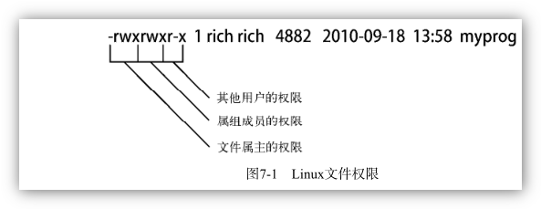

[TOC]

### 7.1 Linux的安全性

用户权限是通过创建用户时分配的用户ID （User ID ，UID）来跟踪的。 UID 时数值，每个用户都有唯一的UID。

#### 7.1.1 /etc/passwd 文件

Linux 系统使用了一个专门的文件来讲用户的登录名匹配到对应的UID值。 这个文件就是 /etc/passwd ，它包含了一些于用户有关的信息。


**UID**

Linux系统中，有三类用户，分别是：普通用户、根用户、系统用户

Linux采用了32位整数跟用户分配不同的id，即userid，也就是 UID。 这意味着，理论上一个计算机系统最多默认支持了40亿个不同用户。

<u>通常</u>普通用户的UID 大于500，因此默认的，在添加普通用户时，系统默认用户ID从500开始编号。

根用户，即root用户，在<u>Redhat系列系统下</u>，用户的ID范围时1 ~ 499。root 用户就是一个Linux操作系统中上帝一样的存在，能删一切（by@jayce）。

系统用户是指，系统运行时必须有的用户，但是并不是真实的使用者。例如apache，mysql相关服务，就需要使用系统用户apache和mysql。 

> 下文中有讲到shadow文件，可以cat /usr/shadow 就会发现除了注册过的用户和root，还有很多用户，很多以news，mail等服务命令的用户，这些用户都是系统用户。


```bash
jayce@DESKTOP-JASQLDM:~$ cat /etc/passwd
root:x:0:0:root:/root:/bin/bash
daemon:x:1:1:daemon:/usr/sbin:/usr/sbin/nologin
bin:x:2:2:bin:/bin:/usr/sbin/nologin
sys:x:3:3:sys:/dev:/usr/sbin/nologin
sync:x:4:65534:sync:/bin:/bin/sync
games:x:5:60:games:/usr/games:/usr/sbin/nologin
man:x:6:12:man:/var/cache/man:/usr/sbin/nologin
lp:x:7:7:lp:/var/spool/lpd:/usr/sbin/nologin
.
.
.
```


**GID**

GID，即Group ID ，用户组id。

UID 和 GID 是什么关系？ 是从属关系，Linux下，每个用户至少属于有一个组。


确定用户id 使用 `id` 命令

```bash
$id #显示当前用户的id相关信息
$id username #显示某用户的id信息
```

确定某用户所属的用户组，使用 `groups` 命令

```bash
$groups #显示当前用户所属用户组
$groups username #显示某用户所属用户组
```

查看当前用户名，可以使用 `whoami` 命令

查询当前在线用户，可以使用 `who` 命令

 > :warning:一个系统中，不能存在重复的username，也就是用户名不能重复，但是，多个用户名可能共用一个UID !!! 


#### 7.1.2 用户名和密码 /etc/passwd 和 /etc/shadow

系统用来记录用户名、密码最重要的两个文件就是/etc/passwd 和 /etc/shadow 

**passwd和shadow什么关系？**

最早在UNIX系统中用于记录密码的文件就是passwd（第2列的x），但是有一个问题：每个用户都需要有读取这个文件的权限，随着现代密码破解技术的发展，即便是加密的密码，也有被破解的可能。所以将密码从这个文件中剥离出去是非常必要的。
目前Linux的做法是将密码相关的信息保存在 /etc/shadow 中。而默认，只有root用户才有读取权限。其他人完全没有读取这个文件的可能。这种保存密码的方式，被称之为“影子密码”。

**/etc/passwd 内容格式说明**

| 列数 | 含义      | 说明                                                         |
| ---- | --------- | ------------------------------------------------------------ |
| 1    | 用户名    | 是UID的字符串标记方式，方便阅读                              |
| 2    | 密码      | 在旧的UNIX系统中，该字段使用户加密之后的密码，现在已经不再使用，而是将密码放在 etc/shadow 中，所以此处都只是一个字母 x |
| 3    | UID       | 系统用来区分不同用户的整数                                   |
| 4    | GID       | 系统用来区分不同用户组的整数                                 |
| 5    | 说明栏    | 类似于“注释”，现在已经不再使用                               |
| 6    | 家目录    | 用户登录之后，所在的目录，即用户的家目录                     |
| 7    | 登录Shell | 用户登录之后，所使用的Shell                                  |

**/etc/shadow 内容格式说明**

| 列数 | 含义                     | 说明                                                         |
| ---- | ------------------------ | ------------------------------------------------------------ |
| 1    | 用户名                   | 是UID的字符串标记方式，方便阅读                              |
| 2    | 密码                     | 经过加密之后的密码                                           |
| 3    | 密码的最近修改日期       | 这个数组是从 1970 年 1 月 1 日至密码修改日的天数             |
| 4    | 密码不可修改的天数       | 修改密码之后，几天内不可修改密码，如果是0，则随时可以修改    |
| 5    | 密码重新修改的天数       | 考虑到密码使用一段时间后可能会泄露，可以设置一个修改时间，在密码到期之前，系统就会提醒用户修改密码。一般默认99999可以认为是永久 |
| 6    | 密码失效前提前警告的天数 | 设定密码到期前几天内开始提醒用户修改密码                     |
| 7    | 密码失效宽限天数         | 如果密码到期，过了几天之后将会失效，无法登录系统             |
| 8    | 密码失效日期             | 一般为空                                                     |
| 9    | 保留字段                 | 暂时没有使用                                                 |


#### 7.1.3 添加新用户 `useradd`

`useradd` 命令，用于向Linux系统添加新的用户。 

`useradd ` 使用系统的默认值以及命令行参数来设置用户账户。

系统默认值被设置在 /etc/default/useradd 文件中。 可以使用 `useradd -D` 查看所用Linux系统中的这些默认值：

```bash
jayce@DESKTOP-JASQLDM:~$ useradd -D
GROUP=100
HOME=/home
INACTIVE=-1
EXPIRE=
SHELL=/bin/sh
SKEL=/etc/skel
CREATE_MAIL_SPOOL=no
```


> 本章节部分内容摘录自：《Linux系统命令及Shell脚本实践指南》


在创建新用户的时候，如果你不在命令行中指定具体的值，`useradd` 命令就会使用 `-D`选项所显示的那些默认值。也就是：

- 新用户会被添加到GID为100的公共组；

- 新用户的HOME目录将会位于 /home/loginname;

- 新用户账户密码在过期之后不会被禁用；

- 新用户账未被设置过日期；

- 新用户账户将sh shell 作为默认shell；（sh 指向的是dash）

  - ```bash
    root@DESKTOP-JASQLDM:/bin# ls -la sh
    lrwxrwxrwx 1 root root 4 Aug  5 05:39 sh -> dash
    ```

- 系统会将 /etc/skel 目录下的内容赋值到用户的HOME目录下；

- 系统不会为该用户账户在mail目录下创建一个用于接受邮件的文件。

> 因为发行版本的不同这些都可能不同

倒数第二个值，useradd命令允许管理员创建一份默认的HOME目录配置，然后作为新用户创建的家目录模板。

```bash
jayce@DESKTOP-JASQLDM:/bin$ ls -lah /etc/skel
total 20K
drwxr-xr-x  2 root root 4.0K Aug  5 05:40 .
drwxr-xr-x 92 root root 4.0K Oct  8 07:21 ..
-rw-r--r--  1 root root  220 Feb 25  2020 .bash_logout
-rw-r--r--  1 root root 3.7K Feb 25  2020 .bashrc
-rw-r--r--  1 root root  807 Feb 25  2020 .profile
```

第六章说过了， 这些文件，是bash shell 环境的标准启动文件。 

```bash
##测试，使用默认参数创建一个新用户账户，检查HOME目录
root@DESKTOP-JASQLDM:~# useradd -m test
root@DESKTOP-JASQLDM:~# ls -lah /home/test
total 20K
drwxr-xr-x 2 test test 4.0K Oct 10 07:39 .
drwxr-xr-x 5 root root 4.0K Oct 10 07:39 ..
-rw-r--r-- 1 test test  220 Feb 25  2020 .bash_logout
-rw-r--r-- 1 test test 3.7K Feb 25  2020 .bashrc
-rw-r--r-- 1 test test  807 Feb 25  2020 .profile
root@DESKTOP-JASQLDM:~#
```

> useradd -m 选项，是“创建用户家目录”。 

| 参数             | 描述                                                         |
| :--------------- | :----------------------------------------------------------- |
| -c comment       | 给新用户添加备注                                             |
| -d home_dir      | 为主目录指定一个名字（如果不指定，就会和登录名一致）         |
| -e expire_date   | 用YYYY-MM-DD格式指定一个账户过期的日期                       |
| -f inactive_days | 指定这个账户密码过期后多少天这个账户被禁用；0表示密码一过期就立即禁用，1表示禁用这个功能 |
| -g initial_group | 指定用户登录组的GID或者组名                                  |
| -G group ...     | 指定用户除了登陆组之外所属的一个或者多个附加组               |
| -k               | 必须和-m一起使用，将/etc/skel目录的内容复制到用户的HOME目录  |
| -m               | 创建用户的HOME目录                                           |
| -M               | 不创建用户的HOME目录（当默认设置里要求创建时，才会使用这个选项） |
| -n               | 创建一个与用户登录名同名的新组                               |
| -r               | 创建系统账户                                                 |
| -p passwd        | 为用户账户指定默认密码                                       |
| -s shell         | 指定默认的登录shell                                          |
| -u uid           | 对账户指定唯一的UID                                          |

> 在创建新用户的时候，使用命令行参数可以更改系统指定的默认值。但是如果总是需要修改某个值的话，最好还是修改一下系统的默认值配置

可以在 `-D` 选项后跟上一个指定的值，来修改系统默认的新用户设置。

| 参数               | 描述                                         |
| ------------------ | -------------------------------------------- |
| -b default_home    | 更改默认的创建用户HOME目录的位置             |
| -e expiration_date | 更改默认的新账户的过期日期                   |
| -f inactive        | 更改默认的新用户从密码过期到账户被禁用的天数 |
| -g group           | 更改默认的组名称或者GID                      |
| -s shell           | 更改默认的登录shell                          |

```bash
##示例修改新用户默认的登录shell
root@DESKTOP-JASQLDM:/bin# useradd -D -s /bin/bash
root@DESKTOP-JASQLDM:/bin# useradd -D
GROUP=100
HOME=/home
INACTIVE=-1
EXPIRE=
SHELL=/bin/bash
SKEL=/etc/skel
CREATE_MAIL_SPOOL=no
```


#### 7.1.4 删除用户 `userdel`

`usesdel` 命令用于从系统中删除用户，但是，默认情况下，保险起见，`userdel`命令只会删除/etc/passwd 文件中的用户信息， 而不会删除系统中属于该账户的任何文件。
如果，加上 `-r ` 参数， `userdel` 命令会删除用户的HOME目录以及邮件目录。 然而，系统上仍然可能存在已删除用户的其他文件。 这在有些环境中会造成问题。

```bash
##用户删除示例
root@DESKTOP-JASQLDM:/bin# userdel -r test
userdel: test mail spool (/var/mail/test) not found
root@DESKTOP-JASQLDM:/bin# ls -al /home/test
ls: cannot access '/home/test': No such file or directory
```


#### 7.1.5 修改用户

Linux提供了一些不同的工具来修改已经有用户账户的信息。

| 命令     | 描述                                                     |
| -------- | -------------------------------------------------------- |
| usermod  | 修改用户账户的字段，还可以指定主要组以及附加组的所属关系 |
| passwd   | 修改已有用户的密码                                       |
| chpasswd | 从文件中读取登录名密码对，并更新密码                     |
| chage    | 修改密码的过期日期                                       |
| chfn     | 修改用户账户的备注信息                                   |
| chsh     | 修改用户账户的默认登录shell                              |


##### 1. usermod

该命令是用户账户修改工具中最强大的一个。 更用于修改 /etc/passwd文件中的大部分字段，著需要与想修改的字段对应的命令行参数就可以了。 参数大部分和`useradd` 命令的参数一样（`-c` 修改备注、`-e` 修改过期日期，更多见手册）。 

此外，该命令还有一些可能派上用场的选项

- `-l` 修改用户账户的登录名。

- `-L`锁定账户，使用户无法登录

- `-p` 修改账户的密码

- `-U` 解除锁定，使用户能够登录。

  > `-L`、`-U` 选项是比较常用的选项

##### 2. passwd 和 chpasswd

Linux系统上的任何用户都能改自己的密码。但是，只有root用户才有权限改别人的密码。

```bash
passwd username
```

> `-e` 选项能强制用户下次登录的时候，修改密码。 可以先给用户设置一个简单的默认密码。然后用户自己下次登录的时候，就会被强制要求修改密码。

为系统中大量的用户修改密码，`chpasswd` 命令可以事半功倍。 

`chpasswd` 命令能从标准输入自动读取登录名和密码对（由冒号分割）列表。给密码加密，然后为用户账户设置。 你也可以用重定向命令来将含有userid:passwd 对的文件重定向给该命令。

```bash
chapasswd < users.txt
```


##### 3. chsh、chfn  和 chage

这三个工具专门用来修改特定的账户信息。 

**`chsh` 命令**用于快速修改默认的用户登录shell。 使用时，必须用shell的全路径作为参数，不能只用shell名。 

```bash
chsh -s /bin/csh username
```


**`chfn` 命令**提供了在 /etc/passwd 文件的备注字段中存储信息的标准方法。 chfn 命令会  将用于 Unix 的finger命令的信息存进备注字段。 finger 命令可以非常方便的查看Linux 系统上的用户信息。

```bash
 finger username
```

> :notebook: 处于安全性的考虑，很多Linux系统管理员会在系统上禁用finger命令， 不少发行版甚至都没有默认安装该命令。可以直接查看 /etc/passwd 文件即可。

如果在使用`chfn` 命令的时候，没有参数，他会引导你输入默认的备注字段。

```bash
root@DESKTOP-JASQLDM:~# tail -n 1 /etc/passwd
jayce:x:1000:1000:,,,:/home/jayce:/bin/bash
root@DESKTOP-JASQLDM:~# chfn jayce
Changing the user information for jayce
Enter the new value, or press ENTER for the default
        Full Name []: SunZhongyi
        Room Number []: -
        Work Phone []: 13407135362
        Home Phone []: -
        Other []: -
root@DESKTOP-JASQLDM:~# tail -n 1 /etc/passwd
jayce:x:1000:1000:SunZhongyi,-,13407135362,-,-:/home/jayce:/bin/bash
```

**`chage` 命令** 用来帮助管理用户账户的有效期。

| 参数 | 描述                               |
| ---- | ---------------------------------- |
| -d   | 设置上次修改密码到现在的天数       |
| -E   | 设置密码过期的日期                 |
| -I   | 设置密码过期到锁定账户的天数       |
| -m   | 设置修改密码之间最少要多少天       |
| -W   | 设置密码过期前多久开始出现提醒信息 |

> 该命令的时间日期值的指定可以有两种任意格式：
>
> - YYYY-MM-DD
> - 1970/01-01 到既定日期的天数

chage命令中，有个好用的功能就是可以设定账户的过期日期。 也就是可以是定临时的用户，不需要记住删除用户了。


### 7.2 使用Linux 用户组

组的概念 ，使得所有组员用了这个特定组的共同权限。 

> 不同的发行版，在处理组的成员关系的时候，略有差异。 有些发行版会创建一个组，把所有的用户都当作这个组的成员。 这种情况要特别小心，因为文件很有可能对其他用户也是可读的。 有些发行版会为每个用户创建单独的一个组， 这样可以更安全 。

每个组都有唯一ID ——GID， 还有一个唯一的组名。


#### 7.2.1 /etc/group 文件

与用户账户类似，组信息也保存在系统的一个文件中。 /etc/group 文件包含系统上用到的每个组的信息。 

```bash
root@DESKTOP-JASQLDM:~# head /etc/group
root:x:0:
daemon:x:1:
bin:x:2:
sys:x:3:
adm:x:4:syslog,jayce
tty:x:5:
disk:x:6:
lp:x:7:
mail:x:8:
news:x:9:
```

和UID一样，GID 在分配的时候也采用了特定的格式。 系统账户用的组通常会 分配低于500 的GID 值，而用户组的 GID 则会从500 开始分配。  /etc/group 文件有四个字段：

- 组名
- 组密码
- GID
- 属于该组的用户列表（用逗号隔开）

> 组密码允许非组内成员通过它临时成为该组成员，功能并不普遍，但存在。 

> :warning: 千万不能通过直接修改 /etc/group 文件来添加用户到一个组。 要用 `usermod` 命令。

> 说明 用户账户列表某种意义上有些误导人。你会发现，在列表中，有些组并没有列出用户。这并不是说这些组没有成员。当一个用户在/etc/passwd文件中指定某个组作为默认组时，用户账户不会作为该组成员再出现在/etc/group文件中。多年以来，被这个问题难倒的系统管理员可不是一两个呢。

#### 7.2.2 创建新组

`groupadd` 命令用于在系统上创建新组。 

```bash
root@DESKTOP-JASQLDM:~# groupadd test_group
root@DESKTOP-JASQLDM:~# tail -n 1 /etc/group
test_group:x:1001:
```

**添加用户到组**

在创建新的组是，默认没有用户被分配到该组。 `groupadd` 命令没有提供将用户添加到组中的选项，但是可以用`usermod ` 命令来弥补这一点。

```bash
root@DESKTOP-JASQLDM:~# usermod -G test_group jayce
root@DESKTOP-JASQLDM:~# tail -n 1 /etc/group
test_group:x:1001:jayce

root@DESKTOP-JASQLDM:~# id jayce
uid=1000(jayce) gid=1000(jayce) groups=1000(jayce),1001(test_group)
```

> 如果更改了已登录系统账户所属的用户组，该用户必须登出系统后再登录，组关系的更改才能生效。

> :warning: 为用户账号分配组时要格外小心， 如果加了 `-g` 选项， 指定的组名会替换掉改账户的默认组。 `-G` 选项则将该组添加到用户的属组的列表里，不会影响到默认组。
>
> 更普遍的是同时使用 -G -a 的选项，意思是把某用户附加到某组


#### 7.2.3 修改组

在 /etc/group 文件中，可以看到，需要修改的组信息并不多， `groupmod` 命令可以修改已有组的 GID （加 -g 选项），或者组名 （加` -n ` 选项）。

```bash
root@DESKTOP-JASQLDM:~# tail -n 1 /etc/group
test_group:x:1001:jayce
root@DESKTOP-JASQLDM:~# groupmod -n test_group_changed test_group
root@DESKTOP-JASQLDM:~# tail -n 1 /etc/group
test_group_changed:x:1001:jayce
```

```bash
groupmod -[option] new_value old_value
```


> 所有的安全权限都是基于GID 的，你可以随意的改变组名而不会影响到文件的安全性。


### 7.3 理解文件权限

```bash
jayce@DESKTOP-JASQLDM:/dev$ ls -la
total 4
drwxr-xr-x  8 root root     2740 Oct  8 07:21 .
drwxr-xr-x 19 root root     4096 Oct  8 07:21 ..
crw-r--r--  1 root root  10, 235 Oct  8 07:21 autofs
drwxr-xr-x  2 root root       40 Oct  8 07:21 block
drwxr-xr-x  2 root root       60 Oct  8 07:21 bsg
crw-------  1 root root  10, 234 Oct  8 07:21 btrfs-control
crw-------  1 root root   5,   1 Oct  8 07:21 console
crw-------  1 root root  10,  62 Oct  8 07:21 cpu_dma_latency
crw-------  1 root root  10, 203 Oct  8 07:21 cuse
lrwxrwxrwx  1 root root       13 Oct  8 07:21 fd -> /proc/self/fd
crw-rw-rw-  1 root root   1,   7 Oct  8 07:21 full
crw-rw-rw-  1 root root  10, 229 Oct  8 07:21 fuse
crw-r--r--  1 root root   1,  11 Oct  8 07:21 kmsg
crw-------  1 root root  10, 237 Oct  8 07:21 loop-control
brw-------  1 root root   7,   0 Oct  8 07:21 loop0
brw-------  1 root root   7,   1 Oct  8 07:21 loop1
brw-------  1 root root   7,   2 Oct  8 07:21 loop2
brw-------  1 root root   7,   3 Oct  8 07:21 loop3
brw-------  1 root root   7,   4 Oct  8 07:21 loop4
```

**输出结果的第一个字段，就是描述文件和目录权限的编码。 这个字段的第一个字符代表了对象的类型：**

- `-`代表了文件
- `d`代表了目录
- `l`代表了链接
- `c`代表字符型设备
- `b`代表块设备
- `n`代表网络设备

**之后，有3组三字符的编码，每一组定义了3种访问权限：**

- `r`代表对象是可读的
- `w`代表对象是可写的
- `x`代表对象是可执行的

**若没有某种权限，在该权限位会出现单破折线。 这3组权限分别对应对象的3个安全级别：**

- 对象的属主
- 对象的属组
- 系统其他用户




#### 7.3.2 默认文件权限 umask

这些文件的权限从何而来？  ——`umask` ，`umask` 命令用来设置所创建文件和目录的默认权限。 


```bash
jayce@DESKTOP-JASQLDM:~/test$ touch newfile
jayce@DESKTOP-JASQLDM:~/test$ ls -la newfile
-rw-rw-r-- 1 jayce jayce 0 Oct 10 10:32 newfile
```

`touch` 命令用分配给我的用户的默认权限创建了这文件。 `umask` 命令可以显示和设置这个默认的权限。 

```bash
jayce@DESKTOP-JASQLDM:~/test$ umask
0002
```

`umaks` 命令。工作原理稍有复杂。 

这四位值种，首位，代表的是一项特别的安全特性， 叫做黏着位（sticky bit) 。

而后面的三位是表示文件或者目录对应的 umask 八进制值。 

如果要理解 umask 是怎么工作的，得先理解八进制模式的安全性设置。 


<mark>八进制模式的安全性设置先获取这3个 `rwx` 权限的值，然后将其转换成 3位二进制值，用一个 八进制来表示。</mark>


在这个二进制表示中，每个位置，代表了一个二进制位。 因此，如果读权限是唯一置位的权限，权限值就是 `r--`，转换成二进制就是 `100` ，代表的八进制值就是 4。


**可能会遇到的组合**

| 权限  | 二进制值 | 八进制值 |       描述       |
| :---: | :------: | :------: | :--------------: |
| `---` |   000    |    0     |   没有任何权限   |
| `--x` |   001    |    1     |   只有执行权限   |
| `-w-` |   010    |    2     |   只有写入权限   |
| `-wx` |   011    |    3     | 有写入和执行权限 |
| `r--` |   100    |    4     |   只有读取权限   |
| `r-x` |   101    |    5     | 有读取和执行权限 |
| `rw-` |   110    |    6     | 有读取和写入权限 |
| `rwx` |   111    |    7     |    有全部权限    |

因此，八进制模式的值664代表了：属主和属组成员都有读取和写入的权限，而其他用户都只有读取权限。

上面的列出的文件：`-rw-rw-r-- `，转译成二进制就是：110110100，转译成8进制就是，664。 

```bash
jayce@DESKTOP-JASQLDM:~/test$ ls -la newfile
-rw-rw-r-- 1 jayce jayce 0 Oct 10 10:32 newfile
```


 那，这个八进制的 664  和 umask的输出是怎么联系的？ 

```bash
jayce@DESKTOP-JASQLDM:/$ umask
0002
```

<mark>`umask`值只是一个掩码。它会屏蔽掉不想授予该安全级别的权限。</mark>


要把 umask 值从对象的全权限值中减掉。 对文件来说，全权限的值 是 666 （所有用户都有读和写的权限） ； 对目录来说，则是 777 （所有用户都有读、写、执行的权限）。


所以，在上个例子中，对于文件 newfile 来说，其全权限值为666， 全权限值减去 八进制模式值 664 ，就是002 了。 加上首位的黏着位，就是 0002


**在大多数发行版中，umask值通常会设置在 /etc/profile 启动文件中，不过有一些设置在 /etc/login.defs 文件中。可以使用 `umask` 命令为默认umask 设置指定一个新的值。**

> 通过上面的介绍分析，可知，如果要设定umask 值，遵循计算规则。
>
>  umask值 = 文件/文件夹的全权限值 - 八进制权限值组合

这是上面分析过程的一个逆过程，

例如，想要设定默认的文件权限是，属主可读可写，属组用户仅可读，其他用户无任何权限，那么其二进制值就是110100000，换算成8进制权限值组合就是640 。 

所以，umask 值 = 666 - 640 = 026


> :warning: 特别注意，此时，由于目录不同于文件，其全权限值为777， 所以目录的权限此时是：
>
> 目录全权限值 - umask值 =  777 - 026 =  751 （二进制：111101001）
>
> 也就是默认的目录权限是：属主可读可写可执行，属组用户可读可执行，其他用户仅可执行。


### 7.4 改变安全性设置

如果你已经创建了一个目录或者文件，需要改变它的安全性设置。 在 Linux系统上有一些工具能够完成这项任务。


#### 7.4.1 改变权限

`chmod` 命令，可以用来改变文件和目录的安全性设置。 其格式如下 ：

```bash
chmod options mode file
```

mode 参数，可以使用**八进制模式**或者**符号模式**进行安全性设置。 实例：

```bash
jayce@DESKTOP-JASQLDM:~/test$ ls -la newfile
-rw-rw-r-- 1 jayce jayce 0 Oct 10 10:32 newfile
jayce@DESKTOP-JASQLDM:~/test$ chmod 444 newfile
jayce@DESKTOP-JASQLDM:~/test$ ls -la newfile
-r--r--r-- 1 jayce jayce 0 Oct 10 10:32 newfile
```

将newfile 的安全权限改为全部仅可读。 如果你尝试修改这个文件，系统会提示你这个文件是只读的。 但是你依然可以通过编辑器强制对其进行编辑保存（vi 编辑器`wq!`）：

```bash
E45: 'readonly' option is set (add ! to override)
```


使用**符号模式**的时候就会复杂一些。

```bash
[ugoa…][[+-=][rwxXstugo…]
```

第一组字符定义了权限作用的对象：

- `u` 代表用户
- `g` 代表组
- `o` 代表其他
- `a` 代表上述所有

后面跟的符号：

- `+` 表示你想在现有权限的基础上增加权限
- `-` 表示你想在现有权限的基础上移除权限
- `=` 将权限设置成后面的值

最后，第三个符号代表作用到设置上的权限，这个值 比通常的 rwx 多。 额外的设置有以下几项：

- `X` 如果对象是目录或者它已有执行权限，赋予执行权限
- `s` 运行时重新设置UID 或者 GID 
- `t` 保留文件或者目录
- `u` 将权限设置为跟属主一样
- `g` 将权限设置为跟属组一样
- `o` 将权限设置为跟其他用户一样

**用例：**

```bash
##增加权限 +
jayce@DESKTOP-JASQLDM:~/test$ ls -la newfile
-r--r--r-- 1 jayce jayce 6 Oct 10 15:49 newfile
jayce@DESKTOP-JASQLDM:~/test$ chmod u+w newfile
jayce@DESKTOP-JASQLDM:~/test$ ls -la newfile
-rw-r--r-- 1 jayce jayce 6 Oct 10 15:49 newfile
jayce@DESKTOP-JASQLDM:~/test$ chmod g+wx newfile
jayce@DESKTOP-JASQLDM:~/test$ ls -la newfile
-rw-rwxr-- 1 jayce jayce 6 Oct 10 15:49 newfile
jayce@DESKTOP-JASQLDM:~/test$
```

```bash
##移除权限 -
jayce@DESKTOP-JASQLDM:~/test$ ls -la newfile
-rw-rwxr-- 1 jayce jayce 6 Oct 10 15:49 newfile
jayce@DESKTOP-JASQLDM:~/test$ chmod u-w newfile
jayce@DESKTOP-JASQLDM:~/test$ ls -la newfile
-r--rwxr-- 1 jayce jayce 6 Oct 10 15:49 newfile
jayce@DESKTOP-JASQLDM:~/test$ chmod g-wx newfile
jayce@DESKTOP-JASQLDM:~/test$ ls -la newfile
-r--r--r-- 1 jayce jayce 6 Oct 10 15:49 newfile
```

```bash
##直接设定 =
jayce@DESKTOP-JASQLDM:~/test$ ls -la newfile
-r--r--r-- 1 jayce jayce 6 Oct 10 15:49 newfile
jayce@DESKTOP-JASQLDM:~/test$ chmod u=rwx newfile
jayce@DESKTOP-JASQLDM:~/test$ ls -la newfile
-rwxr--r-- 1 jayce jayce 6 Oct 10 15:49 newfile
```

```bash
##将其他用户的权限设定成和属主用户一样
jayce@DESKTOP-JASQLDM:~/test$ ls -la newfile
-rwxr--r-- 1 jayce jayce 6 Oct 10 15:49 newfile
jayce@DESKTOP-JASQLDM:~/test$ chmod o=u newfile
jayce@DESKTOP-JASQLDM:~/test$ ls -la newfile
-rwxr--rwx 1 jayce jayce 6 Oct 10 15:49 newfile
```


> :warning: 使用`ls -F` 命令，会在列出的结果中，对可执行文件加上一个`*`号。
>
> ```bash
> jayce@DESKTOP-JASQLDM:~/test$ ls -F
> newfile*
> jayce@DESKTOP-JASQLDM:~/test$ cat newfile
> echo "hello world"
> jayce@DESKTOP-JASQLDM:~/test$ ./newfile
> hello world
> ```


> 目前为止，`chmod` 命令滚还没有使用过 option 选项。 实际`chmod`提供了一些选项。
>
> 例如 `chmod -R` 更够递归的修改整个文件夹内文件的权限。 


#### 7.4.2 改变所属关系 chown chgrp

有的时候，你需要改变文件的属主。 Linux 提供了两个命令来实现 修改文件的属主。

> <mark>只有root 用户能够改变文件的属主。 任何属主都可以改变文件的属组，但是前提是属主必须是原属组和目标属组的成员。</mark>

- `chown`：用于改变文件的属主
- `chgrp`：用于改变文件的默认属组

```bash
chown options owner[.group] file
```
改变属主：


```bash
root@DESKTOP-JASQLDM:/home/jayce/test# chown user_test newfile
root@DESKTOP-JASQLDM:/home/jayce/test# ls -la newfile
-rwxr--rwx 1 user_test jayce 19 Oct 10 16:22 newfile
root@DESKTOP-JASQLDM:/home/jayce/test#
```


改变属组：

```bash
root@DESKTOP-JASQLDM:/home/jayce/test# chown .user_test newfile
root@DESKTOP-JASQLDM:/home/jayce/test# ls -la newfile
-rwxr--rwx 1 user_test user_test 19 Oct 10 16:22 newfile
```


以上两个步骤， 如果Linux 系统采用和用户登录名匹配的组名。 可以只用一个条目就改变二者


```bash
root@DESKTOP-JASQLDM:/home/jayce/test# ls -la newfile
-rwxr--rwx 1 user_test user_test 19 Oct 10 16:22 newfile
root@DESKTOP-JASQLDM:/home/jayce/test# chown jayce. newfile
root@DESKTOP-JASQLDM:/home/jayce/test# ls -la newfile
-rwxr--rwx 1 jayce jayce 19 Oct 10 16:22 newfile
```


> 区别就是：
>
> - 仅改变属主：`chown user_name newfile`
> - 仅改变属组：`chown .group_name newfile`
> - 同时改变属主和属组(属组和属主名相同时)：`chown the_both_name. newfile`


### 7.5 共享文件 chmod g+s

在Linux上，通用的文件共享方法是通过创建组。 但是在一个完整的共享文件的环境下会很复杂。

前面说过，创建文件的时候，Linux 会用你默认的UID 和 GID 给文件分配权限。 想要让其他人也能够访问到文件，要么改变其他用户所在安全组的访问权限，要么就给文件分配一个包含其他用户的新默认组。 

在大范围环境中，创建分享文档，会很繁琐。 所以有种简单的方法解决该问题。


Linux还为每个文件和目录存储了3个额外信息位：

- 设置用户ID（SUID）：当文件被用户使用时，程序会以文件属主的权限运行；
- 设置组ID （SGID）：对文件来说，程序会以文件属组的权限运行；对目录来说，目录中创建的新文件会以目录的默认属组作为默认属组。
- 黏着位：进程结束后，文件还驻留（黏着）在内存中。

> SGID 位对文件共享来说，非常重要。 启用SGID之后，你可以强制在一个共享目录下创建的新文件都属于该目录的属组，这个组也就成为了每个用户的属组。

SGID 可以通过chmod命令设置。 它会加到标准3位八进制值之前（组成4位八进制值），或者在符号模式下用符号`s`。

| 二进制2位置位含义 | 二进制1位置位含义 | 二进制0位置位含义 |
| :---------------: | :---------------: | :---------------: |
|      SUID位       |      SGID位       |      黏着位       |

| 二进制值 | 八进制值 | 描述                 |
| :------: | :------: | -------------------- |
|   000    |    0     | 所有位都清零         |
|   001    |    1     | 黏着位置位           |
|   010    |    2     | SGID位置位           |
|   011    |    3     | SGID位和黏着都置位   |
|   100    |    4     | SUID位置位           |
|   101    |    5     | SUID位和黏着位都置位 |
|   110    |    6     | SUID位和SGID位都置位 |
|   111    |    7     | 所有位都置位         |

因此，要创建一个共享目录，使得目录里的新文件都能沿用目录的属组，只需要将该目录的SGID 位置位。

**实验：**

> root权限下操作

*实验预备：*

先在/home/jayce/test 下创建两个testdir1和testdir2两个文件夹。

```bash
root@DESKTOP-JASQLDM:/home/jayce/test# mkdir testdir1 testdir2
root@DESKTOP-JASQLDM:/home/jayce/test# ls -l
total 8
drwxr-xr-x 2 root root 4096 Oct 12 09:44 testdir1
drwxr-xr-x 2 root root 4096 Oct 12 09:44 testdir2
```

然后修改两个文件夹的属组为之前创建的user_test:

```bash
root@DESKTOP-JASQLDM:/home/jayce/test# tail -n 1 /etc/group
user_test:x:1002:
root@DESKTOP-JASQLDM:/home/jayce/test# chgrp user_test *
root@DESKTOP-JASQLDM:/home/jayce/test# ls -l
total 8
drwxr-xr-x 2 root user_test 4096 Oct 12 09:44 testdir1
drwxr-xr-x 2 root user_test 4096 Oct 12 09:44 testdir2
```

*实验开始：*

将分别使用`chmod g+s `命令使得testdir1文件夹，具备在其内新建文件时能够沿用目录属组的能力。以及对testdir2不做任何授权操作，进行对比验证。

```bash
root@DESKTOP-JASQLDM:/home/jayce/test# chmod g+s testdir1 | ls -l
total 8
drwxr-sr-x 2 root user_test 4096 Oct 12 09:44 testdir1
drwxr-xr-x 2 root user_test 4096 Oct 12 09:44 testdir2
root@DESKTOP-JASQLDM:/home/jayce/test# touch ./testdir1/testfile1 ; ls -l ./testdir1
total 0
-rw-r--r-- 1 root user_test 0 Oct 12 10:00 testfile1
root@DESKTOP-JASQLDM:/home/jayce/test# touch ./testdir2/testfile2 ; ls -l ./testdir2
total 0
-rw-r--r-- 1 root root 0 Oct 12 10:00 testfile2
```

实验可见， 通过`chmod g+s testdir1` 命令，对文件夹testdir1操作后， 该文件夹的属组权限由`r-x`变作了`r-s`。 是`r,w,x`之外的一个状态。 

再分别再这两个文件夹testdir1、testdir2 下创建新文件时。 发现新文件的属组也不同。 

testdir1/testfile1 属组沿用了其父目录 testdir1 。 

而尽管testdir2 同样是修改了属组为user_test， 但是其属组却是操作者的属组，也就是root。 


> chmod g+s [file/folder ]  到底有什么用？
>
> 实际上，我们起初讨论的文件共享并没有在实验中提及，Linux中文件共享还是通过属组圈定用户实现。  但是，如果不通过`chmod g+s` 把属组权限状态改为`**s` 。 那么被共享文件夹下的每个文件都需要一一去设定属组权限，因为默认的文件的属组会是文件创建者，需要把所有文件都改成共享的属组，才能被共享属组中的成员操作使用。 
>
> 而这个命令，是指大大的简化了这个过程，只需要对根目录施加权限。 再当不论是谁在该目录下新建文件，文件的属组都是会沿用被设定的共享属组。  可以理解为一个递归的自动化授权实现。 


在继续之前，目前为止，还存在一些问题需要注意：

- user_test 这个测试用于设定为共享组中，仅有 user_test 一个用户。

```bash
root@DESKTOP-JASQLDM:/home/jayce/test# tail -n 1 /etc/group
user_test:x:: ##7.2.1 最后说明了，/etc/group会不显示初始组用户，也就是用户名为user_test的用户，所以这里看到的是空的
```

- testdir1 文件夹对属组用户没有`w`权限，也就是不能在内创建文件夹

```bash
drwxr-sr-x 2 root user_test 4096 Oct 12 10:00 testdir1
```


所以，为了测试， 需要添加一个用户到 `user_test` 这个组。：

```bash
root@DESKTOP-JASQLDM:/home/jayce/test# id jayce
uid=1000(jayce) gid=1000(jayce) groups=1000(jayce)
root@DESKTOP-JASQLDM:/home/jayce/test# tail -n 1 /etc/group
user_test:x:1002:
root@DESKTOP-JASQLDM:/home/jayce/test# usermod -a -G user_test jayce
root@DESKTOP-JASQLDM:/home/jayce/test# id jayce
uid=1000(jayce) gid=1000(jayce) groups=1000(jayce),1002(user_test)
root@DESKTOP-JASQLDM:/home/jayce/test# tail -n 1 /etc/group
user_test:x:1002:jayce
```


还有授予testdir1 这个文件夹写权限。

```bash
root@DESKTOP-JASQLDM:/home/jayce/test# chmod g+w testdir1 | ls -l
total 8
drwxrwsr-x 2 root jayce 4096 Oct 12 10:00 testdir1
drwxr-xr-x 2 root jayce 4096 Oct 12 10:00 testdir2
root@DESKTOP-JASQLDM:/home/jayce/test#
```


*切换到 jayce用户，创建文件，测试属组是否还是user_test*


```bash
jayce@DESKTOP-JASQLDM:~/test/testdir1$ ls -l
total 0
-rw-rw-r-- 1 jayce user_test 0 Oct 12 11:08 testfile@jayce
```


