[TOC]

# Chapter1 : 提高命令行生产率

**目标：**通过使用Bash shell 高级功能，Shell 脚本以及红帽企业Linux所提供的各种使用程序，可以高效地运行命令。

- 通过编写简单的shell脚本自动之心该命令序列
- 使用for循环和条件，借助脚本中项目列表或者通过命令行高效地运行命令
- 使用`grep` 命令和正则表达式，查找与日志文件和命令输出中的模式相匹配的文本。


## shell脚本

#### H4 - 创建和执行 BASH SHELL 脚本

**创建：**

```bash
vim script.sh
```

**内容：**

内容-首行：

```bash
#!/bin/bash #声明解释器，告诉系统执行的时候，应该使用指定类型的shell来执行脚本
```

内容-首行-示例：

```bash
#！/usr/bin/python3
```

内容-正文：

```bash
#!/bin/bash
#Auther: JAYCE 这是注释
echo "Hello World!"
```

**执行：**

```bash
chmod +x script.sh
./script.sh
```

:star:如果不给执行权限，可以使用以下方式去执行：

```bash
bash script.sh
```


> 关于环境变量的说明
>
> ```bash
> echo $PATH
> /usr/share/Modules/bin:/usr/local/sbin:/usr/local/bin:/usr/sbin:/usr/bin:/root/bin
> ```
>
> 当在任意路劲中，如下尝试执行脚本：
>
> ```bash
> script.sh
> ```
>
> 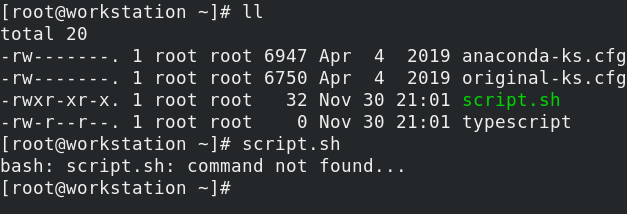
>
> 会提示找不到命令，这是因为，编写的脚本并不存在于`$PATH`所在目录，所以会提示不存在，因此在直接通过文件名的时候，执行脚本，需要指定脚本所在路径，也就是`./script.sh`

#### H4 - 声明变量

**声明变量**

声明变量遵循以下格式：

```bash
VARIABLE_NAME=VARIABLE_VALUE
```

例如：

```bash
str="Hello World"
```

**查看定义的变量 `set`**

查看定义的变量，要使用`set` 命令，如：

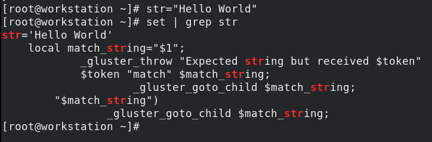

**取消已经定义的变量 `unset`**

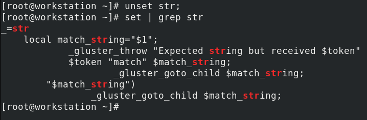


> :warning:危险脚本示例：
>
> script.sh
>
> ```bash
> #!/bin/bash
> VAR=/useless_file_folder
> rm -rf VAR/*
> ```
>
> 看上去，等同于执行：`rm -rf /useless_file_folder/*`
>
> 但是，一旦useless_file_folder 目录是未定义，那么就等同于`rm -rf /*`


#### H4 - 引用变量`$VAR_NAME` 或者 `${VAR_NAME}`

```bash
str="Hello World!"
echo $str
Hello World!

echo ${str}
Hello World!
```


#### H4 - 变量导出`export`

实验：

```bash
VAR1="Hello World！"
```

script.sh

```bash
#!/bin/bash
echo $VAR1
```

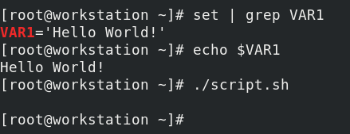

当在shell中，定义了变量，然后尝试在script.sh 脚本中去引用，会发现输出为空。 

这是由于，在shell中直接定义的变量，仅仅当前shell环境下可以引用。 

在执行任意脚本的时候，都是启动了一个新的进程。也就是执行脚本的shell环境，并不同与定义`VAR1`变量的shell环境。所以无法引用。


要想在脚本中去引用外部的变量， 那么这个外部变量必须定义在**环境变量**中。

可以使用在`VAR1`变量定义的shell环境中执行 `export` 命令，**临时导出**到 **环境变量**。 

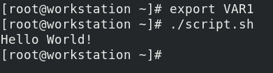

这样，脚本就可以在脚本中去引用了。


#### H4 - 变量持久化

以上在shell临时定义变量，或者临时导出到环境变量。 都是临时的，且仅在当前用户的当前shell中能够被引用。 也就是即便是同一个用户，新建一个shell，一样无法引用。 以上的变量定义都是**临时变量**

所以，需要 **变量持久化** , 变量持久化的方法是通过在开机自计划执行脚本中去定义变量，有两种情况，这两种情况的区别在于开机计划执行的脚本文件不同：

- 某个用户私有的变量持久化

  定义或者导出变量在 `~/.bashrc`

- 所有用户共有的变量持久化

  定义或者导出变量在`/etc/bashrc`

在定义之后，需要系统重启，待脚本执行之后，才会生效。 也可以使用`source ~/.bashrc` 或者 `source /etc/bashrc` 以立即重载文件以生效。


> :warning: 如果要在脚本中使用变量，还是需要在`.bashrc` 或者 `/etc/bashrc` 中使用`export` 命令导出。


> 关于变量持久化和变量作用域的问题，在RH124 day2_RH124_chapter5-d.md/H5 - 更改SHELL 环境一节 中已有详细描述。所以这里不做过多重复。


#### H4 - 特殊变量

- $1 $2	 返回第n个参数
- $0          返回当前脚本的文件名
- $#          返回参数的数量
- \$$          返回当前脚本执行的进程号
- $?          返回执行状态，非0都是未执行成功

script.sh

```bash
#!/bin/bash
echo \$1 "$1"
echo \$2 "$2"
echo \$0 "$0"
echo \$# "$#"
echo \$$ "$$"
echo \$? "$?"
pgrep script.sh	#查看脚本执行时的进程id
sleep 5
```

```bash
./script.sh a b c
$1 a
$2 b
$0 ./script.sh
$# 3
$$ 2339
$? 0
2339
```

> 可以在退出的时候，复制一个值，从0~255
>
> ```BASH
> exit 100
> ```
>
> 

本节内容讲的比较粗略，所以看了下Runoob上简短的Shell教程，总结在

#### 【附属】/ 第一章提高命令行生产率基础Shell教程.md


#### H4 - Debug 模式

`-x` ：debug 模式， 打印出程序执行的明细过程。遇到错误时打印错误信息。

`-e` ： 遇到错误终止执行

让整个脚本文件进入调试模式：（在文件顶部 #！ 的末尾加上 "`-x`"）

```bash
#!/bin/bash -x
echo \$1 "$1"
echo \$2 "$2"
echo \$0 "$0"
echo \$# "$#"
echo \$$ "$$"
echo \$? "$?"
pgrep script.sh	#查看脚本执行时的进程id
sleep 5
```

让某部分代码进入调试模式：使用 `set -x` 和 ` set +x` 包裹命令范围：

```bash
#!/bin/bash
echo \$1 "$1"
echo \$2 "$2"
set -x 
echo \$0 "$0"
echo \$# "$#"
echo \$$ "$$"
set +x 
echo \$? "$?"
pgrep script.sh	#查看脚本执行时的进程id
sleep 5
```

如果需要在遇到错误时，退出执行，应用以上的规则的同时，加个`-e` 选项即可，即`-xe` 


## 使用正则表达式匹配命令输出中的文本

- `grep ` 命令，用来筛选文本字符串

  ```bash
  cat /etc/passwd | grep 'root'
  ```

  很多发行版中，对grep有别名，使得在使用grep命令输出的结果中，会高亮匹配项。 

  ```bash
  $ alias grep
  alias grep='grep --color=auto'
  ```

  有一些发行版可能没有别名，如果是临时使用，可以临时指定color高亮（不用加）：

  ```bash
  $ cat /etc/passwd | /usr/bin/grep root --color
  ```

  

  `grep` 常用选项：

  - `-i` 忽略大小写

  - `-v` 相反选择

  - `-E` 正则表达式扩展

    - "或" 搜索，同时匹配多个关键词 （ --extended-regexp）

    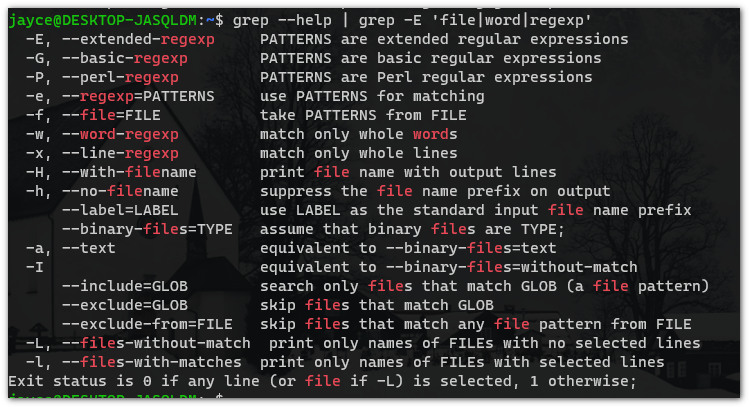

    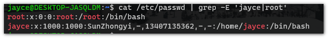

    - 正则匹配

      使用正则匹配的时候，不要加引号

      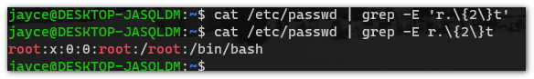

  `-v` 相反选择

  `-E` 

  

  

# Chapter2 : 计划将来任务

**目标：** 规划任务以便再将来自动执行

- 设置一个在将来某个时刻运行一次的命令
- 利用用户的crontab文件，安排计划任务
- 利用系统crontab 文件和目录，安排计划任务
- 启用和禁用systemd 定时器并配置管理临时文件的定时器


#### H4 - 检查和管理<u>临时的</u>用户作业

在写一次性计划任务的时候，主要是通过一个名为`atd` 的守护进程来实现的。 关键命令为`at`。

- `at` ： 在特定的实现执行命令

- `atq` ： 列举计划中的任务列表，（如果是root用户，会列举所有用户的计划任务）

- `atrm` ： 删除计划任务（以任务号码为依据）

  

**关于时间的说明**，计划任务的时间指定非常的灵活：

- 指定一天在某个特定时间执行特定的命令，时间可以指定为**HH:MM**, 
- 除了特定的时间点，还可以指定特殊的时间关键词，例如 **midnight**  ， **noon** , **teatime** (下午茶时间4pm)
- 还可以通过 **AM** , **PM** 来明确上午或者下午
- 此外更加常用的是指定时间，时间格式支持非常灵活：**MMDD[CC]YY**  ,    **MM/DD/[CC]YY** ,  **DD.MM.[CC]YY** ,  **[CC]YY-MM-DD**
- 还能以当前时间为准，定时外来间隔多久执行，格式为 **now+ count time-units**,  时间单位可以是 **minutes** , **hours** , **days** , **weeks** , 
- 还能直接指定模糊时间，**today** , **tomorrow** .

例如，指定计划任务自 今天 4pm 开始，延迟3天后执行， **at 4pm + 3 days** 。 指定计划任务在7月31号 早上10:00 执行，**at 10am Jul 31 ** 。指定计划任务在明天早上1点执行，**at 1am tomorrow **  。

> 不清楚的时候，及时查看手册

示例：

```bash
#监听日志 
[root@servera ~]# tail -n 0 /var/log/messages -f 
# -f 参数是 follow 的意思
```

```bash
#new tab
[root@servera ~]# at now +2min						#执行计划任务时间
warning: commands will be executed using /bin/sh
at>logger "test"									#执行的命令
ar> <EOT>											#Ctrl + D退出
job 2 at Wed Dec  2 18:59:00 2020					#计划成功

[root@servera ~]# atq								#atq 查看任务列表
4		Wed Dec 2 19:08:00 2020 a root 
[root@servera ~]# atrm 4				 			#删除计划
```

> `logger "msg"` 命令用于手动记录信息到系统日志。
>
> 如果没有删除计划，在tail 追踪的tab shell中就会在指定时间打印日志信息


**计划任务文件**

定义的计划任务，存放在 /vat/spool/at/ 


#### H4 - 计划周期性用户作业

> 本章重点在周期性指定用户的计划任务，后面的定时器作了解。

分为两类，一类是面向系统的，另一类是面向用户的。

##### 一、面向系统的周期性计划任务 /etc/crontab文件 | /etc/cron*目录

面向系统的， 可以通过 文件/目录来定义

- **通过文件定义**

  通过文件定义，可以通过编写 /etc/crontab 文件：

  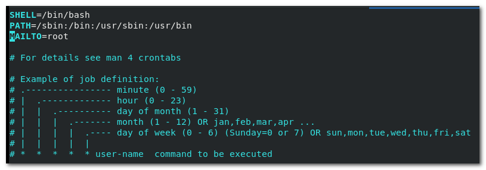

  ```bash
  *	 *	 *	  *	   *	user-name	command	to be executed
  分	时	天	月	周	 用户名	     程序/脚本/命令
  ```

  - \* 未定义
  - x-y 范围
  - x.y 列表
  - */x 每多长时间， 间隔

  示例-1：
  系统每隔5分钟，以root用户身份 执行 "logger test" 命令 （打印日志信息 test）

  ```bash
  */5	*	*	*	* root logger test	
  ```

  

  示例-2：
  定期在2点到4点，执行html文件的备份，（2-4， 是在这个时间段中任意时间，具体时间由其他因素影响）

  ```bash
  *	 2-4	*	*	* root tar -cf /var/www/html && echo "backup html files"
  ```

  

  示例-3：
  每周一，三，五 凌晨2点01 分执行系统重启

  ```shell
  1	2	*	* 	1，3，5 root	systemctl reboot 
  ```

  

- **通过目录定义**

  通过目录定义，可以在 /etc/cron 下的子目录中去定义

  ```bash
  [root@servera ~]# cd /etc/cron. <tab>
  cron.d/		cron.daily/		cron.hourly/	cron.monthly/	cron.weekly/
  ```

  - 在cron.d目录下可以 和 通过和文件  /etc/crontab定义同样的规则去指定计划任务

  - 此外，除了cron.d 目录，还可以定义任务脚本存放在以下目录 

    - cron.monthly/		#月
    - cron.weekly/           #周
    - cron.daily/               #日
    - cron.hourly/			#时

    > :star::star::star: 通过目录定义计划任务，除了在cron.d 中定义和/etc/crontab 文件中一样的精确时间规则。 其他通过目录指定的计划任务，都没有精确时间，只保证在指定周期内会执行。 （可以在/etc/crontab中预定义默认时间，有一些发行版本，例如ubuntu中就有预定义，但是红帽的我没有找到，官方的文档中也没有说明，不做深究）
  
    > :star: 系统中由什么机制来保证计划任务一定会执行? 
    >
    > 设想这样一种场景：
  > 定义了计划任务在每周3的凌晨1点执行，但是由于硬件维护，在12点就关机了，那这个计划任务怎么去保证执行呢？ 系统中有 /etc/anacrontab 文件去保证执行机制暂时不仔细研究。
  
  
  
  

##### 二、面向用户的周期性计划任务 crontab 工具

面向用户的周期性计划任务通常通过一个专门的计划任务管理工具去实现的——`crontab`

该命令由几个常用的选项：

- `-e` 编辑
- `-u` 指定用户 普通用户不可以指派普通用户
- `-l` 查看任务
- `-r` 删除任务

用例：

以root身份指派任务到student用户，每间隔一分钟，写入一次日志，内容为“test”

```bash
[root@sercera ~]# crontab -e -u student
```

输入完这行指令后，将会自动跳到编辑器，任务的定义语法和在 /etc/crontab 中是一样的。

```bash
*/1	*	*	*	*	logger test
```

查看student用户的任务列表

```bash
[root@sercera ~]# crontab -l -u student
*/1	*	*	*	*	logger test
```

监听日志：

```bash
#tail -n 0 /var/log/messages -f #每间隔一分钟会刷新输出
```

删除student用户的计划任务

```bash
[root@servera ~]# crontab -r -u student
```


**计划任务文件**

通过crontab 计划任务管理工具指定到用户的计划任务，文件存放于 /var/spool/cron/user_name


##### 三、 【通过systemd 的timer 定时器指定计划任务】

systemd 中的 timer 可以定义更加灵活，精确的计划任务，考的可能性比较大

- 通过web控制台添加定时任务

  ```bash
  systemctl enable cockpit.socket --now
  ```

  **检查web控制台服务是否启动**，可以通过侦听端口是否运行的方式来检查

  ```bash
  ss -tplna | grep :9090
  ```

  还可以通过systemctl 服务状态来检查

  ```bash
  systemctl is-active cockpit.socket
  ```

  

  web控制台 => Services =>Timer => Create Timer => 填写执行计划
  Service name :
  Description:
  Command:
  指定执行的时间：系统启动之后 | 指定特定时间

  => 保存

  

  写完之后，可以在页面下方看到该计划任务信息。

  也可以在命令行通过以下命令查看该计划任务：

  ```bash
  systemctl cat rht-demo.timer #rht-demo 是刚才填写的Service name
  ```

  

  

  命令行查看timer任务列表

  ```bash
  systemctl list-timers --type=timer
  ```

  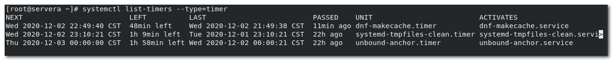

  - NEXT：下次执行时间

  - LEFT：距离下次执行间隔时间

  - LAST：上次执行时间

  - PASSED：上次执行已经过去了多久

  - UNIT：执行的服务单元

  

- 通过命令行指定更加高级的计划任务

  ```bash
  #查看timer在man手册中的章节
  man -k timer
  #systemd.timer(5)
  #systemd.time(7)
  ```

  写的时候，语法不清楚，可以在 systemd.time(7) 手册中找到很多示例。

  通过命令行定义timer计划任务，老师没讲。


#### H4 - 查看临时文件

/tmp			:	10天定时清理一次（通过timer实现的）

/var/tmp	:	 30天定时清理一次

手动清空临时文件目录：

```bash
systemd-tmpfiles --clean
```


# Chapter3 : 调优系统性能

**目标：** 通过设置调优参数和调整进程的调度优先级来提高系统性能

- 通过选择由 <span style="color:red">`tuned`</span>守护进程管理的调优配置文件来优化系统性能。
- 通过  <span style="color:red">`nich`</span>  和  <span style="color:red">`renice`</span> 命令，对特定进程进行优先排序或者取消其优先排序。


### H3 - 调优系统

这部分内容，这老师讲的超级烂，深入的研究是一个挺大的工程，有专门的课程。有需要自己去网上找资源学习。 这里着重注意考试相关的内容。 考试考的可能性比较大。但是考的会比较简单。

> 性能调优主要的两个指标：
>
> - 吞吐量： 在单位时间内能够完成更过复杂的任务
> - 延迟 ： 完成一个任务，消耗更加低的时间

**可能用到的相关命令**

```bash
#确定tuned被安装了，如果没有，就自己安装
yum list installed tuned
```

```bash
#systemctl 启用tuned 服务
systemctl enable tuned
```

```bash
# 用systemctl status 检查tuned.service 服务已经启用
systemctl status tuned.service
```

性能调优，是一个大学问，基本的使用tuned， 只需要使用tuned提供的预置好的参数配置。 在**/usr/lib/tuned/**目录下，可以看到tuned提供的配置参数模式，它们是针对某些特性的优化配置，按照需求，可以启用这些配置。

常用的几种：

balanced 平衡的
desktop 面向桌面的
hpc-compute 高性能的
latency-performance 延迟性
network-latency 网络延迟
network-throughput 网络吞吐量
powersave 节能
recommend.d 推荐类型的
virtual-guest	针对虚拟机的优化
vittual-host	针对宿主机的优化

latency-performance 延迟性

network-latency 网络延迟

network-throughput 网络吞吐量

powersave 节能

recommend.d 推荐类型的

vittual-host	针对宿主机的优化

vittual-host	针对宿主机的优化

desktop 桌面的

> 查看/usr/lib/tuned/desktop/tuned.conf 为例，可以发现，其实这些调优脚本，是去修改了 /sys/下的文件，


几个重要的命令：

关键的命令是`tuned-adm` ，用于tuned管理的命令。

```bash
tuned-adm <tab>
active		list	off		profile		recommend	verify
```


查看所有预置的 tuned 参数配置模式：

```bash
tuned-adm list
```

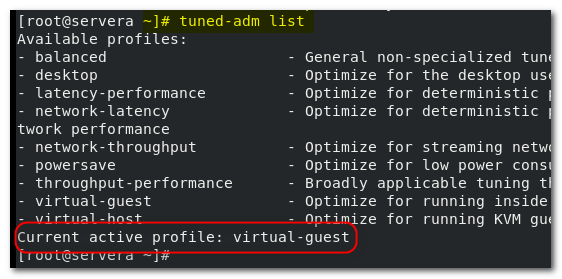

> 可以看到，当前使用的预置配置模式是 ： virtual-guest 即针对虚拟机的优化配置

更改配置模式：

```bash
#例如更改为针对网络延迟的优化
tuned-adm profile network-latency
```


考试的时候，比较可能让配置 “推荐模式”

```bash
tuned-adm recommend
```

> 考试的时候，万一忘记了命令，还可以走web控制台 => Cockpit.socket => Overview => Performance profile => recommend 就可以了
>
> ```bash
> #前提是cockpit web控制台启用了
> systemctl enable cockpit.socket --now
> ```
>
> 然后浏览器访问9090端口，127.0.0.1:9898 或者 主机ip:9090


> 以上提到的是简单基础的用法，考试大概率不会考高级，考高级也不会写
>
> 但是大概思路是这样的：
>
> 以 /usr/lib/tuned/ 下tuned提供的配置集文件为参照，复制到 /etc/tuned/ 目录下，去配置文件。例如把/usr/lib/tuned/desktop/tuned.conf 复制到 /etc/tuned/test/desktop_based.conf , 然后修改desktop_based.conf 参数配置 - -,这时候使用`tuned-adm list` 就能看到添加的“test”, 然后通过 `tuned-adm profile test` 去指定。 （说的好像知道怎么配置一样 - -，这需要对systemd内核参数比较了解才能写）

Linux.cn 由systemd专题，有时间可以多看看


### H3 - 影响进程调度（调整优先级）

为什么要调整优先级呢？

进程在系统中运行时，默认时平均分配系统资源的，但是有的任务可能比较紧急，需要更高的优先级以更好的运行，所以就需要调整进程的优先级。 

调整优先级，使用`nice`  和 `renice` 命令。

```bash
nice -n 优先级 command
renice -n 优先级 PID
```

优先级范围：-20 - 19 ，一共40个。 

优先级小于 0 的，仅root用户能够分配调度，普通用户只能分配调度0 - 19 的优先级


用例：

为了更好的理解进程优先级，介绍以下下面的例子将用到的一些命令和设备：

- `dd`:  用指定大小的块拷贝一个文件，并在拷贝的同时进行指定的转换。 用到的选项：`bs`=bytes：同时设置读入/输出的块大小为bytes个字节 

- 两个特殊设备：/dev/null ：黑洞，可以无限吞噬数据， /dev/zero : 可以无限提供内容为0的数据

```bash
# 后台执行命令：从zero设备 以1M的速度复制数据到 null 设备 。 由于设备的特殊性，这个命令所开启的进程，如果不被中断，永远不会终止。
dd if=/dev/zero of=/dev/null bs=1M &
```

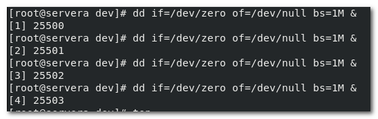

使用top 命令实时监控进程：

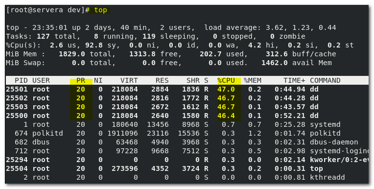

可以看到，cpu 几乎被平均占用，此外默认的优先级别，都是 0 （NI）

这只是为了实验方便启用的进程。 

现在，假如，进程ID 为 25503 和 25500 的进程更加重要，我想让它们优先执行，占有更多的cpu计算资源，就可以使用 `renice` 命令，修改优先级。

```bash
# 更改优先级为 -10
```

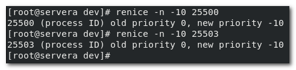

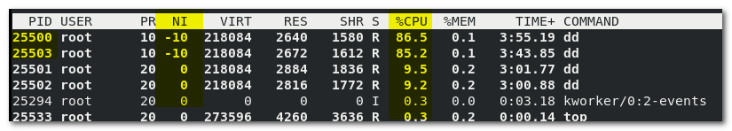

可以看到，优先级越高，cpu 占用的资源就越多。


除了使用`renice` 命令调整优先级， 还可以在执行命令的时候，就直接指定进程的优先级，这时候需要使用`nice` 命令：

```bash
nice -n -15 dd if=/dev/zero of=/dev/null bs=1M &
```

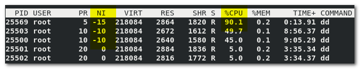


**杀掉全部dd进程**

```bash
pkill -9 dd
```


# Chapter 4 : ACL 权限

本章在 RH124 中讲过了

> day3_RH124_chapter7-10.md

# :star::star: Chapter 5 : 管理SELINUX 安全性


**目标：** 使用SELinux 保护和管理服务器的安全性

- 介绍SELinux 如何保护资源 以及 如何选择执行模式。
- 配置文件的SELinux 上下文，以控制进程如何与该文件进行交互。
- 配置SELinux 布尔值， 从而允许针对不同的访问需求更改运行时策略。
- 调查与SELinux 日志消息并对SELinux AVC 拒绝问题进行故障排除。

### H3 - SELINUX 如何保护资源安全，SELNUX 安全的基本概念

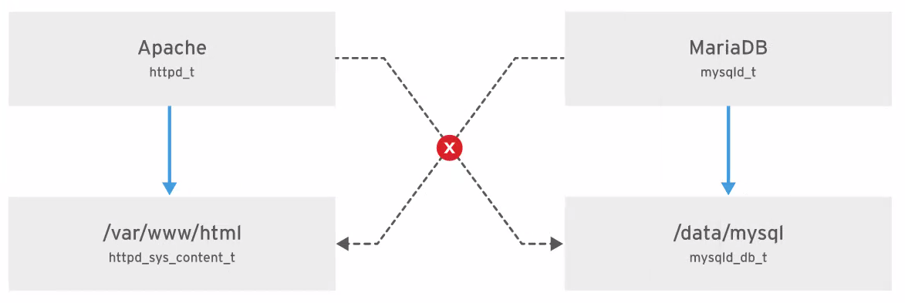

基于内核之上的安全策略，SELinux， 中文即 安全增强型的 Linux 。红帽系统，服务器版本是自带的并且启用。 普通用户桌面版本是没有的。

**引入：**

以上图为例，在没有开启SELinux 策略的情况下。 Apache 在系统中的权限属于系统用户， Apache 相关服务访问相关的目录是正常的发，例如/var/www/html。  但是如果Apache有一个漏洞，黑客利用该漏洞，使用Apache系统用户权限，去访问其他不相关的目录做一些非法操作，造成数据泄露等安全问题。

在这种场景下，SELinux的安全机制就能解决很多问题。 如果开启了SELinux安全策略之后，SELinux会监控系统中所有的文件，目录，进程，端口号。 通过**SELinux 上下文(也叫做标签)**的方式来监控，图示例中，上下文就是httpd_t 。通过判断标签是否匹配来确保他们是否是一类的资源。例如 httpd_t 和 下面的httpd_sys_content_t 就匹配。  但是和 mysqld_t , mysqld_db_t 就不匹配。就不是一类资源。 所以当Apache访问不是一类的资源，就会被阻止。

> 因此，在开启SELinux后，管理人员必须要保证应用和数据的标签一致，否则会因为人为的疏忽而导致资源不可访问。（所以大部分人都把SELinux关掉了）


### H3 - 查看SELinux 上下文信息（标签）


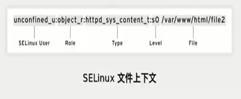

- _u : SELinux User
- _r : SELinux  Role
- _t : SELinux  Type (关键作用)
- _sN : 安全级别
- 后面就是文件


文件/进程， 都可以通过`-Z` 选项查看上下文：

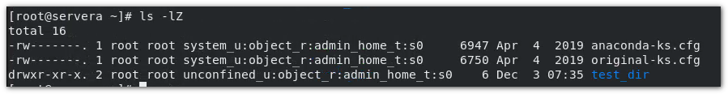

> `ls -Z`	: print any security context of each file，打印所有文件的安全上下文

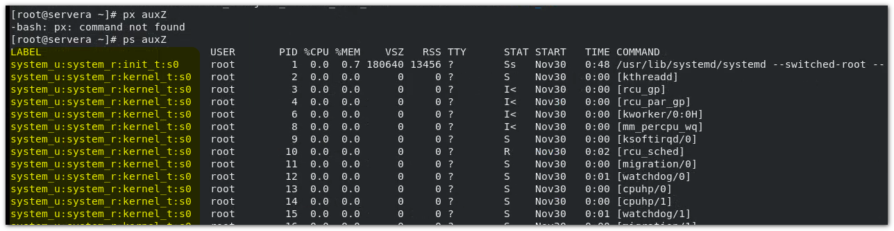

> `ps Z`	: Add a column of secutity data. 添加一列安全信息

 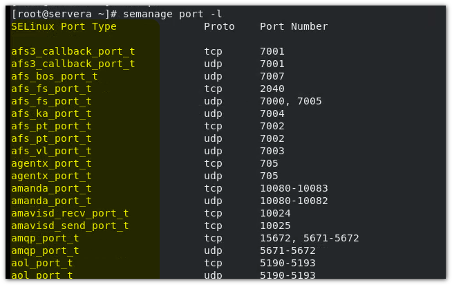


### H3 - 引入 SELinux

【拓】：httpd Apache 服务器

```bash
#安全httpd
yum -y install httpd 

#关闭防火墙
systemctl stop firewalld.service
systemctl disable firewalld.service

#启动httpd服务
systemctl enable httpd --now
#检查端口以查看是否启动（httpd服务默认侦听80端口）
ss -tpna|grep :80

#修改端口
vim /etc/htttpd/conf/httpd.conf
#45行： Listen 80
# ⭐如果端口号发生了变化，要重启服务（配置文件变动了）

#测试访问httpd服务，服务器下的测试主页面
curl -L http://localhost #-L 指的是访问内容， 如果有html内容输出，则说明服务没有问题

#自定义页面
echo "$HOSTNAME" > index.html
cat index.html
servera.lab.example.com

cp -a index.html /var/www/html/ 	#将自定义的主页文件，放到httpd服务默认的主页path

```

【插】httpd web 页面访问调试 以引入SELinux 

```bash
curl -L localhost #	尝试查看刚才替换的页面信息，但是发现还是httpd的测试主页。
curl -I localhost # 查看页面头部信息
```

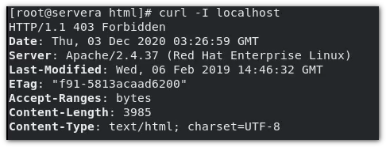

监控访问日志：

```bash
tail -n 0 /var/log/httpd/access_lof -f
```

然后重新开一个tab终端，再次访问 `curl -L localhost`, 可以看到确实访问

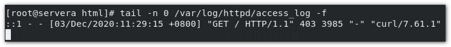

监控一下错误日志，看看是什么原因导致的 403 禁止访问：

```bash
tail -n 0 /var/log/httpd/errot_log -f
```

然后重新开一个tab终端，再次访问 `curl -L localhost`, 可以看到详细报错

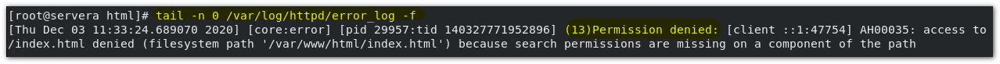

> 报错提示，没有权限访问 var/www/html/index.html

查看一下，index.html的访问权限：

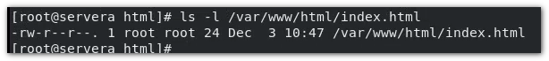

> 可以看到，index.html 对于所有用户有读取权限。 且没有设定acl

查看当前SELinux 的状态 `getenforce`：

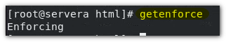

> Enforcing  : 强制模式

临时更改SELinux 模式为 Permissive 模式，并再次尝试使用`curl -L` 命令访问

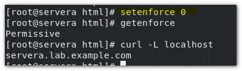

实验说明了，SELinux 策略确实影响了我们访问自定的页面。为什么会出现这个问题？

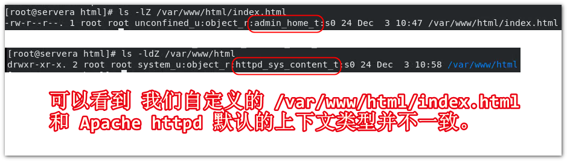

上下文不一致，Enforcing 策略阻止我们访问。http 头部信息提示 403 forbidden, error_log 报错没有权限， 正时这个原因导致的。 		


### H3 - 查看和临时修改SELinux 策略：

查看当前的SELinux 策略状态可以使用 `getenforce` 命令

SELinux 的启用状态分为两种模式：

- Permissive 	=>	0 （允许模式）

  SELinux 会严格遵循策略，一旦发现非法访问，或阻止访问，同时记录日志

- Enforcing       =>    1  （强制模式）

  SELinux 不会阻止非法的访问， 但是会记录日志

> 通常服务不能访问的时候，就可以检查一下是不是SELinux 的影响导致的，可以先将SELinux 策略模式设定为Permissive 模式。 以调试确定服务不能访问是否和SELinux 有关系。


### H3 - 设置 默认/永久性的 SELinux 策略

#### H4 - 查看全局的SELinux 策略

`sestatus` 命令，用于查看全局的SELinux 策略配置

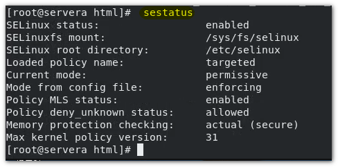

- SELinux status：	SELinux 是否启用
- SELinuxfs mount :      SELinux 挂载的文件系统挂载点， /sys/fs/selinux (内核运行后挂载的目录)
- SELinux root directory :     SELinux 所在的根目录位置
- Loaded policy name:      使用的策略时目标模式
- Current mode:      当前的模式
- Mode from config file:      文件里面的模式
- Policy MLS status:      MLS 多级保护的状态
- Policy MLS status:
- Policy deny_unknow status:
- Memory protection checking:
- Max kernel policy version:


开关SELinux : 由于SELinux 文件系统挂载点在 内核配置文件，所以要想开关SELinux 系统，需要重启机器。 但是如果有服务运行不能关机， 可以通过临时将SELinux 模式改为 Permissive .


#### H4 - 通过配置文件，关闭或者开启SELinux

SELinux 的配置文件为 /etc/selinux/config

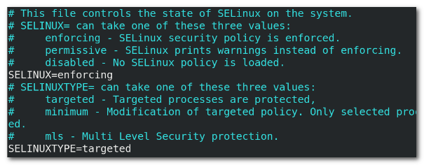

如果需要关闭SELinux , 可以修改该配置文件， 将SELinux 字段值改为 disabled 。 然后重启系统。 关闭之后，在通过 `getenforce` 或者 `sestatus` 来查看SELinux 的状态，将会是disable。 要开启SELinux 也是一样的，需要修改该配置文件。 为enforing。 

关闭之后，在通过 ` getenforce` 或者 `sestatus` 来查看SELinux 的状态，将会是disable。 要开启SELinux 也是一样的，需要修改该配置文件。 为enforing。 


### H3 - 控制SELinux 文件上下文

#### H4 - 初始SELinux 上下文

只要SELinux 是开启状态，那么所有的进程和文件都会有相应的标签。 标签代表了与安全有关的信息，称为SELinux 上下文。新的文件通常会从父目录继承其SELinux 上下文，从而确保他们具有适当的上下文。 

有两种不同的方式可能会破坏该继承过程。 

- 在与最终目标位置不同的位置创建文件，然后移动文件，则该文件将具有创建它时所在目录的SELinux 上下文，而不是目标目录的SELinux 上下文。 
- 如果复制一个保留SELinux 碰上下文的文件，例如在使用 `cp -a` 命令进行复制，或者通过mv进行移动的时候。则SELinux上下文将反应原始文件的位置。（注意之家用 `cp` 命令而附带其额外属性，则SELinux上下文会和目标目录一致）


#### H4 - 通过命令来修改上下文


##### H5 - 修改指定文件的上下文`chcon -t`

上边的那张图：


可以通过`chcon -t` 命令来将指定文件的SELinux 上下文手动的修改。例如这个例子中，将html文件的SELinux的上下文修改为和其父目录的上下文一致。 

```bash
chcon -t httpd_sys_content_t /var/www/html/index.html
```

修改之后，即便是将SELinux 策略通过 `setenforce 1` 设定为 Enforcing 也可以通过 `curl -L localhost` 来访问。 


##### H5 - 刷新上下文`restorecon`

该命令的作用对象不是普通文件，而是目录。 其作用是将目录下的所有子文件和子目录刷新为和作用对象目录的上下文保持一致。

```bash
[root@servera ~]# touch test_file.txt
[root@servera ~]# mv test_file.txt /var/www/html
[root@servera ~]# ls -lZ /var/www/html
```

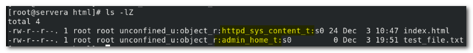

```bash
[root@servera ~]# restorecon -RvvF /var/www/html
# -R：递归 vv: 详情，v越多越详细，最多五个v, 但是并不是所有命令都支持 ； F：强制
```

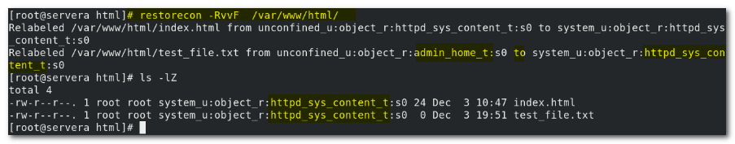


##### H5 - 修改文件的默认SELinux 上下文`semanage`

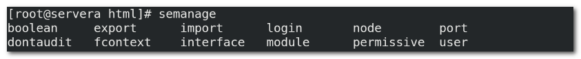

修改文件上下文：fcontext

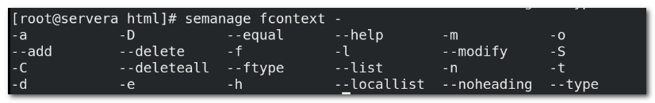

`-t ` 和 `--type` , 一个是短格式，一个是全格式。

`-l` 列举系统中所有的文件的默认上下文

`-m` 修改类型

`-a` 增加

`-D` 删除


用例：

```bash
#先查到要修改的文件
semanage fcontext -l | grep '/var/www/html'
```

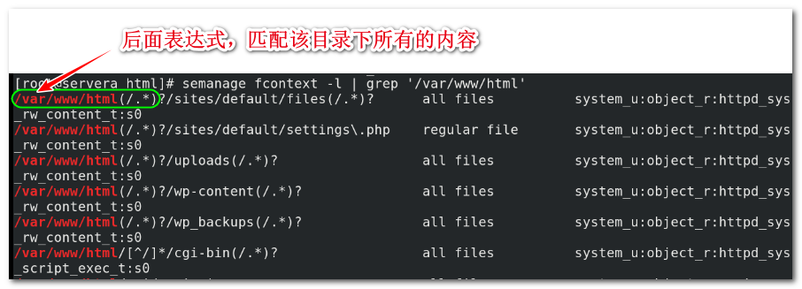

```bash
semanage fcontext -m -t httpd_sys_rw_content "/var/www/html(/.*)?"
```


提示未能修改（默认的SELinux上下文），这是之前没有指定过默认的SELinux上下文，所以应该是添加，而不是修改：

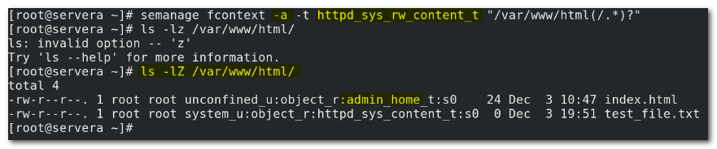

修改了默认的SELinux上下文之后，需要使用`restorecon` 来刷新目录：

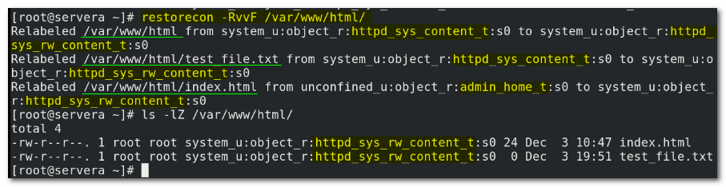

可以看到，修改成功了。 


:star::star::star: 修改上下文，有这样一个特点：

> 以上的修改方式是 “临时的” ，但是不同于我们之前的临时（系统重启就失效）。  这里的临时的意思是：
>
> Dir1/file2  ，file2 和 Dir1 的上下文不一致， 现在通过`chcon -t` 命令将file2 改成和 Dir1的上下文一致，Dir1/file2_1    
>
> 现在有Dir3, 上下不同于Dir1, 通过 `cp` 命令，（注意不是`cp -a`）将file2_1 复制到 Dir3, 即Dir3/file2_1 ,此时file2_1 的SELinux 上下文会自动改为和 Dir3 一致。 

> :star:(这老师讲了有临时还有永久，我觉得理解的有问题)， 我觉的应该这样去理解：
>
> - 修改单个文件的上下文，使用`chron -t` 命令
>
> - 每个目录都有预定的默认上下文，如果想要自定义的修改默认的上下文，就应该使用 `semanage` 命令去修改。 修改完了之后一定要使用`restorecon` 使生效。
> - 刷新上下文，应该使用`restorecon` 命令，该命令的作用，
>   - 一个是可以单独的直接刷新某个目录下的所有子内容为指定的 SELinux 上下文，可以理解为批量的修改文件或者目录上下文。
>   - 还有一个是， 在使用`semanage` 修改或者增加了默认上下文之后， 一定要使用`restorecon` 命令去刷新目录以使得内容生效。 否则，即便是重启系统，默认SELinux 上下文也不会改变。
>
> 老师讲的临时就上上边提到的，除了使用`cp -a`带保留属性的复制，或者使用`mv`移动命令会保有文件的上下文 。 使用单一的`cp` 命令，复制文件到上下文不同的目标目录，上下文会自动修改为目标目录的上下文。 这是特性。 


#### H4 - 使用布尔值调整SELNUX 策略（略）

SELinux 布尔值是可更改SELinux策略行为的参数。SELinux 布尔值是可以启用或禁用的规则。 安全管理员可以使用SELinux 布尔值来有选择地调整策略。

- `getsebool ` : 列出布尔值以及其状态
- `setsebool`: 修改布尔值
- `setsebool -P`: 更改SELinux策略以使修改持久保留。 
- `semanage boolean -l` ： 将报告布尔值是否为持久值，并提供该布尔值的简短描述。

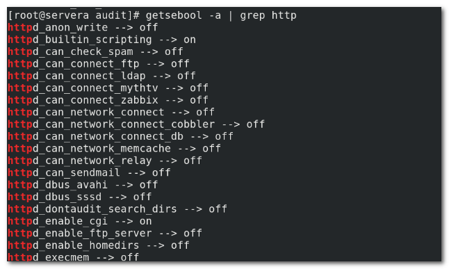

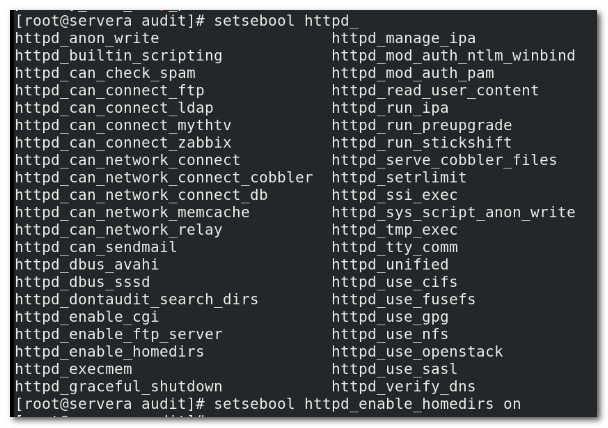

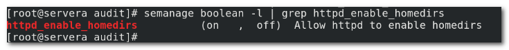

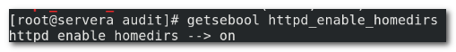

> 很多命令都可以使用tab补齐。主要是要记得关键的命令。


#### H4 - 调查和解决SELINUX问题

查看systemd 日志：

```bash
journal -xe
```

```bash
grep AVC /var/log/audit/audit.log #含有AVC的都是SELinux 有关的日志
```

```bash
sealert -a /var/log/autdit/audit.log
```

> sealert 是日志分析工具，会分析报告遇到的问题

web控制台 => SELinux => SELinux Access Control Errors => solutions => Apply this solution (直接鼠标点击应用解决办法)