[TOC]

# Chapter6: 管理基本存储

**目标：** 使用命令行创建和管理存储设备、分区、文件系统和交换空间

- 创建**存储分区**，将其**格式化**为相应的文件系统，然后进行**挂载**以供使用
- 创建和管理**交换空间**以补充物理内存

### H3 - 添加分区、文件系统 和 持久挂载

#### H4 - 对磁盘进行分区 （fdisk /  parted / cockpit.socket web控制台）

**分区的方案 ：**

- MBR : 适用于早期磁盘较小的分区 磁盘最大支持2TiB, 分区数量最多15个分区， 最大支持4个主分区（推荐将最后一个主分区划分为扩展分区，扩展分区不占用磁盘空间，相当于一个符号），可以再扩展分区中去划分逻辑分区， 主分区 + 扩展分区的  + 逻辑分区  一共15个分区。

- GPT : 最大支持 8ZiB （TB->PB->EB->ZB）,最多支持128（2^7）个分区,  

> 一般启动时走的是Leagcy引导，那么分区方案就是MBR, 如果启动时走的是EFI/UEFI ，那么分区方案就是GPT。
>
> 虚拟机/虚拟化平台（云计算等），一般是采用MBR分区方案。因为一般只跑服务，不存放数据。 所以对磁盘的大小要求不高。
>
> 物理服务器，存储服务器一般走GPT。
>
> 还可以混用

> :star:考试应该是MBR
>
> 千万别把系统盘 /dev/vda 分区了  是根目录 的挂载点，也就是系统。

**管理** 

针对两种不同的分区方案， 在管理上也存在差异：

管理MBR	->	一般使用`fdisk`

管理GPT 	->	gdisk（用法和fdisk一样，不讲）、 parted（教材推荐）

> parted 是 磁盘管理中 最好的工具之一，它支持交互和非交互的两种操作 。

> 考试随便可以使用 fdisk 或者 parted (但是推荐使用fdisk)

【拓】 ：

| 单位 | 制定单位              | 进制   | 示例             |
| ---- | --------------------- | ------ | ---------------- |
| GB   | 国际单位制            | 十进制 | 1 GB = 10^3 MB   |
| GiB  | 国际电工委员会（iec） | 二进制 | 1 GiB = 2^10 MiB |


##### H5 - 分区工具 fdisk

> 考试就用这个，简单些

在day5_RH124_chapter14-16.md 中已经讲过了，这里不做赘述。

补充几个之前没有提到的操作选项，就是，fdisk 的 Create a label, 修改磁盘的分区类型

| 操作选项 | 说明                                                         |
| -------- | ------------------------------------------------------------ |
| g        | create a new empty GPT partition table 新建空白的GPT分区表   |
| G        | create a new empty SGI (IRIX) partition table                |
| o        | create a new empty DOS partition table 新建空白的dos分区表（MBR） |
| s        | create a new empty Sun partition table                       |

> 注意，这项操作会删除已存在的分区，windows可以无损的转换分区类型。linux上会直接删除所有分区数据，然后重新新建分区类型。

> :warning: 注意fdisk的单位是GiB（国际电工委员单位， 二进制计算规则）


##### H5 - 分区工具 parted

parted 命令分区管理工具，特点是支持交互和非交互式两种方式去管理分区。 非交互式管理的最大好处一般体现在两个方面：

- 高效
- 可以写脚本执行

> :warning:注意， parted 工具的单位是国际单位制，GB ,也就是十进制计算规则。

parted 工具常用的选项

- `-s` 非交互执行 ： 不推荐，要小心。 误操作容易造成数据清空。
- `mlabel` : 分区表的类型：label-type：GPT, msdos(MBR)....
- `mkpart` : 分区操作
- `name` : 分区的命令
- `print` : 打印分区表
- `quit` ： 退出


**交互式示例1：**

获取帮助：

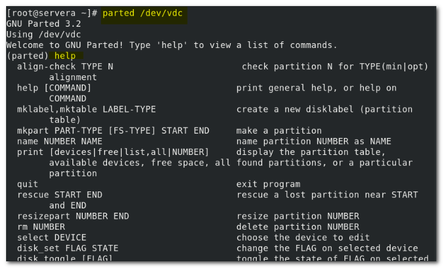

打印分区表：

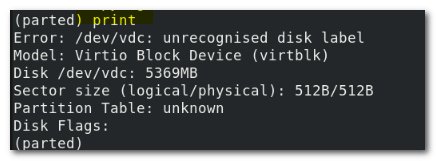

退出：`quit`

---

**交互式分区示例2：**

完整分区步骤：

1. 声明磁盘类型 （msdos(MBR/)  / GPT）: `mklabel` (可\<tab>提示)

   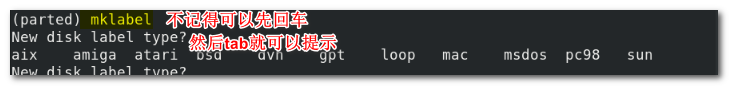

   > 记得就直接 `mklabel msdos`
   >
   > 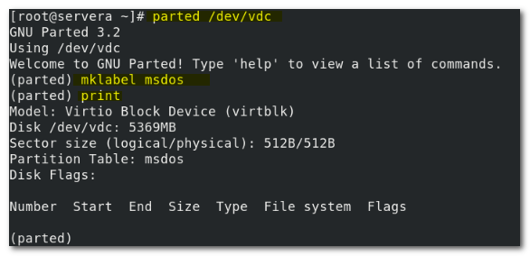

2. 分区 ： mkpart PART-TYPE [FS-TYPE] START END

   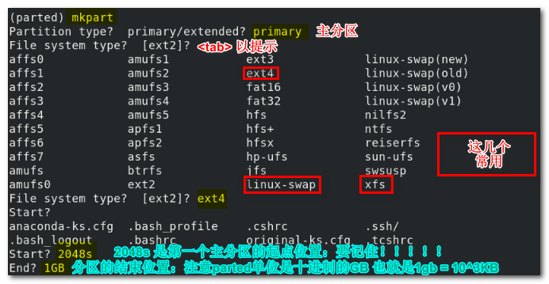	

3. 检查：print

   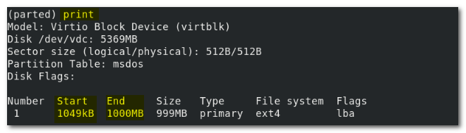

4. 退出 `quit`

   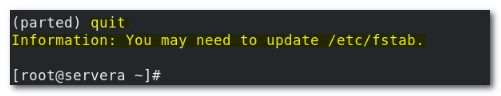

> :warning:  这个提示，是提示要不要永久挂载，/etc/fstab 是永久挂载相关文件。 

5. 更新分区表: `udevadm settle`

---


**非交互式示例1：**

1. 声明分区类型

2. 分区，可以是使用 `parted /dev/vdd help mkpart` 查看帮助

   mkpart 的语法格式是：

   ```bash
   mkparted PART-TYPE [FS-TYPE] START END #这个是关键
   ```

   

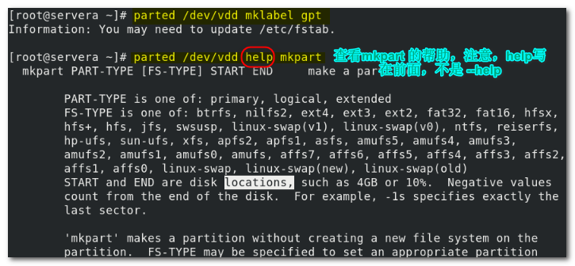

3. 分区，并查验

   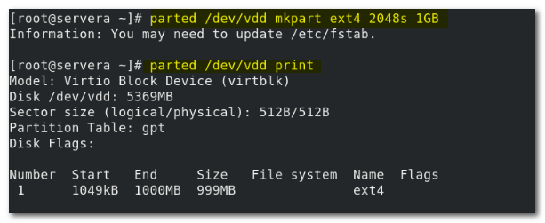

4. 更新分区表： udevadm settle

5. 删除：

   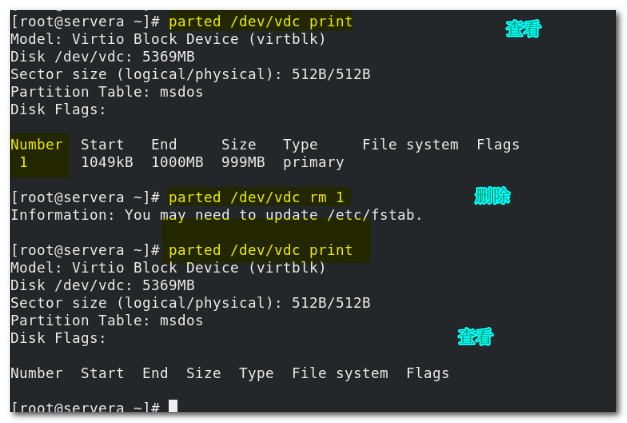

6. 更行分区表 ： `udevadm settle`

> 如果用熟练了的话， parted 非交互模式非常的高效。但是有一些危险，因为没有提示和确定操作。
>
> 总结一下，**创建一个分区**：
>
> 1. 指定分区表类型 （常用的msdos(MBR) 或者 GPT）:
>
>    ```BASH
>    parted /dev/vdd mklabel mkdos
>    ```
>
> 2. 分区并且指定文件类型：
>
>    ```bash
>    parted /dev/vdd mkpart primary xfs 2048s 1GB
>    ```
>
>    > 创建一个主分区，并且指定文件类型为xfs ，分区的大小是从2048s - 1GB
>
> 3. 刷新：
>
>    ```bash
>    udevadm settle 
>    ```
>
> :warning::warning: 这里存在一个问题，需要注意，有待进一步了解，同时，要留意。 就是在第二步创建分区的时候，为什么要指定文件系统。 注意，这并不是格式化， 建立一个能够存储文件的目录，完整的过程是 分区-格式化-挂载-（永久挂载）
>
> 这只是第一步，还是要格式化，然后挂载。这不同于使用fdisk来分区（分区过程不需要指定文件系统 。）
>
> 这里有回答，但是暂时看不太懂到底说的啥意思  [link](https://unix.stackexchange.com/questions/551030/why-does-parted-need-a-filesystem-type-when-creating-a-partition-and-how-does-i),

> 额外的：parted分区管理工具，可以指定的单位除了常规单位，还可以使用百分比。（man parted => "unit" 关键词以查看）
>
> 例如：
>
> ```bash
> [root@servera ~] # parted /dev/vdb mklabel msdos
> [root@servera ~] # parted /dev/vdb mkpart primary xfs 0% 50%	#注意起止位置
> [root@servera ~] # parted /dev/vdb mkpart primary ext4 50% 100%  #注意起止位置
> ```
>
> 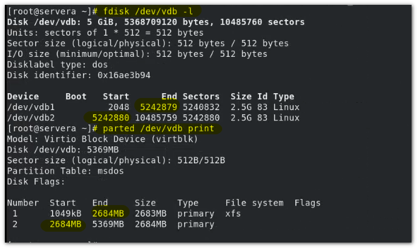


#### H4 - 格式化

day5_RH124_chapter14-16.md 中讲过了，不过多赘述。

#### H4 - 永久挂载 (/etc/fstab)

day5_RH124_chapter14-16.md 中讲了**临时挂载**。 这里只补充永久挂载。

所谓永久挂载，就是即便在系统重启后，具有文件系统的分区，依然是挂载状态，不用重新去挂载。也叫做持久挂载。

持久挂载，需要编辑文件 /etc/fstab   (fstab 即 file system table ，文件系统记录表。)

**查看/etc/fstab 和 挂载设备的情况**

使用 `lsblk` 命令，查看识别块设备的详细信息。

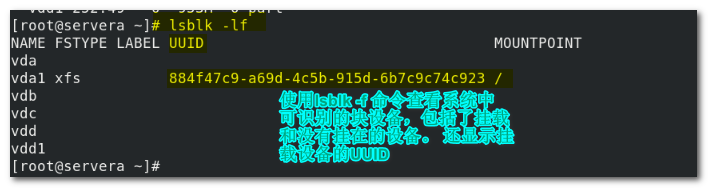

然后，看一下 /etc/fstab 表中的记录信息

```bash
vim /etc/fstab
```

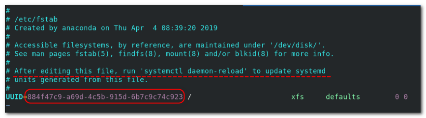

> 可以看到，UUID 和 `lsblk -lf` 中已经挂载的设备UUID 还有挂载点一致。  这说明这个挂载设备和 /etc/fstab 中的记录是对应的。 
>
> :star: 此外，有注释说明，编辑完此文件以后，需要执行`systemctl daemon-reload` 以更新systemd

##### H5 - 文件列含义

| 列数   | 含义                                                         | 示例           | 可选值                                          |
| ------ | ------------------------------------------------------------ | -------------- | ----------------------------------------------- |
| 第一列 | 设备名：<br />- 格式1 ： /dev/xxx<br />- 格式2 ：LABLE="XXX"<br />- 格式3 ： UUID=XXXX(recommend) | UUID=884XXX... |                                                 |
| 第二列 | 挂载点                                                       | /              |                                                 |
| 第三列 | 文件系统类型                                                 | xfs            |                                                 |
| 第四列 | 选项                                                         | defaults       |                                                 |
| 第五列 | dump(备份) 系统关机时<br />会备份文件系统的日志              | 0（默认）      | 0/1/2（1/2都是启用<br />了备份，1，优先级更高） |
| 第六列 | fsck （系统启动时对磁盘进行检查）                            | 0（默认）      | 0/1/2(1/2 启用，1优先级高)                      |

> 查看帮助 ： man 5 fstab


**编写/etc/fstab 文件示例，和挂载示例：**

vdd已经被划定了分区vdd1:

> ```bash
> [root@servera ~] # parted /dev/vdd mklabel mkdos 
> [root@servera ~] # parted /dev/vdd mkpart primary xfs 2048s 1GB
> [root@servera ~] # udevadm settle
> ```

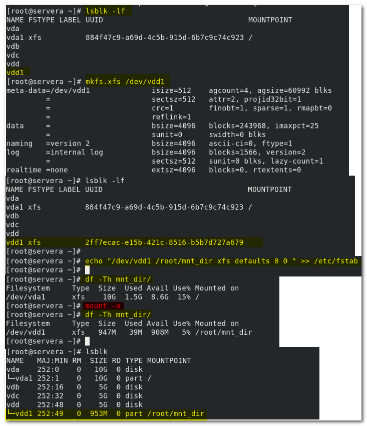

> :star:**写完了分区表之后，要挂载，需要使用`mount -a` 命令**
>
> mount -a  :   mount all filesystems mentioned in fstab
>
> **挂载所有fstab 表中记录的文件系统。**

> 在使用`lsblk`命令查看系统中识别的块设备的挂载情况，可能会出现一个问题。 当新创建了分区表时，可能由于某些原因导致，分区无法同步到内核分区表。 `lsblk` 实际上是向内核索要分区表信息。   那就有可能出现信息不准确的情况。 ？？？？？？
>
> 这种情况下，就可以使用分区工具fdisk 来查看
>
> ```bash
> fdisk -l /dev/vdb #查看指定磁盘
> fdisk -l #查看所有挂载设备的分区情况
> ```


### H3 - 管理交换空间 SWAP

 交换空间： 在磁盘上划分一定的空间，作为特殊使用，将不活动的内存页存放其中，用以补充RAM 。

交换空间的大小并不是越大越好 ，取决于物理内存的大小。

RAM <= 2GiB 	swap=2RAM

2GiB < RAM < 8GiB	swap=RAM

8GiB < RAM < 64GiB	swap>=4GiB or swap=1.5RAM

64 < RAM	swap > 4GiB

其实，swap 交换空间，也叫做swap分区。  所以fdisk 或者 parted 工具都可以创建一个分区。然后通过 mkswap 格式化命令工具，将指定分区格式化为swap文件类型。 这个过程和普通的分区创建格式化是一样的。 存在的主要区别**在于挂载** 。

#### H4 - 创建与格式化swap分区

**以下是使用fdisk 和 parted 创建和格式化一个swap分区的示例：**

> 需要注意的是之前也提到过，parted在建分区的时候也要指定文件类型


准备磁盘：

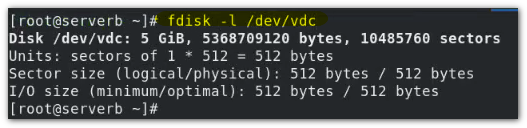

使用 parted 新建swap分区，并格式化：

分区：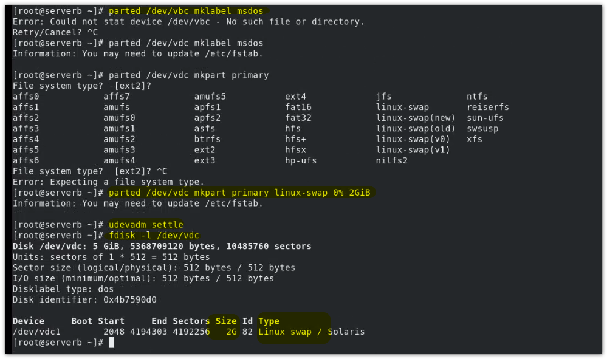

 格式化：
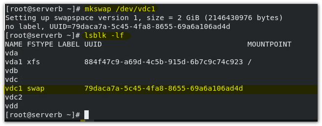


使用fdisk 新建swap分区，并格式化：

分区：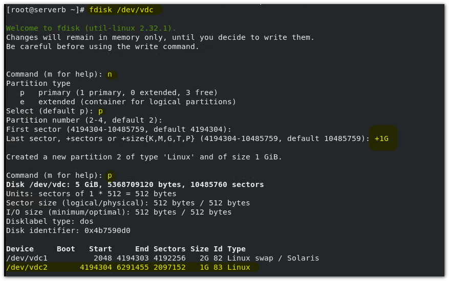

格式化：
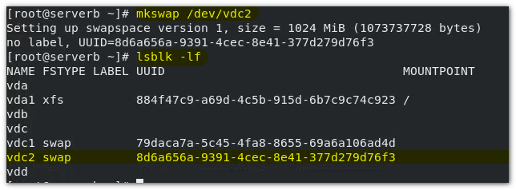

> 无论那一种方式，都要在结束后执行以下命令：
>
> ```bash
> udevadm settle
> ```
>
> 

#### H4 - 激活和关闭swap分区

##### H5 - `free` 和 `top `命令

前面的内容有讲过这两个命令，`free`用于查看当前时间的内存和swap分区的使用情况。而`top`用于动态监测系统资源的使用情况。

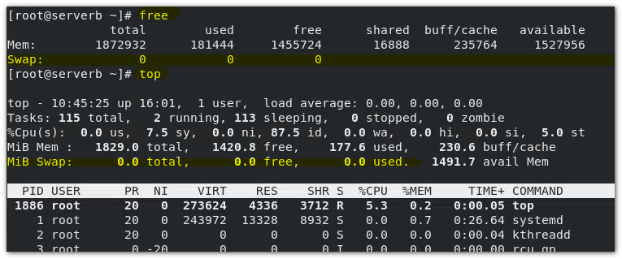

可以看到，都有swap 分区的使用信息。 可用空间都为空。 

##### H5 - 激活和关闭swap分区

`swaplabel`命令：
该命令用于返回某个设备的swap标签（UUID）
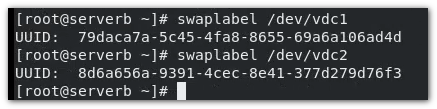


**`swapon` 和 `swapoff` 命令：**

临时激活（挂载）swap分区：`swapon`

```bash
swapon /dev/vdc1
```

查看swap 交换空间的使用情况：`swapon -s`

```bash
swapon -s
```

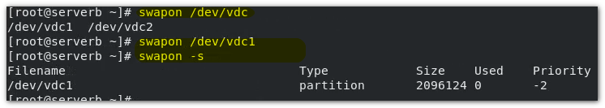

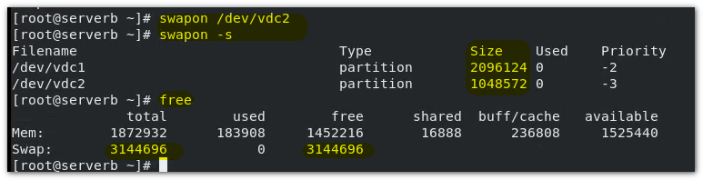

> 如果挂载（激活）了多个swap分区，那么swap的总大小会是各个swap分区的和。 并且有优先级。

使用`lsblk` 命令查看

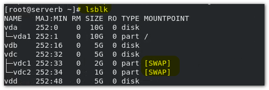

> <span style="color:red">上面的临时挂载，可以看到并不用指定挂载点。</span>

关闭激活的swap分区：

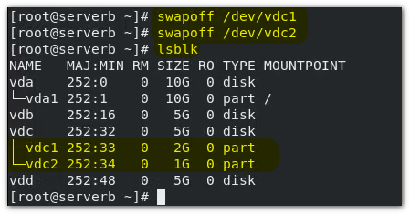

##### H5 - 永久激活/挂载 swap分区

对于已经创建分区 - 格式化为swap 的分区，永久挂载swap分区，和普通的永久挂载一样。 需要编辑 /etc/fstab 文件

```bash
man 8 swapon
```

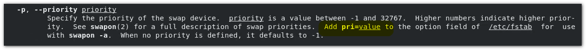

记录规则列含义上面普通设备的永久挂载已经提到过了。所不同的是，swap分区的不用指定的挂载位置，写swap 或者 none 就可以，  然后就是优先级，要用逗号隔开,添加"pri=numb" （numb范围：-1 - 3277） 字段即可。

:star:格式：

```bash
设备	swap/none(“挂载点”) swap(文件系统) defauits,pri=numb选项 0 0
```

```bash
/dev/vdc1 swap swap defaults,pri=300 0 0
```

编辑完了之后，使用`swapon -a` 从/etc/fatab 文件种挂载所有的swap分区。

`swapon -a` :  enable all swaps from  /etc/fstab

```bash
swapon -a
```


> 推荐swap 使用 LVM (逻辑卷)， 后面讲到


# Chapter 7 : 管理逻辑卷 :star::star::star:

**目标：** 使用命令行创建和管理**含有文件系统**和**交换空间**的**逻辑卷**

- 从存储设备**创建**和**管理**逻辑卷，将其格式化为相应的文件系统，或者为其准备交换空间。
- 文件系统添加和删除分区给卷组的存储，并以非破坏性方式扩展以格式化为文件系统的逻辑卷的大小。

### H3 - 创建逻辑卷

#### H4 - 逻辑卷概念

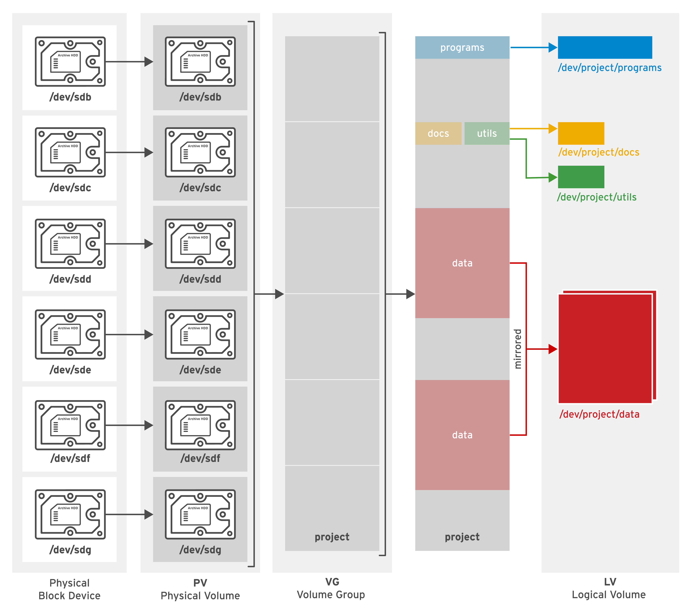

