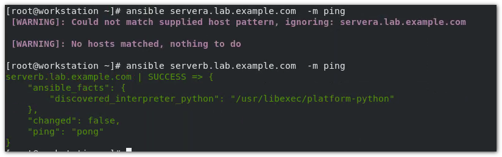
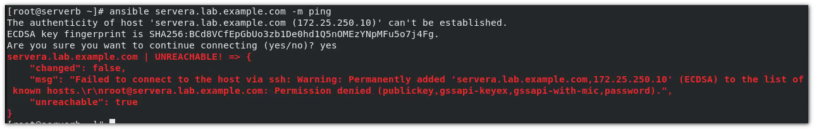
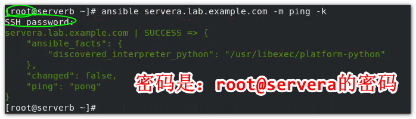
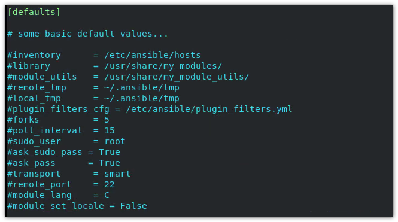

[TOC]

## ## Ansible 特性

- 模块化：调用特性的模块，完成特定的任务
- 有Paramiko, PyYAML, Jinja2 (模块语言) 三个关键模块
- 支持自定义模块
- 基于Python 语言实现
- 部署简单，基于python和SSH ，无需被控端代理程序
- 安全，基于OpenSSH
- 支持playbook 编排任务
- 幂等性： 一个任务执行1遍， 和执行n遍的效果是一样的，不会因为重复执行带来意外情况
- 无需代理不依赖PKI（无需ssl）
- 可使用任何编程语言写模块
- YAML 格式，编排任务， 支持丰富的数据结构
- 较强大的多层解决方案（角色）


## ## ansible 架构


> 安装有ansible环境的主机，为主控端，通过ansible来控制的其他的主机为被控端。

我们需要主机清单： Host Inventory 来指定被管理的主机特征集群（就是列出那些被控对象），我们可以通过ansible对特性一个或者多个主机进行单个指令进行管理，这需要用到功能模块（Modules）。 也可以通过playbook（剧本）的方式实现类似脚本一样的自动批量控制操作。

> ansible维护了数以千计的功能模块，也可以自定义功能模块。


## ## Ansible的主要组成部分

- Ansible Playbooks:  任务剧本（任务集），编排定义Ansible任务集的配置文件，由Ansible顺序依次执行，通常是 JSON 格式的 YML 文件。
- Inventory： Ansible 管理主机的清单 etc/ansible/hosts (默认)
- Modules: Ansible 执行命令的功能模块，多数内置核心模块，也可以自定义
- Plugins： 模块功能的补充，如连接类型的插件、循环插件、变量插件、过滤插件等（该功能并不常用）
- API： 共第三方程序调用的应用程序编程接口
- Ansible : 组合 Inventory、API、 Modules、 Plugins 的绿框，可以理解为是ansible 命令工具，其为核心执行工具。


## ## Ansible 工作原理


> 注意： 被控端，既可以是主机，还可以是网络设备（交换机，路由器...）
>
> CMDB: 是一个管理系统


**Ansible 命令执行来源：**

- <span style="color:red">**1.单用户命令，**</span>
- <span style="color:red">**2.playbook脚本**</span>
- 公有云或者私有云程序服务
- CMDB 这种数据库管理系统

>  对于运维工程师来讲，前两者是最主要的方式。其他方式其实也是在底层调用各类命令。只是从运维管理角度来说，使得维护成本变低了。


**利用Ansible 实现管理的方式：**

- Ad-Hoc ： 即ansible命令，主要用于临时命令使用场景 （就是命令行单挑命令控制）
- Ansible-playbook ： 主要用于长期规划好的，大型项目的场景，需要有前提的规划。


**Ansible-playbook(剧本） 执行过程：**

- 将已有编排好的任务集写入Ansible-Playbook
- 通过ansible-playbook命令分拆任务集至逐条ansible命令，按照预定的规则，顺序逐条执行。


**Ansible主要操作对象：**

- HOSTS 主机
- NETWORKING 网络设备


**注意事项：**

- 执行ansible的主机一般称为主控端，中控，master或者堡垒机
- 主控端Python版本需要2.6 或者 以上
- 被控端 Python版本小于2.4 需要安装python-simplejson
- 被控端如果开启SELinux需要安装libselinux-python
- windows 不能作为主控端（没有终端程序）


## ## 安装

- rpm 包安装 : EPEL 源 

```bash
yum install ansible
```

> 最简单的方式，但是需要配置一下epel源

- 编译安装 (官网)：

```bash
yum -y install python-jinja2 PyYAML python-paramiko python-babel python-cryptp

tar xf ansible-1.5.4.tar.gz

cd ansible-1.5.4

python setup.py build

python setup.py install 

mkdir /etc/ansible

cp -r examples/* /etc/ansible
```

- Git 安装

```bash
git clone git://github.com/ansible/ansible.git --recursive

cd ./ansible

source ./hacking/env-setup
```

- pip 安装：pip 是python包的管理器工具，类似yum，或者 npm

```bash
yum install python-pip python-devel

yum install gcc glibc-devel zibl-devel rpm-build openssl-devel

pip install --upgrade pip

pip install ansible --upgrade

```

**确认安装：** `ansible --version`


## <span style="color:red">## 相关文件</span>

**配置文件：**

/etc/ansible/ansible.cfg 主配置文件，配置anshible工作特性

/etc/ansible/hosts 主机清单

/etc/ansible/roles 存放角色的目录（所谓角色就是playbook的集合）

**程序：**

<span style="color:red">/usr/bin/ansible 主程序，临时命令执行工具</span>

<span style="color:red">/usr/bin/ansible-doc 查看配置文档，模块功能查案巩工具（类似man）</span>

/usr/bin/ansible-galaxy 下载/上传优秀代码或者Roles模块的官方平台

<span style="color:red">/usr/bin/ansible-playbook 定制自动化任务，编排剧本工具 </span>

/usr/bin/ansible-pull 远程执行命令的工具

/usr/bin/ansible-vault 文件加密工具（加密playbook中的敏感信息）

/usr/bin/ansible-console 基于Console界面与用户交互的执行工具

> <mark>**ansible 要重点掌握三个东西：模块、playbook、角色**</mark>

 

## ## 主机清单inventory

- Inventory 主机清单

  ansible的主要功用在于批量主机操作，为了便捷的使用其中的部分主机，可以在inventory file中将其**分组**命名

- 默认的inventory file为 **/etc/ansible/hosts**

- inventory file 可以有多个，且也可以用过Dynamic Inventory 来动态生成


`ansible --help`:

ansible 命令可以调用各种模块执行单个任务，例如：

```bash
ansible host -m ping
```

`-m` 参数用于指定模块， 此处的ping 不是linux 中的ping命令，而是ansible的ping模块 。**走的是ssh协议。**  该模块执行后，发送ping 包到目标主机，如果可以ping通，将返回一个"pong"

**Ping 模块 - 用例：**

1. 在/etc/ansible/hosts 文件末尾添加主机 （这里简单示例，没有写成组）

   

2. 尝试使用 `ping` 模块。

   

> 可以看到，清单中必须指定ansible执行的目标主机，否则提示No hosts matched, noting to do .

> :warning: 这里有一点特别要注意，由于是在workstation 用ping模块ping serverb 主机， 实验环境中，这两台主机之间是配置了公钥认证的，所以可以直接ping通。
>
> 但是，ansible 中的ping 模块，实际上走的是ssh协议，并不是常规的ICMP协议。 **默认情况下，两台主机之间，如果没有建立过ssh通信记录。是ping不通的。**
>
> 例如：从serverb ping servera (没有ssh登录记录也没有公钥认证)
>
> 
>
> （两台独立的主机，不可能说让你ping就ping。 这不同于ICMP 协议下的ping 命令， 切记！！）
>
> 通过`-k` 选项走密码口令认证，要求输入被ping端密码
>
> ```bash
> ansible host2 -m ping -k
> SSH password:
> ```
>
> 
>
> 但是这种方式存在一个问题，如果是同时ping模块，以及`-k` 选项去ping 多台没有ssh记录的主机。由于密码只能输入一个。 所以就不能用这种方式ping多个主机，除非所有主机的密码都一样。
>
> 因此，实际工作中，应该走 密钥认证 ！！！（基于Key验证）


### 主机清单分组  /etc/ansible/hosts

```bash
[dbservera]#任意定义的组名
servera.lab.xxxxxx  	 #可以是域名
172.25.xxxxx			#还可以是ip地址
172.25.xxxxx

[appservers]
192.168.30.10[1:3] 		#网段为1到3 的三台主机
appserver-[a:f].example.com #指定字母序列
[spec]
172.25.384.25:5000		#指定特定的端口
```

> 定义完成主机后，就可以针对某组主机进行某些操作，例如：
>
> ```bash
> absible appservers -m ping 
> ```


### 主配置文件 /etc/ansble/ansible.cfg

该文件中也是由很多个中括号分了很多语句块。大部分都是注释，很多内容只需要保持默认即可。 

其中比较重要的是 `[defaults]` 部分：



#inventory	主机清单的默认读取路径
#library	库
#modules_utils	模块路径

#remote_tmp 和 #local_tmp 这两个设计ansible的原理：

> 当ansible执行某个指令时候，例如`ansible serverb -m ping ` ，Ansible 会先将该命令，转化成Python脚本，然后放到 ~/.ansible/tmp 目录。然后复制到被控端主机的~/.ansible/tmp 。执行完毕就自动删除了。


#forks =5 	指定并发执行的个数, 默认为5个
#poll_intercal = 15 指定更新数据拉去的频率，默认是15s
#sudo_user = root 管理员用户名，默认指定root用户

> <span style="color:red">**关于ansible命令执行身份的说明：**</span>
> 例如，有user1@servera 用户，和user2@serverb 用户：
>
> 执行以下命令：
>
> ```bash
> [user1@servera] ansible serverb -m ping -k
> ```
>
> > 那么此时输入的密码，就是以serverb上的用户名为user1的用户密码，即user1@serverb, 如果serverb上没有用户user1, 将会提示：“Invalid/incorrect password:Permission denied,xxxx” 和输错密码的提示是一样的。
> >
> > 此时，需要指定用户才能执行(指定serverb上存在的用户)：
> >
> > ```bash
> > [user1@servera] ansible serverb -m ping  -u user2 -k
> > ```
> >
> > 然后输入user2@serverb 的密码即可执行。
>
> 如果是以root用户身份执行 ansible Ad-Hoc 临时命令：
>
> ```bash
> [root@servera] ansible serverb -m ping -k
> ```
>
> 那么，在不指定用户的情况下，将会要求输入 root@serverb 的用户密码。

#ask_sudo_pass = True 是否询问root用户密码（口令）

#ask_pass = True 是否询问用户名口令

#remote_port = 22 远程主机的默认端口号

#host_key_checking = Flase 主机口令检查 （建议取消注释）

#log_path = /var/log/ansible.log 默认的ansible 是不记录日志的，（建议取消注释）

